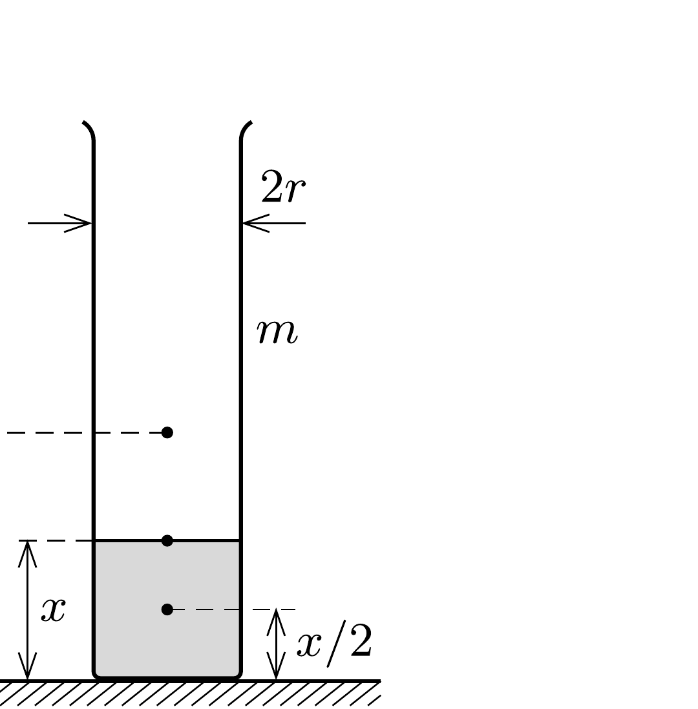
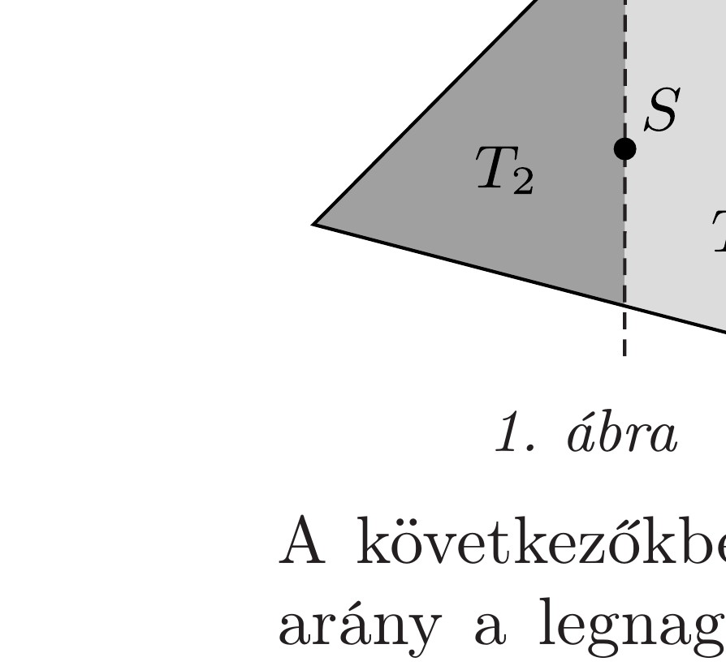

## Útmutatás

A vizet tartalmazó fózőpohár akkor borul fel legnehezebben, ha a súlypontja a lehető legalacsonyabban helyezkedik el. Milyen feltételek teljesülése esetén emelkedik szükségszerúen a víz-főzőpohár rendszer együttes súlypontja, ha akár hozzáadunk, akár elveszünk a pohárból egy kis vizet?

## Megoldás

Ha egy kis vizet töltünk a főzőpohárba, akkor a rendszer súlypontja süllyed, mert ez a kis vízmennyiség az üres pohár súlypontja alá kerül. A víz mennyiségét növelve a közös súlypont egy darabig tovább süllyed, a rendszer stabilitása növekszik. Ez a folyamat addig tart, amíg a pohárban lévő víz szintje el nem éri a víz-főzőpohár rendszer közös tömegközéppontjának magasságát. Ekkor ugyanis egy újabb adag víz már a rendszer súlypontja fölé kerül, ami megemeli a közös tömegközéppontot, és így rontja a stabilitást.

A főzőpohár tehát akkor a legstabilabb, amikor a víz-főzőpohár rendszer közös súlypontja éppen a pohárban lévő víz felszínén van, ekkor lesz a súlypont a lehető legalacsonyabban.

Az ábrán a pohár tömegközéppontjának magasságát $h$-val, a víz magasságát pedig $x$-szel jelöltük, tehát a víz súlypontja $x / 2$ magasságban van. A közös súlypont is $x$ magasságban a víz felszínén található, így a legstabilabb helyzetre a következő összefüggést írhatjuk fel:
\[
x\left(\varrho \pi r^{2} x+m\right)=\varrho \pi r^{2} x \cdot \frac{x}{2}+m h,
\]
ahol $r=30 \mathrm{~mm}$ a pohár sugara, $m=100 \mathrm{~g}$ a tömege, $\varrho$ pedig a víz súrúsége. Az adatokat behelyettesítve az egyenlet egyetlen pozitív gyökére $x \approx 56 \mathrm{~mm}$-t kapunk.

