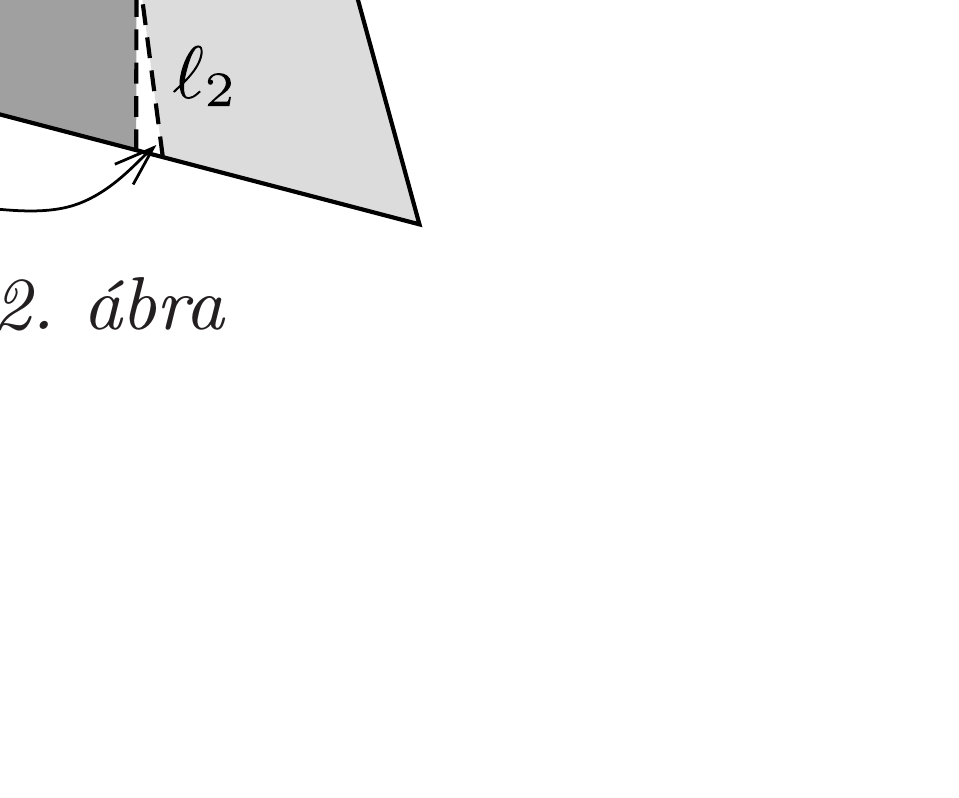
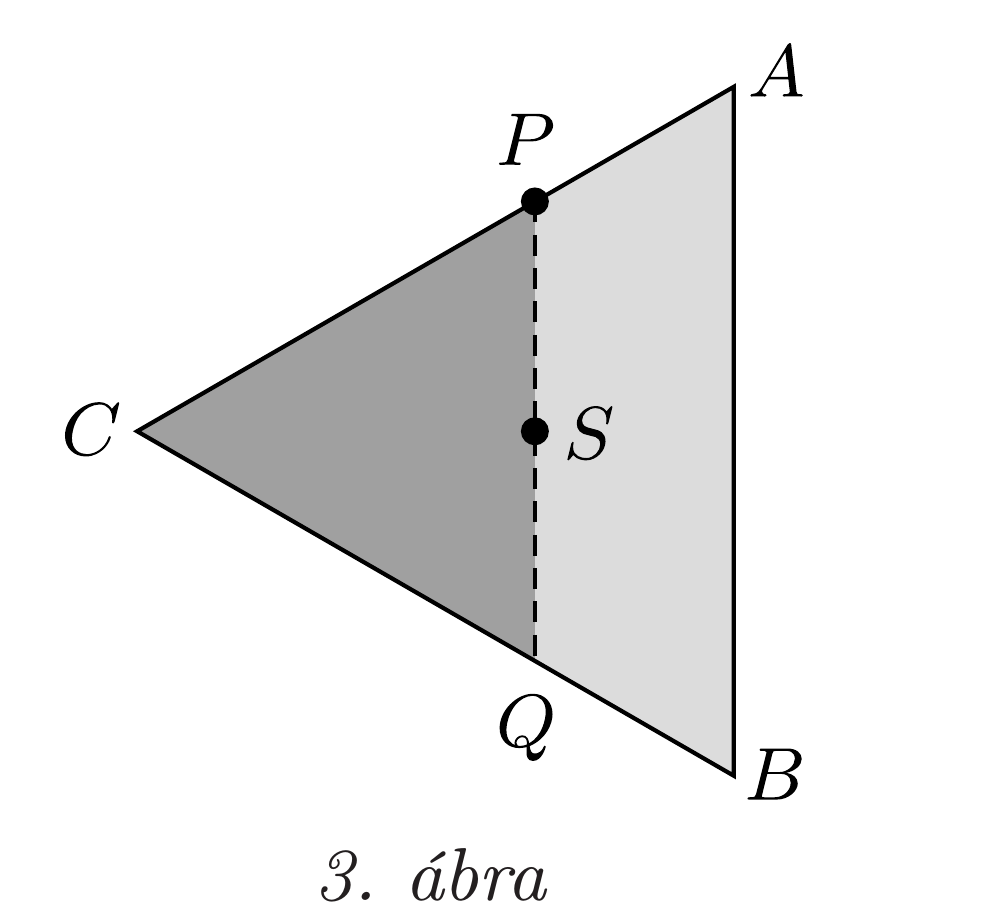

## Útmutatás

Vizsgáljuk a két rész területének arányát! Egyszerú geometriai megfontolással eldönthető, hogy a területek aránya $x$ kicsiny megváltoztatásakor növekszik-e vagy csökken.

## Megoldás

A lemez homogén, emiatt a tömegek aránya helyett vizsgálhatjuk a megfelelő területek arányát. Egyensúlyban a háromszög $S$ súlypontja rajta fekszik a $P$ ponton áthaladó függőleges egyenesen. A kérdés tehát az, hogy a $P S$ egyenes milyen arányban osztja két részre a szabályos háromszög területét (1. ábra).

A területarányt leíró $R(x)=T_{1} / T_{2}$ függvény értéke $x=0$ és $x=1 / 2$ esetén 1, hiszen ekkor a $P S$ egyenes éppen a háromszög egyik szimmetriatengelye (szögfelezője). A következőkben megmutatjuk, hogy $0<x<1 / 2$ esetén $R>1$, és a területarány a legnagyobb értékét $x=1 / 3$-nál éri el, továbbá a maximum nagysága $R(1 / 3)=5 / 4$.

Induljunk ki a háromszög egy általános helyzetéből, és növeljük meg kicsit $x$ értékét, azaz mozdítsuk el a $P$ pontot a tőle távolabbi csúcspont felé a közeli $P^{\prime}$ pontig (2. ábra). Ezáltal a $T_{1}$ terület az ábrán látható $\Delta T_{1}-\Delta T_{2}$ értékkel, a $T_{2}$ terület pedig ennek ellentettjével változik meg. Ha a 2. ábrán látható $\ell_{1}$ és $\ell_{2}$ távolságokra fennáll az $\ell_{1}>\ell_{2}$ egyenlőtlenség, akkor $\Delta T_{1}>\Delta T_{2}$, vagyis a $T_{1}$ terület ténylegesen növekszik, $T_{2}$ pedig ténylegesen csökken,

az $R(x)$ arány tehát nagyobbá válik; ellenkező esetben a
területarány csökken. (A megfontolásunk során a kicsiny háromszögek területét keskeny körcikkekkel közelítettük, melyek területe $\ell_{1}$ és $\ell_{2}$ négyzetével arányos.)

Speciálisan $\ell_{1}=\ell_{2}$ esetén a $P$ pont kis elmozdítására a területarány nem változik, az $R(x)$ függvény tehát itt veszi fel szélsóértékét. Ez akkor teljesül, amikor $P S$ párhuzamossá válik a háromszög $A B$ oldalával (3. ábra). Mivel a háromszög súlypontja 2 : 1 arányban osztja a súlyvonalakat, $A P=\frac{1}{3} A C$, vagyis $x=1 / 3$. Ebben a helyzetben a $P Q C$ háromszög $T_{2}$ területe 4/9-ede az $A B C$ háromszög teljes $T_{1}+T_{2}$ területének, azaz $R(1 / 3)=5 / 4$.

Ha $x$ kisebb a szélsőértéknek megfelelő $1 / 3$ értéknél, $\ell_{1}>\ell_{2}$ miatt az $R(x)$ függvény monoton növekszik, $1 / 3<x<1 / 2$ esetén pedig $\ell_{1}<\ell_{2}$ miatt monoton csökken, tehát a talált szélsőérték valóban maximum.
