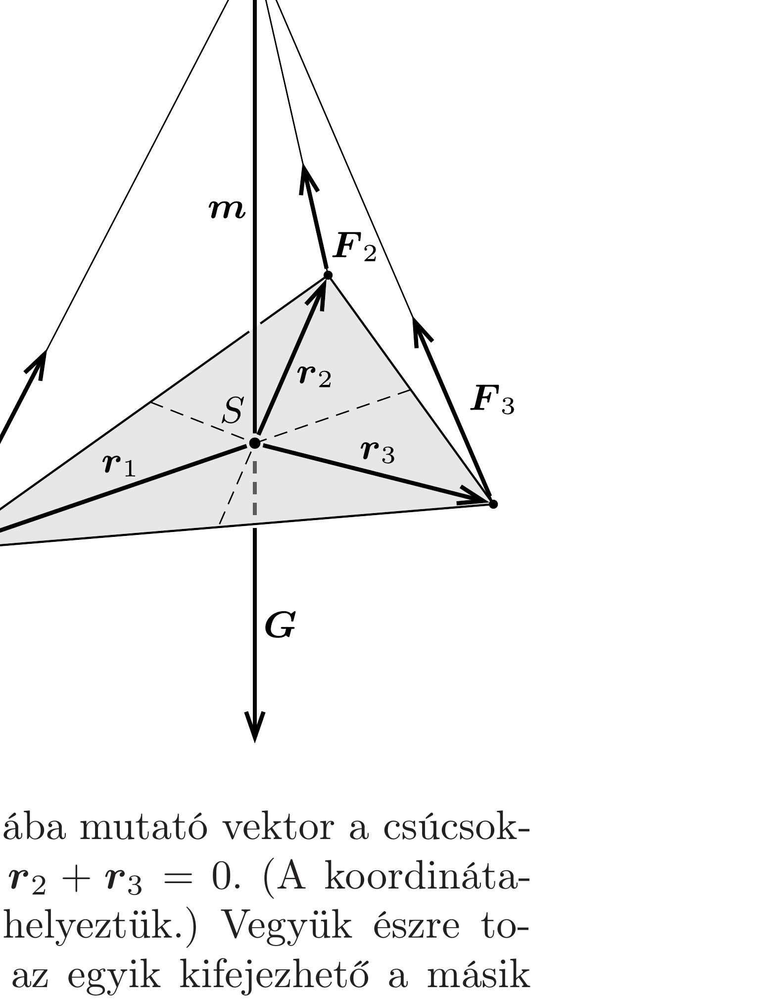

## Útmutatás

Írjuk fel a háromszög alakú lemez egyensúlyának feltételét vektorok segítségével!

## Megoldás

A háromszöglemez $S$ tömegközéppontjának egyensúlyban a felfüggesztési pont alatt kell elhelyezkednie. Jelöljük az $S$ pontból a háromszög csúcsaiba mutató vektorokat az ábrán látható módon $\boldsymbol{r}_{1}, \boldsymbol{r}_{2}$ és $\boldsymbol{r}_{3}$ mal, a felfüggesztési pontba mutató (függőleges) vektort pedig $\boldsymbol{m}$-mel. Ekkor a fonalak által a lemezre kifejtett $\boldsymbol{F}_{1}, \boldsymbol{F}_{2}$ és $\boldsymbol{F}_{3}$ eróket kifejezhetjük a fonalak irányába mutató vektorokkal:
\[
\boldsymbol{F}_{i}=\lambda_{i}\left(\boldsymbol{m}-\boldsymbol{r}_{i}\right) \quad(i=1,2,3),
\]
ahol a $\lambda_{i}$ együtthatók (egyelőre) ismeretlen skalárok. A lemez egyensúlyban van, ezért a rá ható $\boldsymbol{G}$ nehézségi erő, valamint a fonalak által kifejtett erők vektori összege nulla:
\[
\boldsymbol{F}_{1}+\boldsymbol{F}_{2}+\boldsymbol{F}_{3}+\boldsymbol{G}=0 .
\]

Használjuk fel, hogy a háromszög tömegközéppontjába mutató vektor a csúcsokba mutató vektorok számtani közepe, vagyis $\boldsymbol{r}_{1}+\boldsymbol{r}_{2}+\boldsymbol{r}_{3}=0$. (A koordinátarendszerünk origóját éppen a tömegközéppontba helyeztük.) Vegyük észre továbbá, hogy $\boldsymbol{G}$ és $\boldsymbol{m}$ párhuzamos vektorok, ezért az egyik kifejezhető a másik
skalárszorosaként: $\boldsymbol{G}=-k \boldsymbol{m}$. A fenti egyenletekből (például $\boldsymbol{r}_{3}$ kiküszöbölésével)
\[
\left(\lambda_{3}-\lambda_{1}\right) \boldsymbol{r}_{1}+\left(\lambda_{3}-\lambda_{2}\right) \boldsymbol{r}_{2}+\left(\lambda_{1}+\lambda_{2}+\lambda_{3}-k\right) \boldsymbol{m}=0
\]
adódik. Mivel $\boldsymbol{r}_{1}, \boldsymbol{r}_{2}$ és $\boldsymbol{m}$ nem egy síkban fekvő vektorok, a lineáris kombinációjuk (skalárokkal szorzott összegük) csak úgy lehet nulla, ha mindhárom vektor együtthatója nulla.

Ezek szerint $\lambda_{1}=\lambda_{2}=\lambda_{3}$, ami annyit jelent, hogy az egyes fonalakat feszítő erók éppen a fonalak hosszával arányosak. (Ez az állítás érvényét veszti akkor, amikor valamelyik fonalat lazára engedjük, hiszen ilyenkor a lemez síkja függőlegessé válik.)
