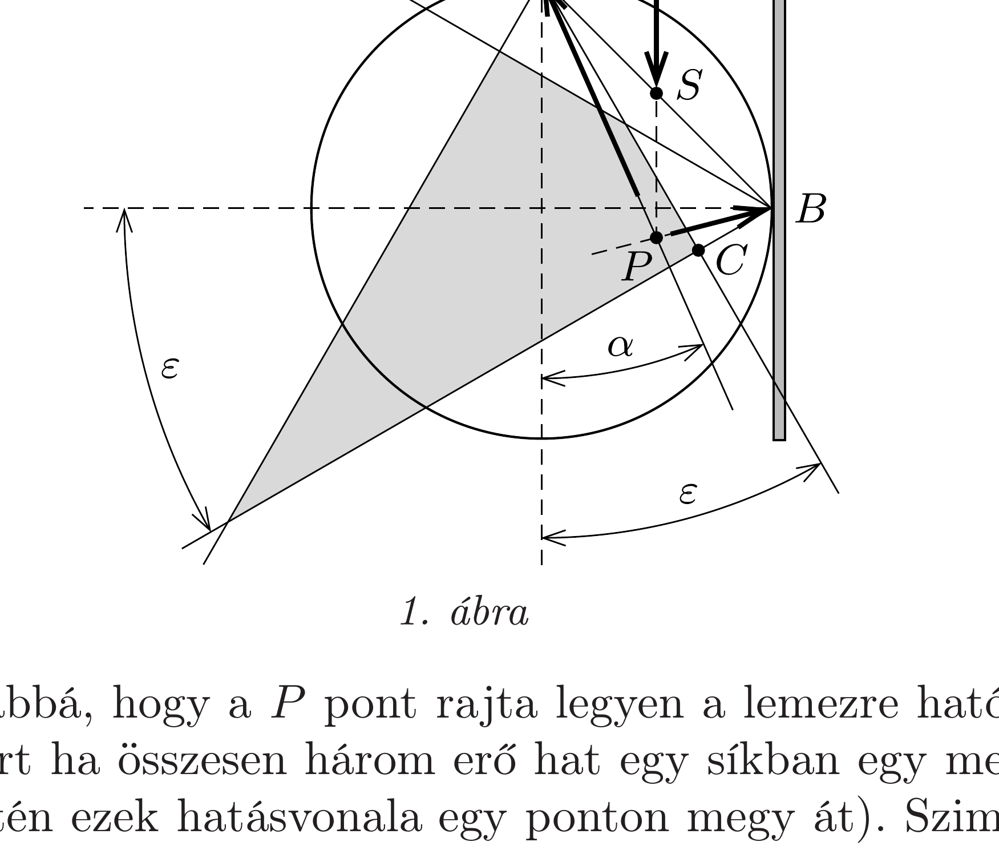
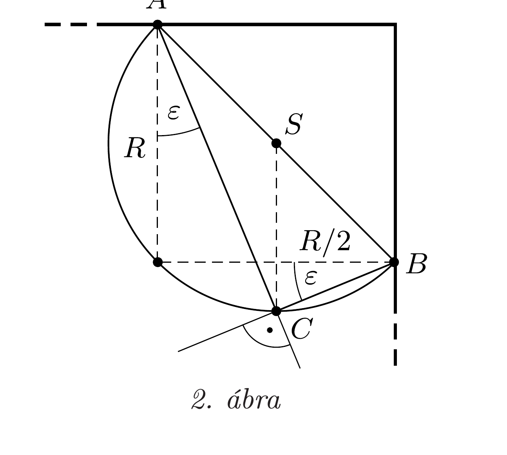

## Útmutatás

Oldjuk meg a feladatot grafikusan! A lemezre ható erők a hengerrel érintkező pontokban legfeljebb $\mathrm{az} \varepsilon=\operatorname{arctg} \mu$ súrlódási határszöggel térhetnek el a lemez síkjára merőleges egyenestől. Vizsgáljuk meg az erők egyensúlyának feltételét a lehető legkisebb súrlódási határszögnél!

## Megoldás

A lemezre ható eróket az 1. ábra mutatja. Az $A$ pontban ható erốnek (a nyomóeró és a súrlódási erő eredőjének) olyan szögtartományban kell feküdnie, amelyre $\operatorname{tg} \alpha \leq \mu$, vagyis
\[
\alpha \leq \operatorname{arctg} \mu=\varepsilon .
\]
Ugyanez igaz a $B$ pontban ható erők eredőjére is. A két erő hatásvonala metszéspontjának, a $P$-vel jelölt pontnak tehát a két szögtartomány közös részébe, az ábrán látható sötétebb négyszögbe (deltoidba) kell kerülnie.

Szükséges továbbá, hogy a $P$ pont rajta legyen a lemezre ható nehézségi erő hatásvonalán (mert ha összesen három erő hat egy síkban egy merev testre, akkor egyensúly esetén ezek hatásvonala egy ponton megy át). Szimmetriaokokból
a lemez $S$ súlypontja az $A B$ szakasz felezőpontjában van, tehát a nehézségi erő hatásvonala a függőleges lemezoldaltól $R / 2$ távolságra halad. A súrlódási együtthatónak (és vele együtt az $\varepsilon$ szögnek) legalább akkorának kell lennie, hogy a négyszög $C$ pontja a függőleges lemezoldaltól legfeljebb $R / 2$ távolságra legyen.

A határesetet a 2. ábra mutatja. A $C$ pont az $A B$ fölé írt Thalész-körön helyezkedik el. A $C S B$ háromszög egyenlőszárú, és mivel $C S B \varangle=45^{\circ}$,
\[
S B C \varangle=\frac{180^{\circ}-45^{\circ}}{2}=67,5^{\circ},
\]
a keresett súrlódási együttható legkisebb értéke:
\[
\mu_{\min }=\operatorname{tg} \varepsilon_{\min }=\operatorname{tg}\left(90^{\circ}-67,5^{\circ}\right)=\operatorname{tg} 22,5^{\circ}=0,41 .
\]

Megjegyzés. A feladat az ún. statikailag határozatlan problémák közé tartozik; pusztán az erők és forgatónyomatékok egyensúlyának feltételrendszere nem határozza meg egyértelmúen a kialakuló erőeloszlást. A grafikus megoldásban ez úgy jelentkezik, hogy a nehézségi erő́ hatásvonalának bármely, a sötétített deltoidon belül lévő pontja lehet az erók hatásvonalának metszéspontja, és ennek megfelelően az erők nagysága és iránya sem egyértelmúen meghatározott.

E határozatlanság hátterében az rejlik, hogy az erók tényleges nagysága attól is függ, hogy mennyire feszítettük neki a lemezt a hengernek. A beszorítottság mértéke a lemezben alakváltozásokat (deformációkat) hoz létre, a feladat teljes részletességében csak a deformációk vizsgálatával, tehát a rugalmasságtan törvényeinek felhasználásával oldható meg.
