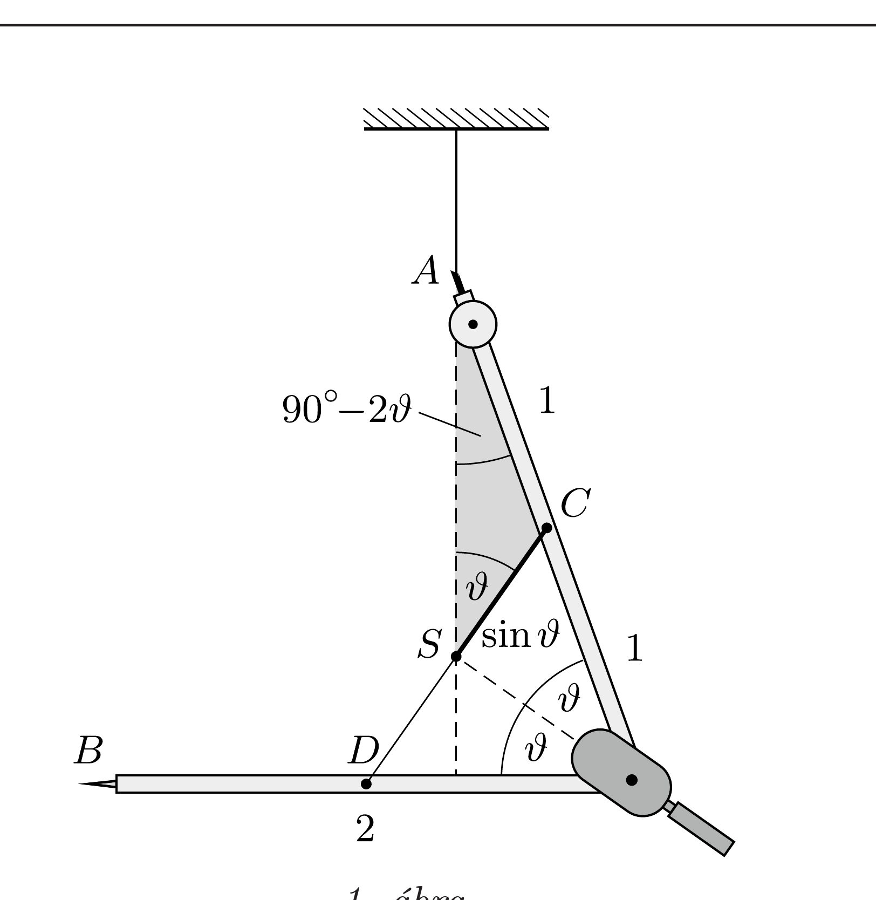
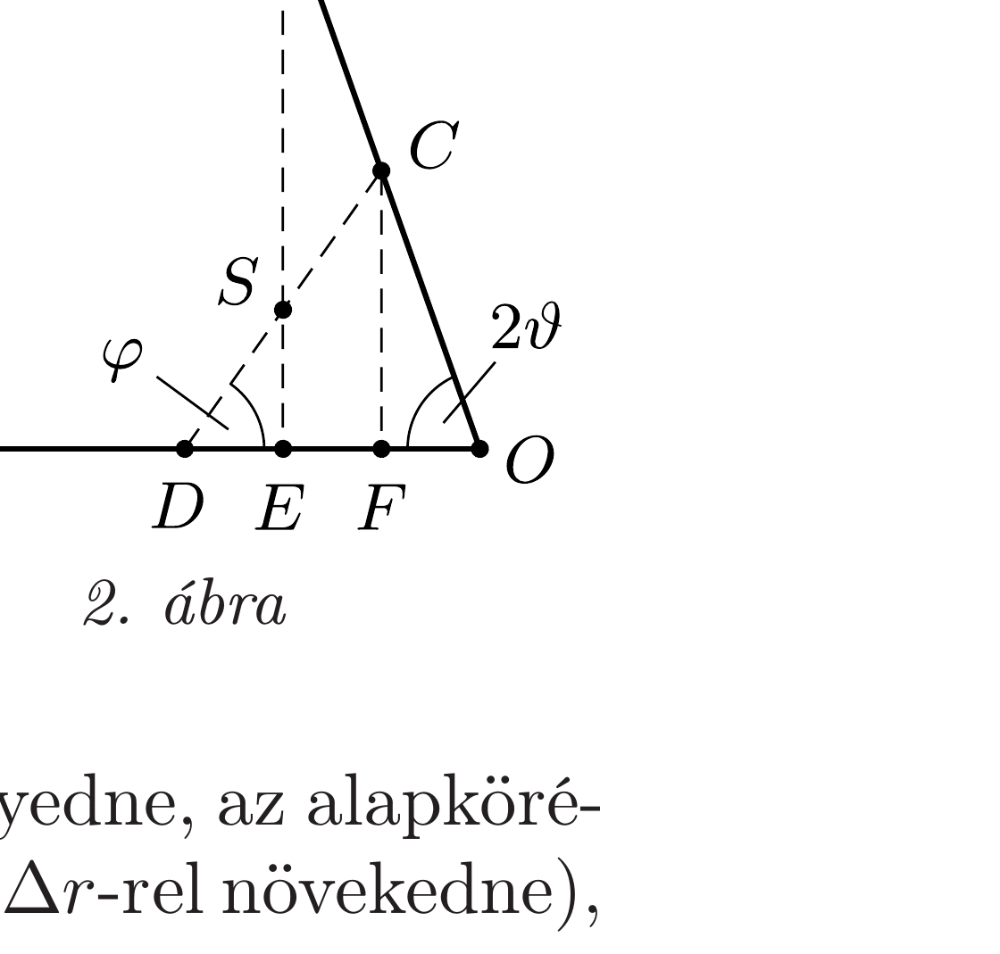

## Útmutatás

A körző tömegközéppontjának mindig a felfüggesztési pont alatt kell lennie. Ha a szárak nyílásszögét változtatjuk, az egyes szárak tömegközéppontja vízszintes irányban is elmozdul, de közös tömegközéppontjuk csak függőlegesen mozoghat.

## Megoldás

Belátjuk, hogy a csukló akkor lesz a legmagasabban, amikor a körző alsó szára vízszintes. Induljunk ki ebbő̌l a helyzetből (1. ábra), és képzeljük el egy pillanatra, hogy a körző felső (felfüggesztett) szárát rögzítve tartjuk. Ha a másik (kezdetben vízszintes) szárat valamerre (akár felfelé, akár pedig lefelé) döntjük, a tömegközéppontja a körző csuklójához vízszintes irányban közeledik. Ha most a felsó szár rögzítését megszüntetjük, ez a szár mindenképpen lefelé mozdul el, mert csak így érhető el, hogy a közös tömegközéppont továbbra is a felfüggesztési pont alatt maradjon.

Jelöljük a körző szárai közötti szöget $2 \vartheta$-val, és válasszuk a szárak hosszát 2 egységnyinek! Az 1. ábrán látható besötétített $S C A$ háromszögre felírhatjuk a szinusztételt:
\[
\frac{\sin \vartheta}{1}=\frac{\sin \left(90^{\circ}-2 \vartheta\right)}{\sin \vartheta},
\]
melyből egyszerú átalakítások után
\[
\sin \vartheta=\frac{1}{\sqrt{3}}, \quad \text { azaz } \quad \vartheta \approx 35,3^{\circ}
\]
adódik. A körzó szárait tehát $2 \vartheta \approx 70,5^{\circ}$-nyira kell kinyitnunk, ekkor lesz a csuklója a legmagasabban.

Megjegyzés. A kérdéses $2 \vartheta$ nyílásszög a párhuzamos szelők tételének alkalmazásával is megkapható. Húzzunk a rendszer $S$ tömegközéppontján és a felső szár $C$ középpontján át egy-egy függőleges egyenest (2. ábra). Ezek a $2 \vartheta$ nyílású szög szárainak párhuzamos szelői, tehát $O C$ és $C A$ egyenlőségéből $E F=F O$ következik. Hasonló megfontolással a $\varphi$ szögre: $D S=S C$ miatt $D E=E F$. Ezek szerint az $E$ és az $F$ pontok harmadolják az $O D$ szakaszt, amely viszont $O C$-vel egyenlő, vagyis $O C=3 F O$. Mivel az $F O C$ háromszög derékszögü, $\cos 2 \vartheta=\frac{1}{3}$, azaz $2 \vartheta \approx 70,5^{\circ}$.

