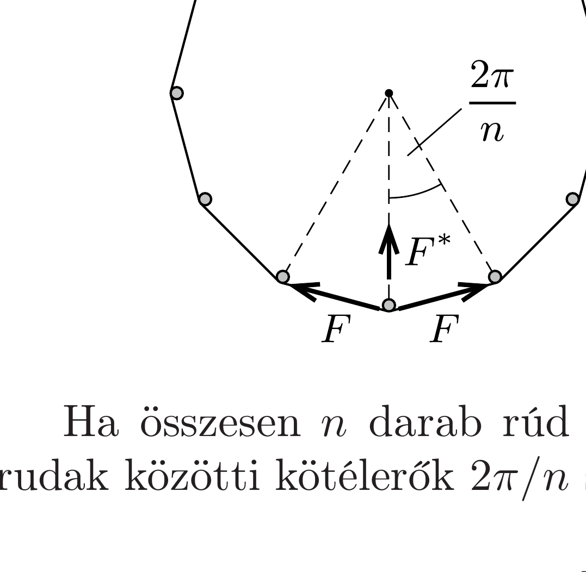
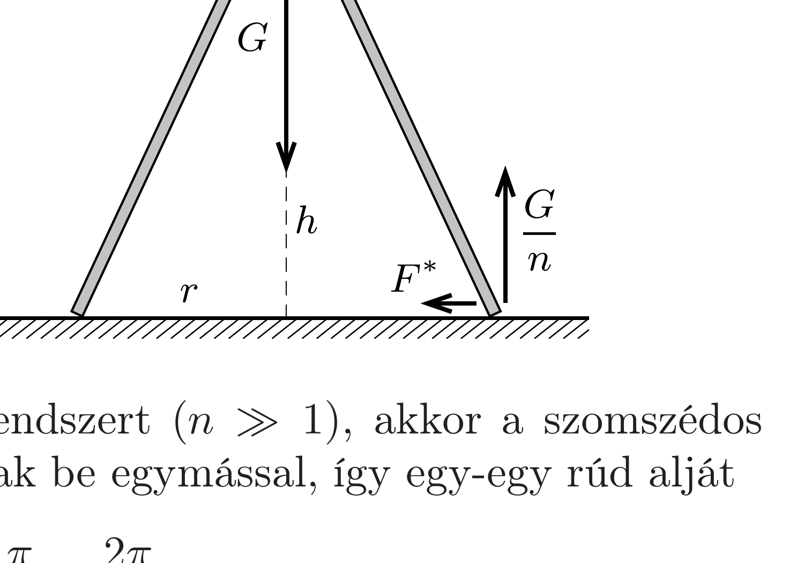

## Útmutatás

Alkalmazzuk a virtuális munka elvét a kúp kicsiny, elképzelt elmozdulására!

## Megoldás

I. megoldás. Ha a kúp csúcsa $\Delta h$ távolsággal lesüllyedne, az alapkörének sugara pedig $\Delta r$-rel megnőne (vagyis az alapkör kerülete $2 \pi \Delta r$-rel növekedne), akkor a külső erők összesen
\[
\Delta W=G \Delta h-F(2 \pi \Delta r)
\]
munkát végeznének. Ennek a mennyiségnek egyensúlyi állapotban nullának kell lennie, ellenkező esetben a kúp valamelyik irányban magától elmozdulna. Innen
\[
F=\frac{G}{2 \pi} \frac{\Delta h}{\Delta r} .
\]
A magasság és az alapkör sugarának megváltozása nem független egymástól, kapcsolatukat az alkotó hosszának változatlansága határozza meg (melyre Pitagorasztételt írhatunk fel):
\[
(r+\Delta r)^{2}+(h-\Delta h)^{2}=r^{2}+h^{2},
\]
ahonnan
\[
\frac{\Delta h}{\Delta r}=\frac{2 r+\Delta r}{2 h-\Delta h} \approx \frac{r}{h}
\]
adódik. Eszerint a keresett erő:
\[
F=\frac{r}{2 \pi h} G .
\]
II. megoldás. Modellezzük a folytonos anyageloszlású papírlapot sok vékony, elhanyagolható tömegú rúddal, amelyek alsó vége egy $r$ sugarú kör kerülete mentén egyenletesen elosztva helyezkedik el, a másik végüket pedig egy kötéllel csuklószerúen egymáshoz kapcsoltuk. Ha a rudak alsó végét is összefogjuk egy fonállal, akkor az indián sátor vázára emlékeztető elrendezés a tetején $G$ súllyal megterhelhető, hiszen az alsó fonál $F$ feszítőereje megakadályozza a rudak szétcsúszását. (A feladat szövege értelmében a súrlódást elhanyagoljuk.)

Ha összesen $n$ darab rúd alkotja a rendszert $(n \gg 1)$, akkor a szomszédos rudak közötti kötélerők $2 \pi / n$ szöget zárnak be egymással, így egy-egy rúd alját
\[
F^{*}=2 F \sin \frac{\pi}{n} \approx \frac{2 \pi}{n} F
\]
nagyságú vízszintes erő húzza a szabályos $n$-szög középpontja felé. Ezen kívül a rúd alját a talaj $G / n$ függőleges eróvel nyomja felfelé. E két erőnek akkor nem lesz eredő forgatónyomatéka a rúd felső végpontjára nézve, ha
\[
\frac{G}{n} r=\frac{2 \pi}{n} F h, \quad \text { azaz } \quad F=\frac{r}{2 \pi h} G .
\]
