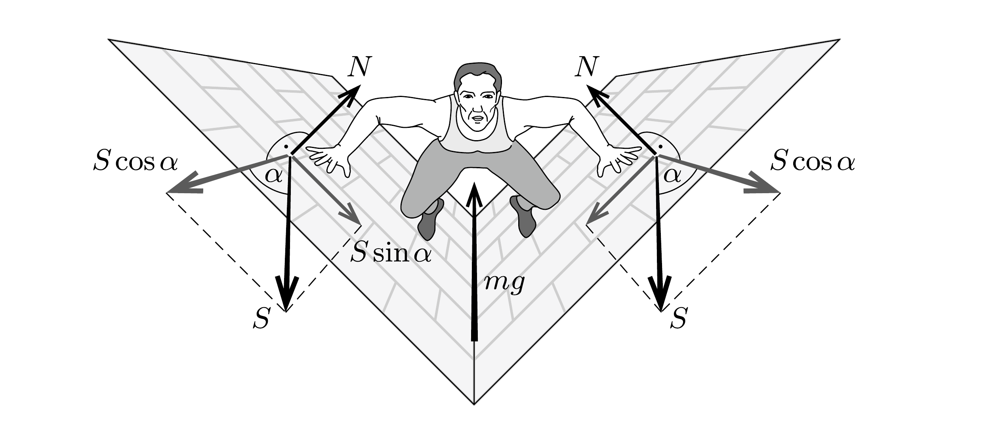

## Útmutatás

A kulcskérdés: hogyan tud a súrlódási erő egyszerre egyensúlyt tartani Jean Valjean súlyával és a falak nyomóerejével?

## Megoldás

A felülnézeti és perspektívikus ábra azt mutatja, hogyan helyezkedik el Jean Valjean a falon. Feltüntettük a fegyencre ható erőket is: a függőlegesen lefelé rányuló nehézségi erőt $(m g)$, egy-egy fal eredó nyomóerejét $(N)$ és a súrlódási eróket $(S)$.

A tapadási súrlódási eróről tudjuk, hogy legnagyobb értéke $\mu N$ lehet. Az irányáról még semmit nem tudunk, ezért vegyük fel általánosan, a függőlegessel zárjon be $\alpha$ szöget. Felírhatjuk a függőleges és a vízszintes irányú erők (erőösszetevők) egyensúlyának feltételét:
\[
\begin{aligned}
m g & =2 S \cos \alpha, \\
N & =S \sin \alpha,
\end{aligned}
\]
ahonnan
\[
N=\frac{1}{2} m g \operatorname{tg} \alpha .
\]
Ekkora eróvel nyomja Jean Valjean a falat. Az egyes falaknál ébredő eredő erő nagysága:
\[
F=\sqrt{N^{2}+S^{2}}=\frac{1}{2} m g \sqrt{\frac{1+\sin ^{2} \alpha}{\cos ^{2} \alpha}} .
\]

Arra is választ kaphatunk, hogy legalább mekkora nyomóerőt kell gyakorolnia a „falramászónak” a falakra, és hogy legalább mekkora a kifejtett eredő erő:
\[
S \leq \mu N, \quad \text { vagyis } \quad \sin \alpha \geq \frac{1}{\mu}, \quad \operatorname{tg} \alpha \geq \frac{1}{\sqrt{\mu^{2}-1}},
\]
innen
\[
\begin{aligned}
& N \geq \frac{1}{2} m g \frac{1}{\sqrt{\mu^{2}-1}}, \\
& F \geq \frac{1}{2} m g \sqrt{\frac{\mu^{2}+1}{\mu^{2}-1}} .
\end{aligned}
\]

Amennyiben $\mu<1$, a fenti kifejezések értelmetlenek, ilyenkor Jean Valjean mindenképpen leesik a falról. Ha viszont $\mu \gg 1$, akkor $F=\frac{1}{2} m g$, tehát Jean Valjean mindkét kezében a súlyának fele nagyságú erő ébred, ilyenkor tehát csak a saját súlyát kell tartania. Ez az extrém nagy tapadási súrlódási együttható annak felel meg, mintha Jean Valjean - a falmászó termekben edzó sportmászókhoz hasonlóan - meg tudna kapaszkodni a börtön falának kiszögellésein.
