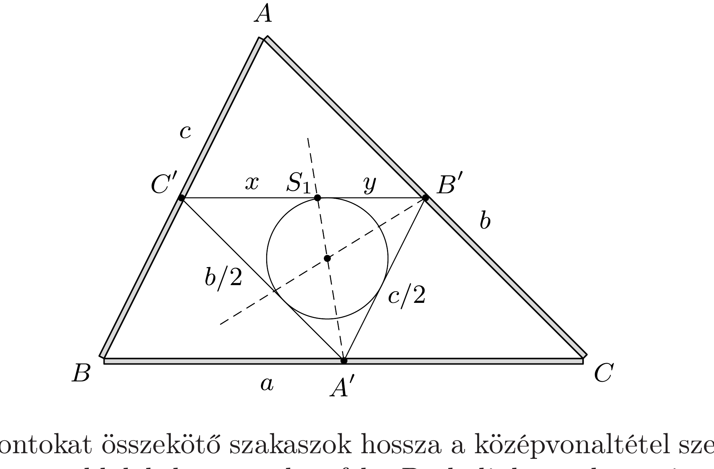

## Útmutatás

Lacinak van igaza. Állításának belátásához segítségünkre lehet a szögfelezőtétel.

## Megoldás

Legyenek a háromszög oldalai $a, b$ és $c$, a rudak egységnyi hosszra eső tömege pedig $\lambda$. A rudakat helyettesíthetjük egy-egy, a felezőpontjukba helyezett $\lambda a, \lambda b$ és $\lambda c$ tömegú pontszerú testtel (lásd az ábrát).

A tömegpontokat összekötő szakaszok hossza a középvonaltétel szerint a megfelelő párhuzamos oldalak hosszának a fele. Próbáljuk megkeresni most az egymástól $a / 2$ távolságra lévő, $\lambda b$ és $\lambda c$ tömegú pontszerú testek tömegközéppontját! Ez abban az $S_{1}$ pontban lesz, amelyre
\[
\lambda c \cdot x=\lambda b \cdot y,
\]
vagyis
\[
\frac{x}{y}=\frac{b}{c}=\frac{b / 2}{c / 2} .
\]

Az $S_{1}$ pont a szögfelezőtétel megfordítása alapján rajta van a $C^{\prime} A^{\prime} B^{\prime}$ szög szögfelező egyenesén. İgy az $S_{1}$-ben található $\lambda(b+c)$ tömeg és az $A^{\prime}$-ben található $\lambda a$ tömegpont közös tömegközéppontja (azaz a háromszögkeret tömegközéppontja) rajta van a $C^{\prime} A^{\prime} B^{\prime}$ szög szögfelezőjén. Mivel bármely másik két pontból is kiindulhattunk volna, így a rudakból épített háromszög tömegközéppontja rajta van az $A^{\prime} B^{\prime} C^{\prime}$ háromszög mindhárom szögfelezőjén, vagyis egybeesik az $A^{\prime} B^{\prime} C^{\prime}$ beírható körének középpontjával.

A súlypont helyét tehát Laci határozta meg helyesen. Feri módszere csak szabályos háromszög esetén ad jó megoldást.
