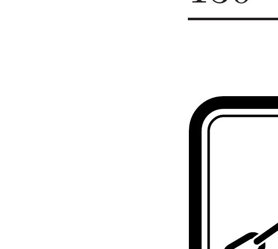
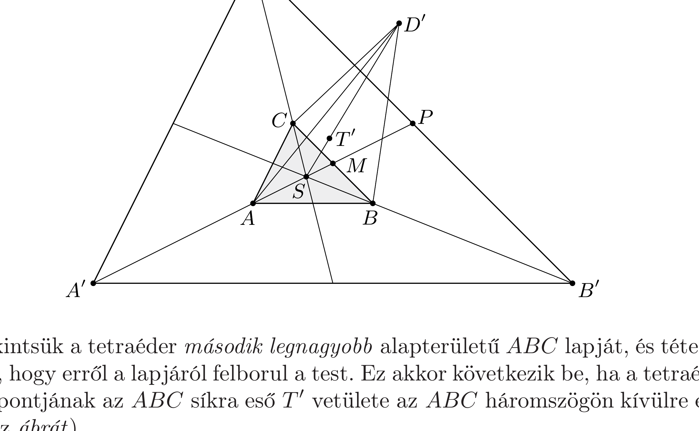
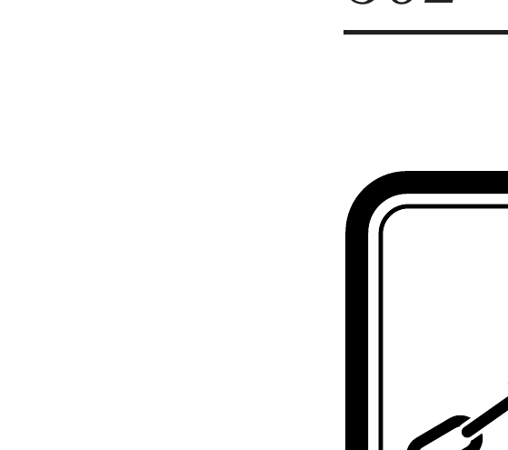

## Útmutatás

Belátható, hogy ha a tetraédernek valamelyik lapja borulékony, akkor a három másik oldallap közül kettőnek biztosan nagyobb a területe a kiszemelt borulékony oldallap területénél. Ebből következik, hogy a tetraédernek biztosan van legalább két olyan oldallapja (a legnagyobb és a második legnagyobb területú oldallap), amire állítva stabilan áll.

\section*{Kötelek, láncok, granulált anyagok}

## Megoldás

Ha a tetraéder valamelyik lapjára állítva felborul, akkor átbillenéskor a súlypontja alacsonyabbra kerül. A súlypont magassága a tetraéder magasságának negyede, a test térfogata tehát valamelyik lapterület és a hozzá tartozó súlypontmagasság szorzatának 4/3-szorosával egyenlő; így minél nagyobb területú lapján fekszik a tetraéder, a súlypontja annál alacsonyabban helyezkedik el.

Megmutatjuk, hogy nem létezik olyan tetraéder, amely három oldallapjáról is felborul. A bizonyítás lényege: belátjuk, hogy ha valamelyik oldallap borulékony, akkor létezik a tetraédernek legalább két másik oldallapja, amelyek mindegyikének nagyobb a területe, mint a kérdéses lap területe. Ebből már következik, hogy a legnagyobb és a második legnagyobb területú oldallapnak stabilnak kell lennie.

Tekintsük a tetraéder második legnagyobb alapterületü $A B C$ lapját, és tételezzük fel, hogy erről a lapjáról felborul a test. Ez akkor következik be, ha a tetraéder $T$ súlypontjának az $A B C$ síkra eső $T^{\prime}$ vetülete az $A B C$ háromszögön kívülre esik (lásd az ábrát).

A homogén tetraéder $T$ súlypontja az $A B C$ háromszög $S$ súlypontját és a negyedik ( $D$-vel jelölt) csúcsot összekötó egyenesen fekszik, az $S D$ szakasz $S$-hez
közelebbi negyedrészénél. Ugyanez igaz a kérdéses pontok $A B C$ síkra eső $T^{\prime}$ és $D^{\prime}$ vetületére is: $S T^{\prime}=\frac{1}{4} S D^{\prime}$.

Nagyítsuk fel az $A B C$ háromszöget az $S$ súlypontjából középpontosan a négyszeresére! Ekkor (az ábra jelöléseit követve) fennáll $A M=M P$, ebből következik, hogy a $B C$ és $B^{\prime} C^{\prime}$ egyenesek távolsága ugyanakkora, mint az $A$ csúcs és a $B C$ egyenes távolsága. Hasonló arányosság teljesül a többi oldalra is.

Mivel a $D$ csúcs $D^{\prime}$ vetülete kívül esik az $A^{\prime} B^{\prime} C^{\prime}$ háromszögön, ezért $D^{\prime}$ és $S$ a felnagyított háromszög valamelyik oldalegyenesének (mondjuk $B^{\prime} C^{\prime}$-nek) ellentétes oldalán helyezkedik el. Emiatt a tetraéder $C B D$ oldallapjának területe
\[
t(C B D)>t\left(C B D^{\prime}\right)>t(A B C) .
\]
(Ez a reláció abból is következik, hogy a tetraéder valamelyik borulékony oldaláról csak kisebb súlypontmagasságú, tehát nagyobb alapterületú oldallapjára fordulhat át.)

Megmutatjuk, hogy a tetraéder másik két oldallapja ( $A B D$ és $A D C$ ) közül legalább az egyik nagyobb területü, mint az alaplap $t(A B C)$ területe. Az oldallapok területe a vetítés során biztosan csökken, ezért igaz, hogy
\[
t(A B D)+t(A D C)>t\left(A B D^{\prime}\right)+t\left(A D^{\prime} C\right) \geq t(A B C)+t\left(C B D^{\prime}\right)>2 \cdot t(A B C) .
\]
Ha két terület összege nagyobb, mint $t(A B C)$ kétszerese, akkor az egyikük biztosan nagyobb, $\operatorname{mint} t(A B C)$.

Találtunk tehát két olyan oldallapot ( $C B D$, valamint $A B D$ és $A D C$ közül az egyik), amelynek területe nagyobb, mint a legnagyobb borulékony oldallap területe. Ez három borulékony oldallap esetén nem lenne lehetséges, vagyis ilyen tetraéder nem létezhet.

\section*{Kötelek, láncok, granulált anyagok}
