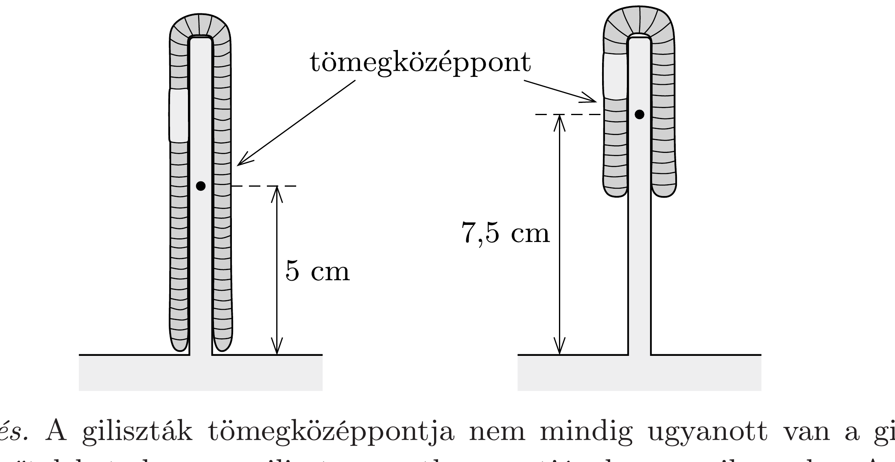

## Útmutatás

Hasonlítsuk össze a tömegközéppontok emelkedését!

## Megoldás

A nehézségi erő ellenében végzett munkát a tömegközéppont emelkedéséből számíthatjuk ki. A „félbehajtott” giliszta tömegközéppontja a két félrész felénél, tehát a giliszta végétől a teljes hosszának negyedénél található.

Ezek szerint a sovány giliszta tömegközéppontja 5 cm-t, a kövéré pedig 7,5 cmnyit emelkedik, a munkavégzések aránya tehát 2 : 3.

Megjegyzés. A giliszták tömegközéppontja nem mindig ugyanott van a gilisztához viszonyítva, sót lehet, hogy a giliszta egyetlen pontjával sem esik egybe, Az egyenes giliszta tömegközéppontja a közepénél, a félbehajlott gilisztáé pedig a végeitől negyedrésznyi távolságra van. A tömegközéppont tehát nem „nőtt hozzá" a hajlékony testek valamelyik pontjához, viszonylagos helyzete változhat. Ezt használja fel az a magasugró is, akinek a teste átbukik a léc felett, tömegközéppontja viszont a léc alatt „bújik át”.
