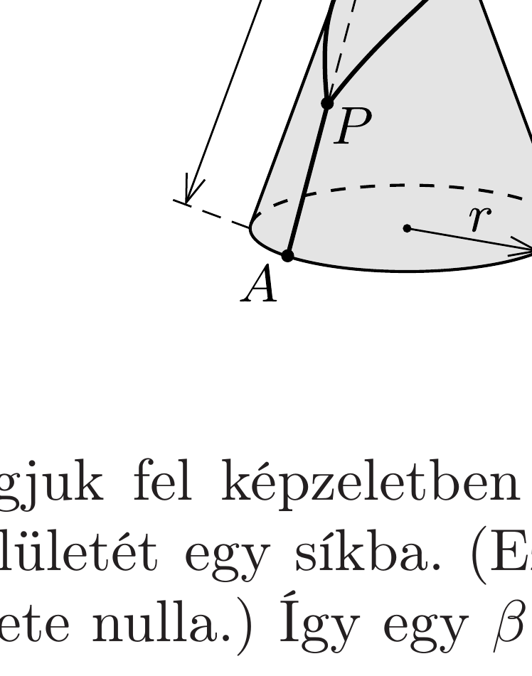
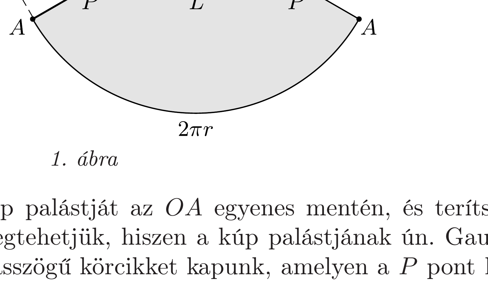
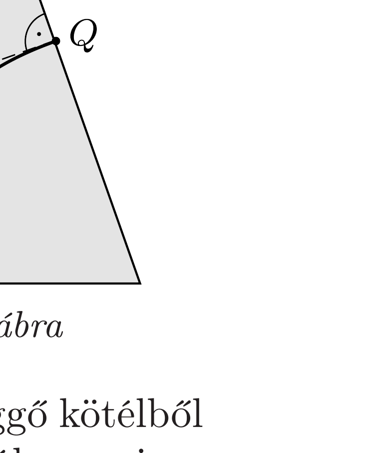

## Útmutatás

A haladók lasszójának minden pontjában ugyanakkora eró ébred. Ugyanez igaz a kezdők lasszójának mindkét darabjára külön-külön. Egyensúlyi állapotban a versenyző helyzeti energiája mindkét lasszó esetében minimális. A kúp palástjára simuló kötéldarab hosszát könnyebb meghatározni, ha a palástot képzeletben sík lappá terítjük szét.

## Megoldás

Jelöljük a kezdők lasszóján lévő zárt hurok hosszát $L$-lel, a kis hurok helyzetét a kúpon $P$-vel, a versenyző helyét $A$-val, a jéghegy csúcsát pedig $O$-val (1. ábra bal oldala). A versenyző akkor kerül a legmélyebbre (tehát akkor lesz a rendszer összenergiája a legkisebb), ha a $P$ pont a lehető legmesszebb van $O$-tól.

Vágjuk fel képzeletben a kúp palástját az $O A$ egyenes mentén, és terítsük ki a felületét egy síkba. (Ezt megtehetjük, hiszen a kúp palástjának ún. Gaussgörbülete nulla.) Így egy $\beta$ nyílásszögü körcikket kapunk, amelyen a $P$ pont két
helyen is megjelenik (lásd az 1. ábra jobb oldalát). A $P$ pontok akkor kerülnek legtávolabb az $O$ ponttól, ha a közöttük húzódó $L$ hosszúságú kötéldarab az ábrán egyenes. Ilyen egyenes a kiterített kúppaláston (az ábrán sötéten jelölt területen belül) akkor húzható, ha $\beta<180^{\circ}$, vagyis
\[
2 \pi r=\ell \beta<\ell \pi, \quad \text { azaz } \quad r<\frac{\ell}{2} .
\]
Ez a feltétel az eredeti (térbeli) jégkúp csúcsszögére az
\[
\frac{r}{\ell}=\sin \frac{\alpha}{2}<\frac{1}{2}, \quad \text { vagyis } \quad \alpha<60^{\circ}
\]
megszorítást adja.
A kezdő versenyzők tehát csak a $60^{\circ}$-nál hegyesebb jégkúpokra tudnak felkapaszkodni a két darabból álló lasszójuk segítségével. Ha a kúp csúcsszöge nagyobb ennél az értéknél, akkor a megterhelt lasszó hurokja átcsúszik a jéghegy csúcsán, és a versenyző leesik.

Megjegyzés. Ha „oldalról” nézzük az átlátszónak gondolt jéghegyet, a lasszó hurokjának egyik ága éppen a másik mögé kerül, emiatt a lasszót egyetlen vonalnak látjuk. Ez a vonal a $P$-vel átellenes végén lévó $Q$ pontban merőleges a kúp ottani alkotójára. Ebből naiv módon arra gondolhatunk, hogy $\alpha$ felső határa 90°, de ez - mint láttuk - nem igaz!

A hiba forrása: $P$ és $Q$ között a lasszó vetülete nem egyenes, mert a lasszó hurokja nem síkgörbe (2. ábra). (Ha az lenne, akkor egy kúpszeletnek, nevezetesen ellipszisnek kellene lennie, de egy ellipszisnek nincs töréspontja $P$-ben, a hurkot alkotó kötélnek viszont - a megterhelt kötélszár miatt - van töréspontja.) Ha a síkba kiterített felületen meghúzott egyenest visszarajzoljuk a kúp palástjára, láthatjuk, hogy ha $\alpha \rightarrow 60^{\circ}$, akkor $Q$ egyre magasabbra kerül, és végül eléri a jéghegy csúcsát.

Mi a helyzet a haladó versenyzők lasszójával? Ez egyetlen, összefüggő kötélből áll, tehát benne a feszítőerón mindenhol ugyanakkora. A kis huroknál, vagyis a $P$ csomópontban három kötéldarab fut össze, ezekben azonos nagyságú eró hat, tehát erőegyensúly akkor állhat fenn, ha a három kötél páronként 120°-os szöget zár be egymással. Az 1. ábra jobb oldalán látható „kiterített” rajzról leolvasható, hogy ebben az esetben $\beta=60^{\circ}$, vagyis
\[
2 \pi r=\ell \frac{\pi}{3},
\]
azaz
\[
\sin \frac{\alpha}{2}=\frac{r}{\ell}=\frac{1}{6}, \quad \text { ahonnan } \quad \alpha=19,2^{\circ} .
\]
Egyensúlyi helyzet tehát csak egyetlen $\alpha$ szögnél állhat fenn, és ez az egyensúly is instabil. Ha a jégkúp csúcsszöge nagyobb ennél a szögnél, akkor a megterhelt lasszó
hurokja felcsúszik a kúp tetejéig, majd azon átugorva visszaesik. Ha a csúcsszög kisebb, mint a kritikus érték, akkor a hurok lecsúszik egészen a versenyzőig, tehát ebben az esetben sem segíti a kapaszkodást. Nem véletlen, hogy ezt a lasszót csak haladó jégfalmászóknak ajánlják!
