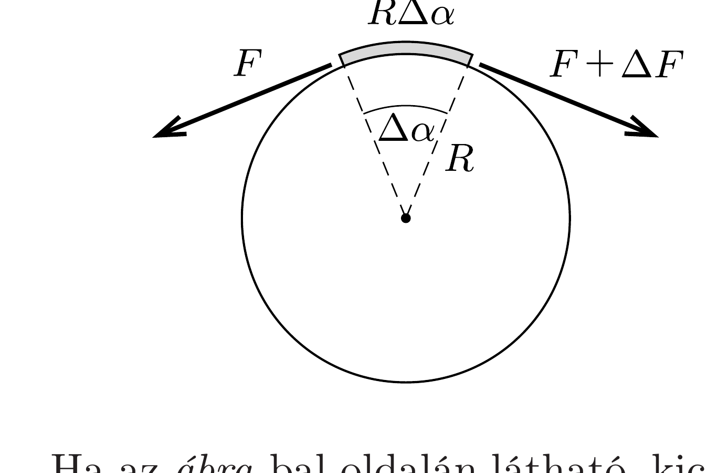
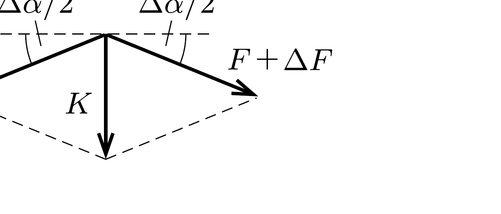

## Útmutatás

Vizsgáljuk meg, hogyan változik a fonalat feszítő eró a hengerpalást mentén! Ennek az erőnek a változási üteme (egységnyi távolságon bekövetkező megváltozása) a fonál és a henger között ható nyomóerővel, tehát végső soron a fonáleróvel arányos. Keressünk hasonló jelenséget, amelyben valamilyen mennyiség változási üteme a mennyiség pillanatnyi értékével arányos (radioaktív bomlás, kondenzátor kisülése stb). Az analógia segítségével megkaphatjuk a kötélsúrlódás formuláját.

## Megoldás

Tartsuk a fonál egyik végét $F_{0}$ eróvel, a másik végét pedig húzzuk akkora $F_{\text {max }}$ eróvel, hogy még éppen ne csússzon meg a hengeren. A fonálnak a hengeren fekvő szakasza fusson be $\alpha$ szöget a henger palástján. A hengerre csavarodó fonál önmagát szorítja a hengerpalástra, ezzel biztosítja a súrlódáshoz szükséges nyomóerőt. A fonálban ébredó feszítőerő az $\alpha$ szög függvényében folyamatosan növekszik, amit az egyes fonaldarabokra ható súrlódási erő ellensúlyoz.

Ha az ábra bal oldalán látható, kicsiny $\Delta \alpha$ középponti szögü fonaldarab egyik végén $F$ a feszítőerő, másik végén pedig $F+\Delta F$, akkor a súrlódás által ellensúlyozott $\Delta F$ növekményt így számíthatjuk ki:
\[
\Delta F=\mu K,
\]
ahol $K$ a henger felületére merőleges nyomóerő, és $\mu$ a keresett súrlódási együttható.

A nyomóerőt az ábra jobb oldali részének megfelelően az $R \Delta \alpha$ hosszúságú fonaldarabra ható $F$ és $F+\Delta F \approx F$ erők vektori eredójeként határozhatjuk meg:
\[
K=2 F \sin \frac{\Delta \alpha}{2} \approx F \Delta \alpha,
\]
amit az (1) egyenletbe helyettesítve az $F$ eró és az $\alpha$ szög kapcsolatára a
\[
\Delta F(\alpha)=\mu F(\alpha) \cdot \Delta \alpha
\]
egyenletet kapjuk. Ez az összefüggés alakilag megegyezik a radioaktív bomlások
\[
\Delta N(t)=-\lambda N(t) \cdot \Delta t
\]
egyenletével (ahol $N(t)$ a bomló anyag részecskeszáma, $t$ az eltelt idő, $\lambda$ pedig a bomlási állandó). A részecskék száma - mint az jól ismert - exponenciális függvény szerint csökken:
\[
N(t)=N_{0} \mathrm{e}^{-\lambda t},
\]
tehát az egyenletek hasonlósága miatt ( $-\lambda=\mu$ megfeleltetéssel) felírhatjuk a „kötélsúrlódás törvényét” is:
\[
F(\alpha)=F_{0} \mathrm{e}^{\mu \alpha} .
\]

A feladatban szereplő elrendezésben
\[
F_{\max }=F_{0} \mathrm{e}^{\mu \pi}=2 F_{0},
\]
ahonnan a súrlódási együttható kifejezhető:
\[
\mu=\frac{1}{\pi} \ln 2 \approx 0,22 .
\]

Megjegyzés. A (3) egyenlet értelmében a fonálerő nagyon gyorsan, exponenciális ütemben növekszik a tekeredési szög függvényében. Emiatt a fonál két végén ható erő aránya már néhány menet feltekerésével nagyságrendi különbségeket is elérhet. Ezt az érdekes tényt használják ki például a hegymászók a kötélbiztosításnál, vagy a matrózok, amikor képesek egy nagy hajót puszta kézzel „megfékezni”.
