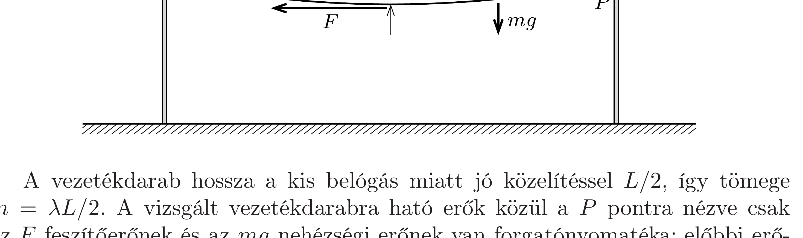

## Útmutatás

Rövid úton megkaphatjuk a feszítőerőt, ha a villanyvezeték alkalmas darabjára (ésszerú közelítések mellett) felírjuk a forgatónyomatékok egyensúlyát.

## Megoldás

A villanyvezeték tetszőleges darabja egyensúlyának feltétele, hogy a rá ható erők és forgatónyomatékok eredője nulla legyen. Vizsgáljuk a vezeték egyik $L / 2$ hosszúságú felének az egyensúlyát és írjuk fel a forgatónyomatékok eredőjét az ábrán látható $P$ felfüggesztési pontra!

A vezetékdarab hossza a kis belógás miatt jó közelítéssel $L / 2$, így tömege $m=\lambda L / 2$. A vizsgált vezetékdarabra ható erők közül a $P$ pontra nézve csak az $F$ feszítőerőnek és az $m g$ nehézségi erőnek van forgatónyomatéka; előbbi erőkarja $d$, az utóbbié pedig (szintén a $d \ll L$ reláció miatt) $L / 4$-nek vehető, így a forgatónyomatékok eredője:
\[
F d-m g \frac{L}{4}=0 .
\]
A tömegre vonatkozó összefüggést felhasználva közvetlenül adódik a villanyvezetékben ébredő (és a vezeték mentén közelítőleg állandó nagyságú) feszítőerő formulája:
\[
F=\frac{\lambda L^{2} g}{8 d} .
\]
