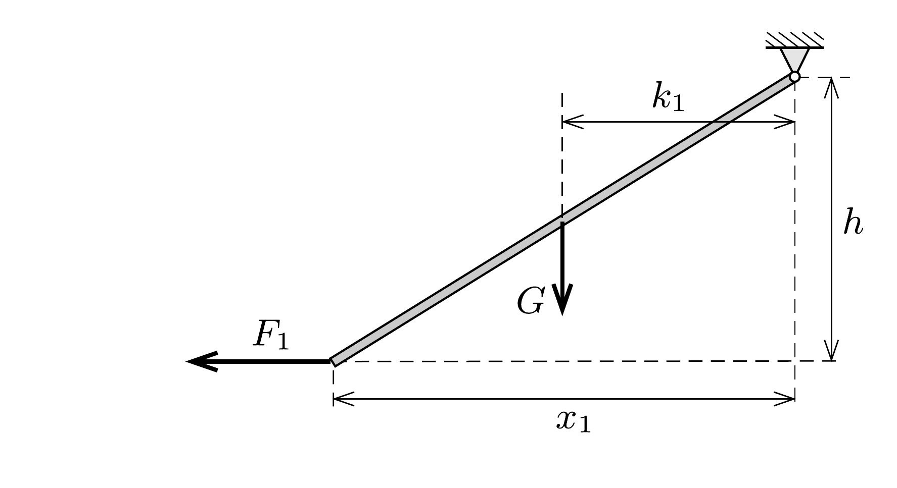
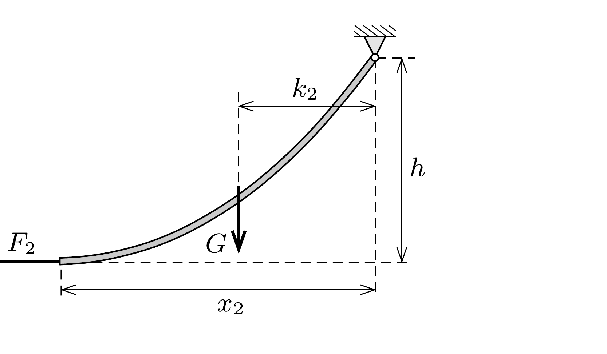

## Útmutatás

A feladat elemi úton, a kötél alakjának ismerete nélkül is megoldható. Vizsgáljuk meg, hogy mekkora vízszintes eró szükséges a mászórúd és a kötél esetén ahhoz, hogy végeik azonos magasságba kerüljenek.

## Megoldás

Képzeljük el, hogy a kötél és a mászórúd végét is ugyanolyan magasra emeljük (ehhez természetesen különböző, $F_{1}$ és $F_{2}$ nagyságú vízszintes erőre van szükség). Így mind a kötél, mind a rúd végpontjának a felfüggesztési ponthoz viszonyított magasságkülönbsége egyaránt $h$ értékú lesz. A kötél vízszintes irányú vetületének $x_{2}$ hossza (a kötél görbültsége miatt) biztosan kisebb, mint a rúd $x_{1}$ nagyságú vízszintes vetülete:
\[
x_{2}<x_{1} .
\]

A nehézségi erő karja (lásd az ábrát) a rúd esetében $k_{1}=x_{1} / 2$, a kötél esetében azonban nem számolható ki ilyen egyszerúen. A felfüggesztési ponthoz közeledve a kötél egyre meredekebbé válik, így az azonos hosszúságú vízszintes vetülettel rendelkező kötéldarabkák tömege annál nagyobb, minél közelebb vannak a felfüggesztési ponthoz. Emiatt a kötélre ható nehézségi erő karjáról biztosan állíthatjuk, hogy $k_{2}<x_{2} / 2$. A két erókar viszonya:
\[
k_{2}<k_{1} .
\]
A felfüggesztési pontra vonatkoztatott forgatónyomatékok egyensúlya a rúd és a kötél esetében:
\[
F_{1} h=G k_{1}, \quad F_{2} h=G k_{2},
\]
ahol $G$ a mászórúd és a kötél súlya. Az erőkarok viszonyából következik, hogy
\[
F_{2}<F_{1},
\]
tehát abban az esetben, ha a kötél és a rúd végpontját egyforma magasra emeljük, nagyobb eróvel kell tartanunk a mászórudat, mint a kötelet. Ha a rúdra ható erốt ezután fokozatosan lecsökkentjük a kötélnél alkalmazott $F_{2}$ értékre, a végpontja lejjebb kerül.

Azonos nagyságú vízszintes húzóerők esetén tehát (egyensúlyi állapotban) a kötél alsó vége magasabban helyezkedik el, mint a mászórúd legalsó pontja.
