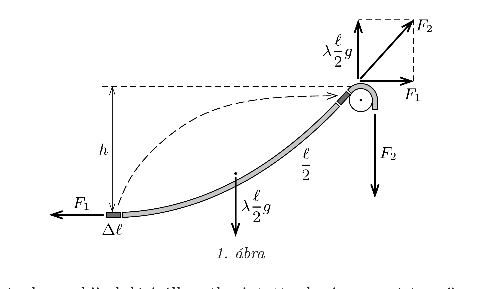
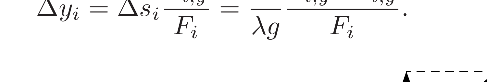
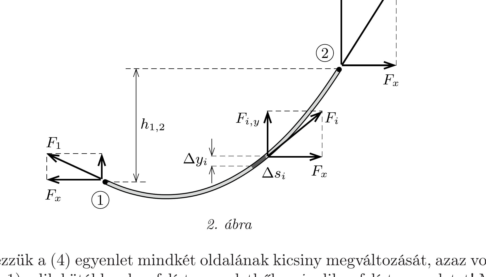
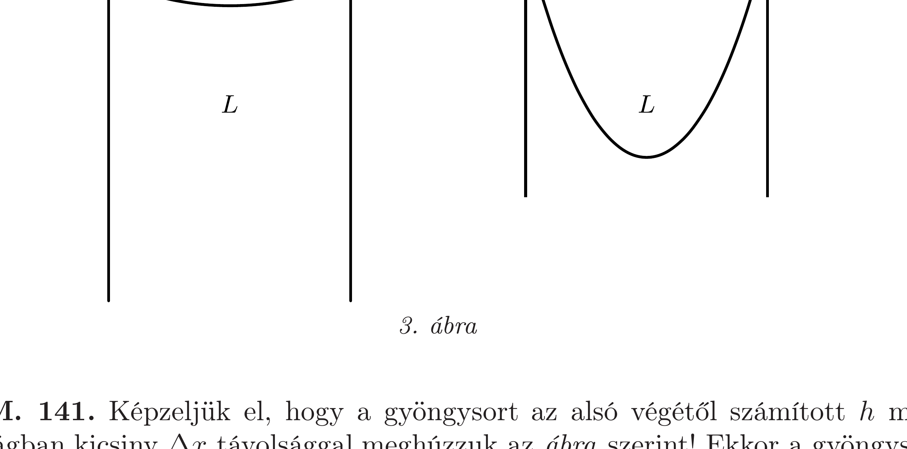

## Útmutatás

Megmutatható, hogy a kötél bármely két (1-es és 2-es jelú) pontjában - így például a középpontjában és a jobb oldali állócsigánál lévő pontjában - ébredő erők különbsége csak a pontok $h_{1,2}$ magasságkülönbségétől, valamint a kötél $\lambda$-val jelölt vonalmenti tömegsürúségétől függ:
\[
F_{2}-F_{1}=\lambda g h_{1,2} .
\]
Ennek belátásához vizsgáljuk meg, hogy milyen energiaváltozásokkal jár, ha gondolatban az 1-es pontnál a kötél egy kis darabkáját kivágjuk, majd a kivágott részt a 2-es pontban betoldjuk!

## Megoldás

I. megoldás. Jelöljük a kötél hosszegységre eső tömegét (vonalmenti súrúségét) $\lambda$-val! A kötél tetszőleges darabkája egyensúlyban van, ezért a kötelet feszítő eró́ vízszintes komponense a csigák közötti kötélrészen belül állandó. A kötélerő függőleges komponense helyről helyre változik: nagysága a kötél közepénél nulla, a csigáknál pedig éppen a belógó rész súlyának fele, $\lambda(\ell / 2) g$.

Kövessük az útmutatást, és gondolatban vágjunk ki a kötél közepéről egy kicsiny $\Delta \ell$ hosszúságú darabot, és toldjuk vissza azt az egyik csigánál a kötélbe! A kötél közepénél a szétvágott kötélrészek összehúzásánál (az 1. ábra jelöléseivel) $F_{1} \Delta \ell$ munkát kell végeznünk, a kis kötéldarabka felemeléséhez $\lambda \Delta \ell \cdot g h$ munkavégzésre van szükség, míg a csigánál való betoldáskor $-F_{2} \Delta \ell$ munkát kell végezni.

Végeredményben a kiindulási állapotba jutottunk vissza, ezért az összes végzett munkának zérusnak kell lennie:
\[
F_{1} \Delta \ell+\lambda \Delta \ell \cdot g h-F_{2} \Delta \ell=0 .
\]
Egyszerúsítés után ebbő̌l az
\[
F_{2}-F_{1}=\lambda g h
\]
összefüggésre jutunk. A fenti gondolatkísérletet a kötél tetszőleges két pontja között elvégezhetjük, ezért általánosan igaz, hogy két különböző pontban ébredő feszítőerók különbsége egyenesen arányos a pontok magasságkülönbségével.

Az $F_{2}$ eró és komponensei közötti kapcsolatot az ábráról olvashatjuk le:
\[
F_{2}^{2}=F_{1}^{2}+\left(\lambda \frac{\ell}{2} g\right)^{2} .
\]
A harmadik egyenletünket az a felismerés szolgáltatja, hogy a kétoldalt lelógó, $s$ hosszúságú kötélrészeket éppen az $F_{2}$ erő tartja:
\[
F_{2}=\lambda g s .
\]
Az (1)-(3) egyenletekből a lelógó kötéldarabok hosszára az
\[
s=\frac{\ell^{2}+4 h^{2}}{8 h}
\]
eredményt kapjuk.
II. megoldás. A kötelek, láncok egyensúlyánál általánosan is érvényes (1) összefüggéshez másképp is eljuthatunk. Ehhez osszuk fel a kötél csigák közötti szakaszát kicsiny, $\Delta s_{i}$ hosszúságú darabkákra $(i=1,2, \ldots, N)$, és jelöljük a kis darabkák két vége közötti magasságkülönbséget $\Delta y_{i}$-vel (2. ábra). Ha $F_{i, y}$ az $i$-edik kis darabka egyik (mondjuk jobb oldali) végpontjánál ható eró függőleges komponense, $F_{x}$ pedig az $i$-től független vízszintes komponens, akkor az eredő erő $F_{i}$ nagyságára felírhatjuk a Pitagorasz-tételt:
\[
F_{i}^{2}=F_{i, y}^{2}+F_{x}^{2}
\]
A kis kötéldarabkákra ható kötélerők eredője éppen a darabkák súlyával egyezik meg:
\[
F_{i+1, y}-F_{i, y} \equiv \Delta F_{i, y}=\lambda \Delta s_{i} g .
\]
Használjuk fel, hogy a kötélerő mindig érintő irányú:

Képezzük a (4) egyenlet mindkét oldalának kicsiny megváltozását, azaz vonjuk ki az $(i+1)$-edik kötéldarabra felírt egyenletből az $i$-edikre felírt egyenletet! Mivel $F_{x}$ a kötél mentén állandó,
\[
F_{i+1, y}^{2}-F_{i, y}^{2}=F_{i+1}^{2}-F_{i}^{2}
\]
amiből az
\[
F_{i, y} \Delta F_{i, y}=F_{i} \Delta F_{i}
\]
összefüggést kapjuk. Az utolsó lépésben felhasználtuk, hogy ha egy tetszőleges $f$ mennyiség kicsiny $\Delta f$ értékkel megváltozik, akkor $f$ négyzetének megváltozása:
\[
\Delta\left(f^{2}\right) \equiv(f+\Delta f)^{2}-f^{2}=2 f \Delta f+(\Delta f)^{2} \approx 2 f \Delta f .
\]

A (6) egyenlőség figyelembevételével (5) így írható:
\[
\Delta y_{i}=\frac{1}{\lambda g} \frac{F_{i} \Delta F_{i}}{F_{i}}=\frac{1}{\lambda g} \Delta F_{i} .
\]
Összegezzük a (7) egyenlet mindkét oldalát az ábrán látható 1-es és 2-es pontok között! Ekkor a következót kapjuk:
\[
h_{1,2}=\frac{1}{\lambda g}\left(F_{2}-F_{1}\right),
\]
ahol $h_{1,2}$ a vizsgált pontok magasságkülönbsége. Ezt az összefüggést a kötél középpontjára és a csigánál lévó pontjára alkalmazva $\left(h_{1,2}=h\right)$ éppen az (1) egyenletre jutunk. Innen a számolás az I. megoldásban leírt módon vihető végig.

Megjegyzés. A kötél $h$ belógása és a csigák közé eső $\ell$ kötélhossz egyértelmữen meghatározza a csigák $d$ távolságát. A kapott eredményből látszik, hogy adott $h$ és $\ell$ (azaz adott $d$ ) mellett minden esetben található olyan $s$ érték, ami biztosítja a kötél egyensúlyát. Érdekes eredményt kapunk akkor, ha a feladat kérdése helyett arra keressük a választ, hogy adott $d$ távolságban elhelyezkedő csigákra $L$ hosszúságú kötelet helyezve mekkora $h$ belógás esetén lehet a kötél egyensúlyban $(L=\ell+2 s)$ ? Felsőbb matematikai eszközökkel megmutatható, hogy $L / d<\mathrm{e}$ esetén (ahol e $\approx 2,718$ az Euler-féle szám) nincs a kötélnek egyensúlyi helyzete, $L / d>\mathrm{e}$ esetén viszont kettő is van (lásd a 3. ábrát). Az egyik (a kisebb belógáshoz tartozó) helyzet a kötél közepének kicsiny, függőleges irányú elmozdítására nézve stabil, míg a nagyobb $h$ értékhez tartozó egyensúlyi helyzet instabil.

