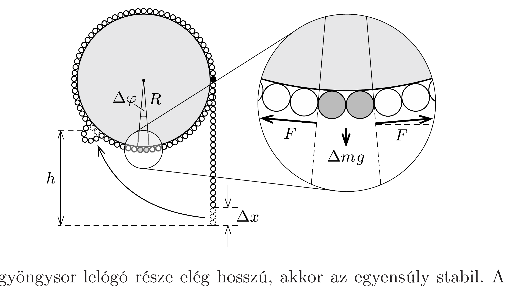

## Útmutatás

A gyöngysor két tetszőleges pontjában ható erők nagyságának különbsége arányos a pontok magasságkülönbségével (lásd az előzó feladatot). Ha a gyöngysor lelógó része elég hosszú, az egyensúly stabil. A lelógó rész hosszát csökkentve a kritikus érték elérésekor a gyöngysor a henger legalsó pontjánál kezd elválni a palásttól.

## Megoldás

Képzeljük el, hogy a gyöngysort az alsó végétől számított $h$ magasságban kicsiny $\Delta x$ távolsággal meghúzzuk az ábra szerint! Ekkor a gyöngysor szabad vége $\Delta x$ magassággal kerül feljebb. Ha a meghúzott pontban a gyöngysort feszítő erő $F(h)$, akkor a végzett munkánk $F(h) \Delta x$. Ez a munka teljes egészében a gyöngysor gravitációs helyzeti energiájának növelésére fordítódik, amit számíthatunk úgy, mintha a gyöngysor alján hiányzó részt $h$ magasságba emeltük volna:
\[
F(h) \Delta x=\lambda \Delta x \cdot g h,
\]
itt $\lambda$ a gyöngysor hosszegységre esó tömege. (A súrlódást a henger „sima felülete” miatt elhanyagoltuk.) Egyszerúsítés után azt kapjuk, hogy a gyöngysorban ébredő eró csak az alsó végétől számított $h$ magasságtól függ:
\[
F(h)=\lambda g h .
\]
Ez az eredmény azonos az előzó feladatban kapott összefüggéssel, mely szerint a (csak súrlódásmentes felületekkel érintkező) kötelek, láncok két tetszőleges pontjában ható erők nagyságának különbsége arányos a pontok magasságkülönbségével.

Ha a gyöngysor lelógó része elég hosszú, akkor az egyensúly stabil. A lelógó részt csökkentve azt tapasztaljuk, hogy egy kritikus $\ell$ hossznál az egyensúly instabillá válik, és a gyöngysor a henger legalsó pontjánál elkezd elválni a palásttól. Ez azt jelenti, hogy ebben a pontban a henger palástja által a gyöngysorra kifejtett nyomóeró nullára csökken. Tekintsük most a henger legalsó pontjánál található, kicsiny $\Delta \varphi$ középponti szöggel jellemezhető, $R \Delta \varphi$ hosszúságú gyöngysordarabkát (lásd az ábrát)! Erre az egyensúly feltétele:
\[
2 F \sin (\Delta \varphi / 2)=\lambda R \Delta \varphi \cdot g,
\]
ahol $F$ a gyöngysor feszítőereje a henger legalsó pontjánál. A kis szög miatt alkalmazhatjuk a $\sin (\Delta \varphi / 2) \approx \Delta \varphi / 2$ közelítést, így
\[
F=\lambda g R .
\]
Ezt az eredményt összevetve az (1) kifejezéssel azt kapjuk, hogy a gyöngysor akkor van egyensúlyban, ha az alsó végének és a henger legalsó pontjának $h$ magasságkülönbsége legalább $R$, azaz a lelógó rész keresett hossza $\ell \geq 2 R$.
