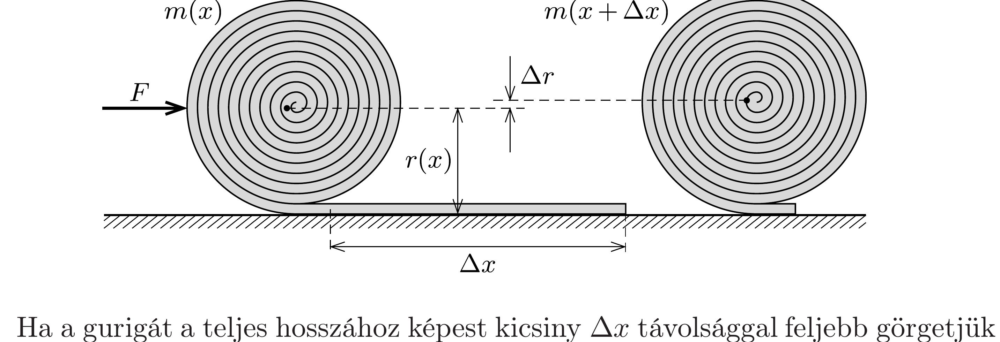

## Útmutatás

Használjuk a virtuális munka elvét, és vizsgáljuk meg, milyen energiaváltozások történnek, ha a valamennyire feltekert szőnyeget egy kicsit továbbgöngyölítjük.

## Megoldás

a) A guriga tömegközéppontja nem esik az alátámasztási pont fölé, így a nehézségi erő forgatónyomatéka görgeti ki a szőnyeget.
b) A szőnyeg $x$ hosszúságú darabjának feltekerésekor kialakuló szőnyegguriga $m(x)$ tömege egyenesen arányos a felgöngyölt rész hosszával:
\[
m(x)=\frac{M}{L} x,
\]
hiszen $x=L$ esetén a tömeg éppen $M$. A guriga keresztmetszetének területe is arányos $x$-szel, vagyis a guriga sugarára fennáll:
\[
r^{2}(x)=\frac{R^{2}}{L} x .
\]

A guriga egyensúlyát biztosító vízszintes $F(x)$ erőt a virtuális munka elvéből határozhatjuk meg:
\[
F(x) \Delta x=\Delta E_{\text {helyzeti }},
\]
ahol $E_{\text {helyzeti }}=m(x) g r(x)$ az $x$ hosszban felgöngyölt szőnyeg helyzeti energiája (ami megegyezik a teljes szőnyeg helyzeti energiájával is).

Ha a gurigát a teljes hosszához képest kicsiny $\Delta x$ távolsággal feljebb görgetjük az ábra szerint, a helyzeti energia megváltozása:
\[
\Delta E_{\text {helyzeti }}=m g \cdot \Delta r+\Delta m \cdot g r,
\]
amit az (1)-ből és (2)-ből adódó
\[
\frac{\Delta m}{m}=\frac{\Delta x}{x} \quad \text { és } \quad 2 \frac{\Delta r}{r}=\frac{\Delta x}{x}
\]
összefüggések felhasználásával
\[
\Delta E_{\text {helyzeti }}=\frac{3}{2} \frac{m g r}{x} \Delta x
\]
alakban is felírhatunk. Ezt (3)-mal összevetve, valamint (1)-et és (2)-t is felhasználva megkaphatjuk a szőnyegguriga egyensúlyban tartásához szükséges erőt a felgöngyölt rész $x$ hosszának függvényében:
\[
F(x)=\frac{3}{2} m(x) g \frac{r(x)}{x}=\frac{3 M g R}{2 L} \sqrt{\frac{x}{L}} .
\]
$x=L$ esetén ez a kifejezés megadja a kérdezett erő nagyságát:
\[
F=\frac{3 R}{2 L} M g .
\]
