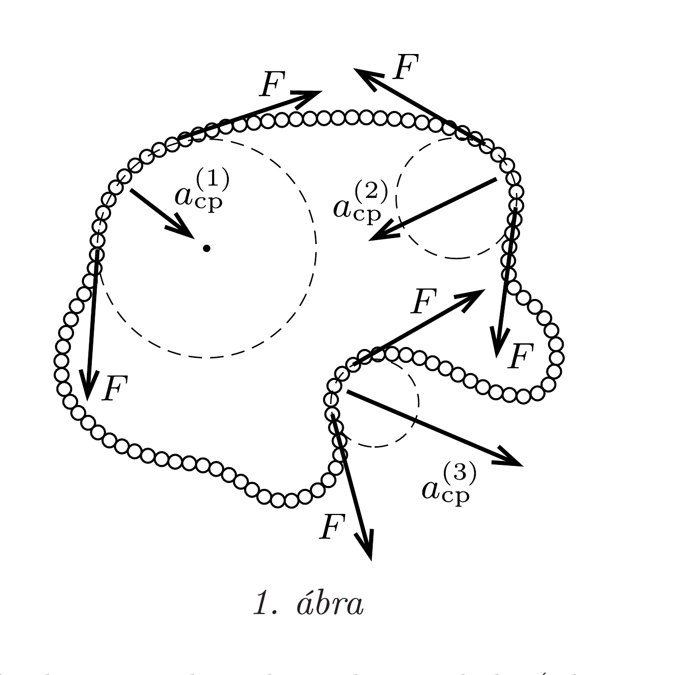
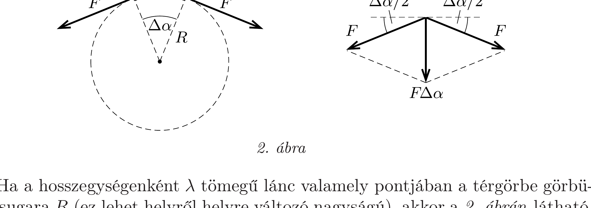

## Útmutatás

A nehézségi erőről a lánc tömegközéppontjával együttmozgó koordináta-rendszerben „megfeledkezhetünk”, a lánc ebből a koordináta-rendszerből nézve súlytalan (de nem tömegtelen!). Gondoljuk végig, hogy a lánc kicsiny, $R$ görbületi sugarú, $v$ sebességgel egyenletesen mozgó darabkájára ható erők milyen irányban akarják deformálni a lánc alakját.

Eláruljuk, hogy Feri sejtése helyes, a lánc megtartja eredeti alakját.

## Megoldás

Megmutatjuk, hogy tetszőleges alakú zárt térgörbe mentén egyenletes sebességgel mozgó lánc (hajlékony kötél) a súlytalanság állapotában akkor is fenntartja ezt a mozgását, ha semmiféle kényszerfeltételt (pl. láncvezetőket a kanyarokban) nem alkalmazunk.

Ha a hosszegységenként $\lambda$ tömegú lánc valamely pontjában a térgörbe görbületi sugara $R$ (ez lehet helyről helyre változó nagyságú), akkor a 2. ábrán látható, $R \Delta \alpha$ hosszúságú ( $\Delta m=\lambda R \Delta \alpha$ tömegú és $v^{2} / R$ gyorsulású) kicsiny láncdarabka mozgásegyenlete:
\[
\lambda R \Delta \alpha \frac{v^{2}}{R}=2 F \sin \frac{\Delta \alpha}{2},
\]
ahonnan a kis szögekre érvényes $\sin \Delta \alpha \approx \Delta \alpha$ formula felhasználásával az
\[
F=\lambda v^{2}
\]
összefüggést kapjuk. Ebben az egyenletben nem szerepel $R$, vagyis a görbület nagyságától függetlenül az érintőleges $F$ erők eredóje éppen akkora, amekkora az adott helyen a lánc „bekanyarodásához" szükséges. Ha a lánc egyenes, akkor egy
kis darabkájára ható eredő erő nulla. Minél jobban görbül a lánc, annál nagyobb lesz az egyes (kicsiny) darabkáira ható eredő erő, és az eredő eró iránya is éppen megfelelő („behorpadt” láncnál pl. kifelé mutat).

A lánc tehát az eredeti alakját és érintőleges sebességét megőrizve esik lefelé, éppen úgy, ahogy Feri sejtette.
