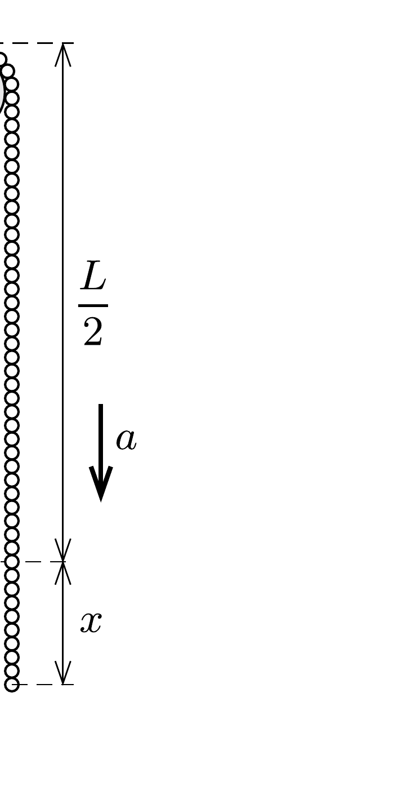

## Útmutatás

Számítsuk ki, mekkora eró feszíti a láncot, amikor éppen elválik a csigától (lásd a 143. feladatot). Használjuk fel az energiamegmaradás tételét is!

## Megoldás

A 143. feladat megoldása szerint egy hosszegységenként $\lambda$ tömegú, $v$ sebességü hajlékony kötelet (láncot)
\[
F=\lambda v^{2}
\]
eró feszít akkor, ha más testekkel nem érintkezik. Ez a feltétel a csigán átvetett láncnál akkor teljesül, amikor az egyre gyorsabb mozgás miatt éppen elválik a csigától, éppen lerepül róla.

Jelöljük a lánc elmozdulását $x$-szel, a bal, illetve jobb oldali rész gyorsulásának nagyságát pedig $a$-val. A két darab mozgásegyenlete:

\[
\begin{aligned}
& F-\lambda\left(\frac{L}{2}-x\right) g=\lambda\left(\frac{L}{2}-x\right) a, \\
& \lambda\left(\frac{L}{2}+x\right) g-F=\lambda\left(\frac{L}{2}+x\right) a .
\end{aligned}
\]
(Felhasználtuk, hogy a csiga mérete kicsi, így a lánc félkör alakú darabkájának tömege a lánc egészének tömege mellett elhanyagolható.)

A lánc sebességét az energiamegmaradás tételéből határozhatjuk meg. A kezdeti (elhanyagolhatóan kicsi sebességú) helyzethez viszonyítva a helyzeti energia annyival csökken, mintha egy $x$ hosszúságú láncdarab $x$-szel mélyebbre került volna:
\[
\lambda x^{2} g=\frac{1}{2} \lambda L v^{2} .
\]
A fenti egyenletekből az elmozdulás és a sebesség kiszámítható:
\[
x=\frac{1}{2 \sqrt{2}} L \approx 0,35 L, \quad v=\frac{\sqrt{L g}}{2} .
\]

A lánc tehát akkor válik el a csigától, amikor a teljes hosszának kb. 15\%-a még felfelé mozog, és a sebessége is kisebb annál, amennyit az energiatételből naivan $x=L / 2$ helyettesítéssel kapnánk. Ez a hibás érték a következő lenne:
\[
\sqrt{\frac{L g}{2}} \approx 0,71 \sqrt{L g} .
\]

Megjegyzés. Érdekesen alakul a lánc további mozgása. Miközben a lánc tömegközéppontja szabadon esik lefelé, a csigától elvált hurok fölfelé kezd emelkedni, méghozzá
egyre nagyobb sebességgel. A felfelé mozgó, egyre kisebb tömegú láncdarab sebessége (elvben) végtelenhez tart. (Ténylegesen a láncszemek és a csiga véges mérete, továbbá a közegellenállás miatt nem nő korlátlanul a sebesség.) A felfelé mozgó láncdarab mozgási energiája - a nagyon gyorsan növekvő sebessége ellenére - véges nagyságú marad, mert a tömege gyorsabban fogy, mint amilyen ütemben a sebessége növekszik. Ez a jelenség játszódik le a „karikás ostor” pattintásakor is: az ostor bizonyos (egyre kisebb hosszúságú) része egyre nagyobb sebességgel mozog, mígnem eléri a hangsebességet, és éles csattanással hangrobbanást hoz létre.
