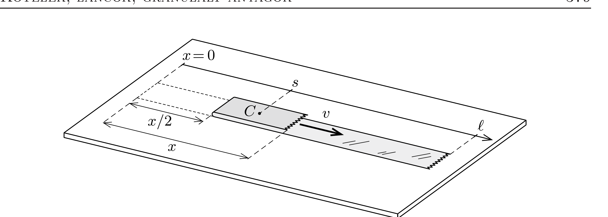

## Útmutatás

Igaz ugyan, hogy a celluxszalag mozgásban lévő részének minden pontja 10 cm/s sebességgel mozog, de a (tömeg)középpontjának sebessége ennél az értéknél kisebb!

## Megoldás

Jelöljük a szalag meghúzott végének pillanatnyi elmozdulását $x$-szel (lásd az ábrát), a hajlat elmozdulása ekkor $x / 2$, a mozgó rész $C$ középpontjának elmozdulása pedig $s=\frac{3}{4} x$. Ezek szerint a középpont sebessége
\[
\frac{\Delta s}{\Delta t}=\frac{3}{4} \cdot \frac{\Delta x}{\Delta t}=7,5 \frac{\mathrm{~cm}}{\mathrm{~s}} .
\]

Megjegyzés. A szalag impulzusa (ami megegyezik a mozgásban lévő részének impulzusával) nem kapható meg úgy, hogy a mozgásban lévő rész tömegközéppontjának sebességét megszorozzuk a mozgó rész sebességével! Ennek a furcsaságnak az oka, hogy a szalag mozgásban lévő része változó tömegü.

Változó tömegú testek impulzusa többféle módon is kiszámítható, például úgy, hogy a testet kiegészítjük egy nagyobb, állandó tömegü rendszerré, és ezen rendszer tömegközéppontjának sebességét megszorozzuk a rendszer teljes tömegével. Esetünkben ez az állandó $m$ tömegú rendszer az egész szalag (melynek hosszát jelöljük $\ell$-lel). A szalag tömegközéppontjának koordinátája az ábrán látható koordináta-rendszerben a mozgásban lévő $m(x)=m x /(2 \ell)$ tömegú rész és a maradék (nyugalomban lévő) rész adataiból számítható:
\[
x_{\mathrm{tkp}}=\frac{\frac{1}{2}\left[\frac{x}{2}+x\right] \cdot m(x)+\frac{1}{2}\left(\frac{x}{2}+\ell\right) \cdot[m-m(x)]}{m}=\frac{\ell}{2}+\frac{x^{2}}{4 \ell} .
\]
Ennek idő szerinti deriváltja és az össztömeg szorzata:
\[
p=m \frac{x \dot{x}}{2 \ell}=m(x) \cdot v,
\]
ami - mint az várható volt, - az egész rendszer impulzusával, egyúttal a mozgásban lévő rész impulzusával egyenlő.
