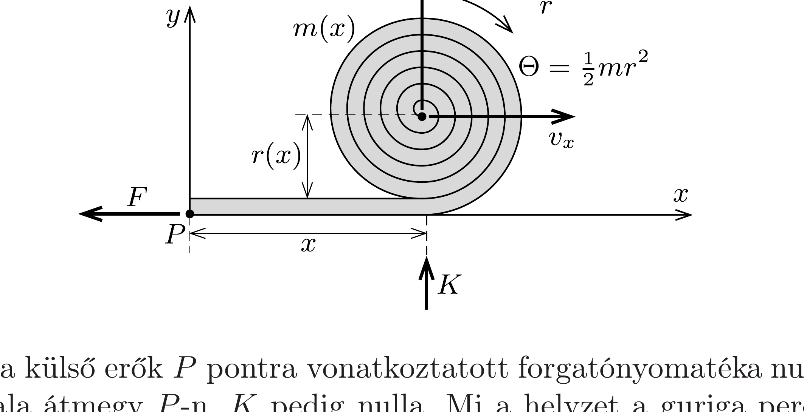

## Útmutatás

Lapozzuk fel a 148. feladatot! Ebből megtanulhatjuk, hogy bizonyos (változó tömegû́) rendszereknél az impulzus, a tömeg és a tömegközéppont sebessége között nem olyan egyszerú a kapcsolat, mint azt korábban megszoktuk.

## Megoldás

Kövessük végig, miként számolhatott Péter! A guriga (pillanatról pillanatra változó) tömege a megtett út függvényében:
\[
m(x)=M\left(1-\frac{x}{L}\right),
\]
a sugara (a guriga keresztmetszetének területe és a tömeg arányosságából):
\[
r(x)=R \sqrt{1-\frac{x}{L}},
\]
a vízszintes irányú sebessége (az energia megmaradásából)
\[
v_{x} \equiv \frac{\mathrm{~d} x}{\mathrm{~d} t}=v_{0} \frac{1}{\sqrt{1-\frac{x}{L}}} .
\]
( $v_{x}$ számításánál felhasználtuk, hogy $R \ll L$ miatt a függőleges irányú sebesség sokkal kisebb, mint a vízszintes, emiatt a neki megfelelő energiajárulékot elhanyagolhatjuk.)

A guriga középpontjának függőleges irányú sebességkomponense:
\[
v_{y}=\frac{\mathrm{d} r}{\mathrm{~d} t}=\frac{\mathrm{d} r}{\mathrm{~d} x} \cdot \frac{\mathrm{~d} x}{\mathrm{~d} t}=\frac{\mathrm{d} r}{\mathrm{~d} x} \cdot v_{x}=-\frac{R v_{0}}{2 L} \frac{1}{1-\frac{x}{L}} .
\]
(A negatív előjel arra utal, hogy a középpont $x$ növekedtével egyre mélyebbre kerül.) Az ebből számolható impulzuskomponens:
\[
p_{y}=m(x) \cdot v_{y}(x)=-\frac{M R v_{0}}{2 L} .
\]
Mivel ez a mennyiség időben állandó, az impulzustételből azt a - talán - meglepő eredményt kapjuk, hogy $K=0$, vagyis a talaj (a guriga elhanyagolhatóan kicsi súlyán kívül) nem fejt ki erốt a túzoltófecskendőre.

Eszerint a külső erők $P$ pontra vonatkoztatott forgatónyomatéka nulla, hiszen $F$ hatásvonala átmegy $P-\mathrm{n}, K$ pedig nulla. Mi a helyzet a guriga perdületével? Ha helyes Péter számolása, a teljes impulzusmomentumnak időben állandónak kell lennie.

A $P$ pontra vonatkoztatott perdület két részből tevődik össze: a guriga $N_{1}$ sajátperdületéből és a tömegközéppont mozgásából származó $N_{2}$ pályaperdületből. A sajátperdület (ha a guriga forgási irányát tekintjük pozitívnak, és kihasználjuk, hogy a guriga tisztán gördülése miatt $\omega=v_{x} / r$ )
\[
N_{1}=\Theta \omega=\frac{1}{2} m r^{2} \cdot \omega=\frac{1}{2} m r v_{x}=\frac{1}{2} M R v_{0}\left(1-\frac{x}{L}\right) .
\]
Ez időben változó mennyiség, hiszen $x$ változik. A pályaperdület
\[
N_{2}=p_{x} \cdot r-p_{y} \cdot x=m r v_{x}-x m v_{y}=M R v_{0}\left(1-\frac{x}{L}\right)+M R v_{0} \cdot \frac{x}{2 L},
\]
a rendszer teljes perdülete
\[
N_{1}+N_{2}=M R v_{0}\left(\frac{3}{2}-\frac{x}{L}\right) \neq \text { állandó. }
\]

Ezek szerint nem érvényes a perdületváltozásra vonatkozó egyenlet (perdülettétel) a kitekeredó fecskendőre! - állítja Péter.

Pálnak más a véleménye: szerinte a guriga (és az egész rendszer) függőleges irányú impulzusát másképp kell számolni, mert $p_{y} \neq m(x) \cdot v_{y}$.

Valóban, az impulzust úgy is megkaphatjuk (és úgy biztosan helyesen kapjuk meg), hogy kiszámítjuk a teljes ( $M$ tömegǘ) rendszer tömegközéppontjának függőleges komponesét, majd képezzük ezen mennyiség $M$-szeresének időbeli változási sebességét. Az eredmény:
\[
p_{y}^{(\text {helyes })}=\frac{\mathrm{d}}{\mathrm{~d} t}\left[\frac{m(x) r(x)}{M}\right] \cdot M=M R v_{x} \frac{\mathrm{~d}}{\mathrm{~d} x}\left(1-\frac{x}{L}\right)^{3 / 2}=-\frac{3}{2} \frac{M R v_{0}}{L} .
\]
Ez háromszor nagyobb, mint a naiv módon számított $m \cdot v_{y}$ mennyiség!
Ezzel - a helyesen számolt - impulzussal a pályaperdület
\[
N_{2}^{(\text {helyes })}=M R v_{0}\left(1-\frac{x}{L}\right)+M R v_{0} \cdot \frac{3 x}{2 L},
\]
a rendszer teljes impulzusmomentuma pedig
\[
N_{1}+N_{2}^{\text {(helyes) }}=\frac{3}{2} M R v_{0}=\text { állandó. }
\]

Megnyugodhatunk, a gurigára (erre a változó tömegú testre) is érvényes a perdülettétel, csak éppen helyesen (jóllehet szokatlan módon) kell számolnunk a rendszer impulzusát, és vele együtt a pályaperdületet.

Megjegyzések. 1. A helyesen számolt függőleges impulzus is időben állandó, tehát Péter következtetése, miszerint $K=0$, helytálló.
2. A guriga vízszintes mozgásának tanulmányozásánál a $p_{x}=m(x) \cdot v_{x}(x)$ képletet alkalmazta Péter is és Pál is, pedig - mint láttuk - a változó tömegú rendszereknél ez nem biztos, hogy igaz. Szerencsére azonban az eredmény helyes, ez Pál módszerével (az egész rendszer tömegközéppontjának $x$ koordinátáját az idő szerint deriválva) belátható.
