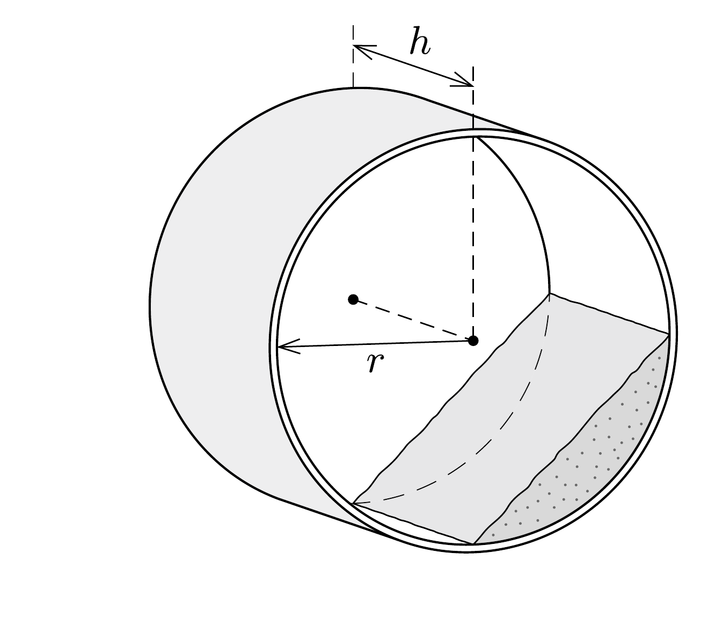
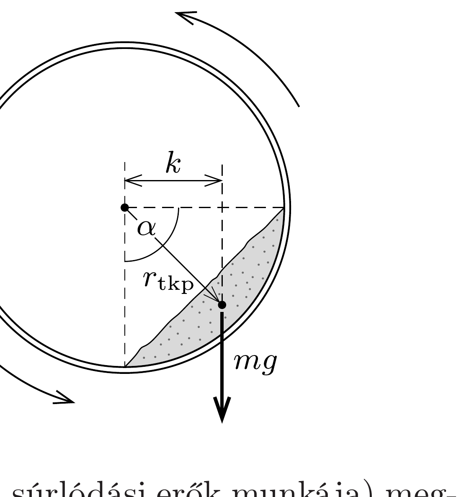

## Útmutatás

A betonkeverőhöz hasonló szerkezet forgatásához szükséges mechanikai munka teljes egészében hővé alakul. A munka kiszámításához szükségünk lesz a homok „rézsűszögére”, amire - hétköznapi tapasztalataink alapján - becslést adhatunk.

\section*{Folyadékok és gázok mechanikája}

## Megoldás

Ha a henger elég lassan forog (a feladatban 2 másodperc alatt fordul körbe, és ez elég lassúnak tekinthető), akkor a homok a hengerben valamennyire „felmászik” a forgás irányának megfeleló oldalon, és közelítőleg egy hengerszelet térfogatát tölti ki (lásd az ábra bal oldalát).

A hőmérséklet változását a homok $m$ tömege, $c$ fajhője és a rajta végzett súrlódási munka ismeretében tudnánk meghatározni: $\Delta T=W_{\text {súrl }} / c \cdot m$. A homok tömege adott $(m=100 \mathrm{~kg})$, fajhőjét táblázatból (a hozzá hasonló anyagok, pl. a kvarcüveg vagy a porcelán adatainak felhasználásával) J/(kgK) egységekben 700-800 közötti értékre becsülhetjük.

A homok mozgásának részletes leírása (és ennek ismeretében a súrlódási munka kiszámítása) reménytelenül bonyolult feladat lenne. Szerencsére erre nincs szükség! Elegendő azt észrevenni, hogy az egyenletesen forgatott hengerben a homok elóbb-utóbb állandósult (stacionárius) állapotba kerül. A homok egyes darabkái mozognak (áramlanak) ugyan, de a homok egésze olyan alakot vesz fel, amelynek határa időben nem változik. Emiatt a homok tömegközéppontja mindig ugyanott, a henger forgástengelyétől vízszintes irányban valamekkora $k$ távolságra helyezkedik el (lásd az ábra jobb oldalát).

A homok belső energiájának növekedése (azaz a súrlódási erők munkája) megegyezik a henger egyenletes forgatása során végzett munkával, ez utóbbi pedig a hengerre kifejtendő $m g \cdot k$ forgatónyomatéknak és a henger $\Delta \varphi$ szögelfordulásának szorzatával egyenlő:
\[
W_{\text {súrl }}=m g k \cdot \Delta \varphi .
\]
A 10 perc alatti szögelfordulás
\[
\Delta \varphi=2 \pi \cdot 0,5 \mathrm{~s}^{-1} \cdot 600 \mathrm{~s}=1885 \mathrm{rad},
\]
a nehézségi erő nagysága pedig
\[
m g=100 \mathrm{~kg} \cdot 9,81 \frac{\mathrm{~m}}{\mathrm{~s}^{2}}=981 \mathrm{~N} .
\]

Hátravan még a nehézségi erő $k$ karjának kiszámítása. Becsüljük meg először a tömegközéppont és a forgástengely $r_{\text {tkp }}$ távolságát! Felhasználjuk, hogy egy $h$ hosszúságú, $r$ sugarú henger $\alpha$ nyílásszögú szeletének térfogata
\[
V=\frac{1}{2} h r^{2}(\alpha-\sin \alpha) .
\]
Jelen esetben $h=10 \mathrm{dm}, r=5 \mathrm{dm}$. A hengerben lévő homok térfogatát a tömegéből és $\varrho=1,4 \mathrm{~kg} / \mathrm{dm}^{3}$-nek becsült sứrúségéből is meghatározhatjuk:
\[
V=\frac{m}{\varrho} \approx 70 \mathrm{dm}^{3} .
\]
(A homok súrúsége a homok összetételétől, „lazaságától” és nedvességtartalmától is függ, de mindenképpen kisebb, mint a tömör kvarc táblázatban megtalálható $2,65 \mathrm{~kg} / \mathrm{dm}^{3}$-es súrúsége.) A térfogat (2) becsült értékét (1)-be helyettesítve, majd az $\alpha$-ra vonatkozó transzcendens egyenletet numerikusan megoldva $\alpha \approx 90^{\circ}$, illetve $r_{\mathrm{tkp}} \approx 4 \mathrm{dm}$ adódik.

Vajon hogyan helyezkedik el a homokkal kitöltött hengerszelet síkja a henger tengelyén átmenó függőleges síkhoz képest? Mindennapi tapasztalatból (homokozó, homokóra) tudjuk, hogy a (száraz) homokból kb. 45°-os „rézsúszög” alakítható ki, ezért jogosan tekinthetjük úgy, hogy az állandósult mozgású homokgörgeteg legfelső pontja jelen esetben is a henger tengelyével kb. azonos magasságba kerül. Emiatt a keresett erókar nagysága
\[
k \approx r_{\mathrm{tkp}} \cdot \sin 45^{\circ} \approx 2,8 \mathrm{dm},
\]
a súrlódási munkára pedig mintegy 520 kJ-t kapunk. Ezt felhasználva és a homok fajhőjét 800 J/(kgK)-nek véve kapjuk:
\[
\Delta T \approx 6,5^{\circ} \mathrm{C} .
\]
Mivel a homok súrúsége és fajhője is mintegy 10\%-ra határozatlan mennyiség, a homok dinamikus rézsúszöge is rejt ekkora bizonytalanságot, helyesnek tekinthetünk minden olyan becslést, amely mintegy 20\%-kal tér el $\Delta T$ fenti értékétől, vagyis 5 és 8 fok közé esik.

\section*{Folyadékok és gázok mechanikája}
