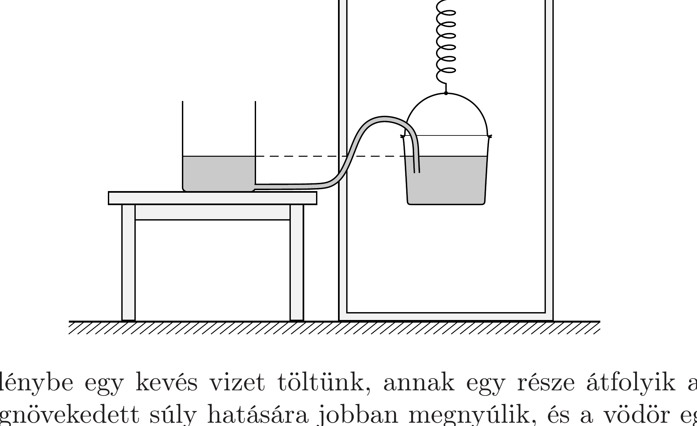

## Útmutatás

Többféle megoldás is elképzelhető. Az egyikben egy könnyen nyújtható rugó a kulcsszereplő.

## Megoldás

Rögzítsünk egy könnyen nyújtható rugót a fekete doboz tetejéhez, és a rugó másik végére akasszunk egy vödröt. A dobozba bevezetett csövet - egy hajlékony csatlakozón keresztül - vezessük be a vödörbe.

Ha az edénybe egy kevés vizet töltünk, annak egy része átfolyik a vödörbe, a rugó a megnövekedett súly hatására jobban megnyúlik, és a vödör egy keveset lesüllyed. Ha ez a süllyedés nagyobb, mint a vödörbe került víz magassága, akkor a vödörben lévő víz szintje a fekete doboz aljához képest lesüllyed, és ugyanezt kell tennie az edényben lévő víz szintjének is (hiszen közlekedőedényről van szó). A folyamat megfordítható: ha az edénybő́l kimerünk valamennyi vizet, akkor a vízszint megemelkedik!
