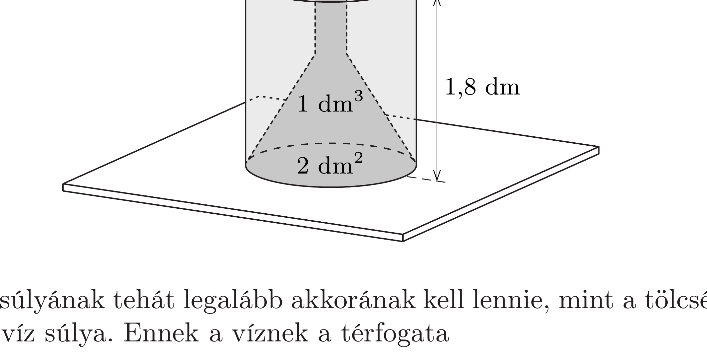

## Útmutatás

Vegyük körül gondolatban a tölcsért egy vele azonos alapterületü hengerrel, amibe annyi vizet öntünk, hogy elérje a tölcsérben lévő víz szintjét. Mekkora eróvel hat ekkor a víz a tölcsérre?

## Megoldás

Gondolatban vegyük körül a tölcsért egy, a tölcsér alapjával megegyező alapterületú hengerrel, majd töltsünk a hengerbe az ábra szerint annyi vizet, hogy éppen a tölcséren belüli víz szintjéig érjen. Ekkor a tölcsért a belsejében elhelyezkedő víz ugyanakkora erővel nyomja felfelé, mint amekkora eróvel a rajta kívül lévő víz nyomja lefelé.

A tölcsér súlyának tehát legalább akkorának kell lennie, mint a tölcséren kívül elhelyezkedő víz súlya. Ennek a víznek a térfogata
\[
1,8 \mathrm{dm} \cdot 2 \mathrm{dm}^{2}-1 \mathrm{dm}^{3}=2,6 \mathrm{dm}^{3},
\]
azaz 2,6 kg tömegú tölcsér éppen megfelelő. (A tölcsért hallgatólagosan vékony falúnak tekintettük, de a végeredmény ettől függetlenül is helyes.)
