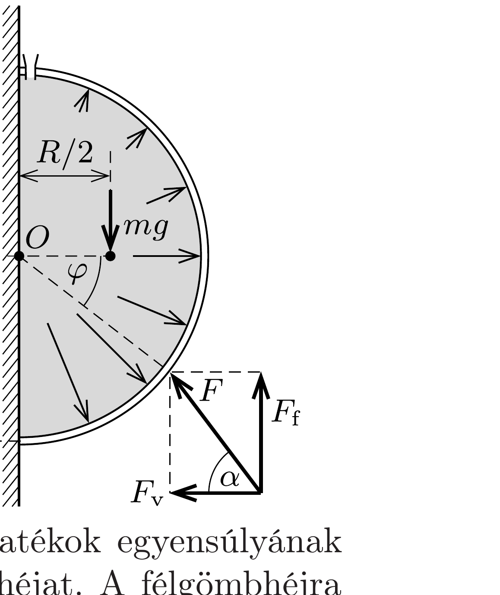

## Útmutatás

Használjuk fel, hogy a félgömb alakú folyadékrészre ható erők eredője nulla. A támadáspont meghatározásakor vegyük figyelembe, hogy a forgatónyomatékok összegének is nullának kell lennie.

## Megoldás

A félgömbhéjra kifejtett erónek két eróvel kell egyensúlyt tartania: a félgömbhéj súlyával, illetve a folyadék hidrosztatikai nyomásából származó eróvel. Számítsuk ki ezen erők vízszintes és függőleges komponenseit!

A függőleges irányban ható erók: a félgömbhéj $m g$ súlya, illetve a folyadék $M g=\frac{2}{3} R^{3} \pi \varrho g$ súlya (a továbbiakban $M$-mel a folyadék tömegét jelöljük). Ezen
két erő összegével megegyező nagyságú, felfelé irányuló az általunk kifejtendő külsó eró $F_{\mathrm{f}}$ függőleges komponense:
\[
F_{\mathrm{f}}=(m+M) g .
\]

Vízszintes irányban a folyadék éppen akkora eróvel nyomja a félgömbhéjat, mint amekkorával a falat (hiszen a folyadékra ható összes erő eredője nulla). Ez utóbbi viszont az átlagos hidrosztatikai nyomás $(\varrho g R)$ és a kör területének szorzataként számítható ki. Az általunk kifejtendő erő vízszintes összetevőjének is ugyanekkorának kell lennie, tehát $F_{\mathrm{v}}=R^{3} \pi \varrho g$, ami a folyadék tömegével is kifejezhető:
\[
F_{\mathrm{v}}=\frac{3}{2} M g .
\]
A félgömbhéjra kifejtendő eredő erő ezek szerint
\[
F=\sqrt{F_{\mathrm{v}}^{2}+F_{\mathrm{f}}^{2}}=M g \sqrt{\frac{9}{4}+\left(1+\frac{m}{M}\right)^{2}}
\]
nagyságú, iránya pedig
\[
\alpha=\operatorname{arctg} \frac{F_{\mathrm{f}}}{F_{\mathrm{v}}}=\operatorname{arctg} \frac{2(m+M)}{3 M}
\]
szöget zár be a vízszintessel (lásd az ábrát).

A szükséges külső erő támadáspontját a forgatónyomatékok egyensúlyának feltételéből lehet meghatározni. Tekintsük csak a félgömbhéjat. A félgömbhéjra ható eróket az ábrán látható módon vegyük fel: a keresett támadáspontban ható külső erő vízszintes és függőleges összetevőit, a félgömbhéj súlyát (a súlypont a szimmetriatengelyen, a sugár felénél van), továbbá a félgömbhéjban lévó folyadék hidrosztatikai nyomásából származó eróket (melyek a félgömbhéj belső felületén oszlanak el). Vegyük észre, hogy a folyadék által a félgömbhéjra kifejtett erők olyanok, hogy a gömb $O$ középpontjára vonatkoztatott eredő forgatónyomatékuk nulla (hiszen minden egyes kis felületdarabkára sugárirányú erót fejt ki a folyadék). Ezért érdemes a forgatónyomatékokat a gömb középpontjára vonatkoztatni. A támadáspont helyét az ábrán látható $\varphi$ szöggel jellemezzük. A forgatónyomatékok egyensúlyából a következő összefüggést kapjuk:
\[
\left(1+\frac{M}{m}\right) \cos \varphi-\frac{1}{2}-\frac{3 M}{2 m} \sin \varphi=0 .
\]
Ez az egyenlet $\sin \varphi$-re vagy $\cos \varphi$-re másodfokú, ami a tömegek arányának ismeretében megoldható.

Megjegyzések. 1. Ha a félgömbhéj sokkal könnyebb, mint a benne lévó folyadék (vagyis $m \ll M$ ), akkor $F \approx 1,8 M g$ és $\alpha \approx \varphi \approx 33,7^{\circ}$. A másik $(m \gg M)$ határesetben $F \approx m g$, $\alpha \approx 90^{\circ}$ és $\varphi \approx 60^{\circ}$.
2. Ha a félgömb alakú folyadékot és a félgömbhéjat egyetlen testnek tekintjük, majd a forgatónyomatékok egyensúlyát erre a testre írjuk fel, a külső erő támadáspontjára
természetesen a korábban számítottal megegyező eredményt kapjuk. Ebben az esetben a víz és a félgömbhéj súlyának forgatónyomatéka mellett a fal által a folyadékra kifejtett nyomóerők járulékát is figyelembe kell vennünk. Vigyázat: igaz ugyan, hogy a folyadék a falat akkora nagyságú eróvel nyomja, mintha a nyomás mindenhol a kör középpontjánál mérhető́ értékú lenne, ez azonban még nem jelenti azt, hogy a folyadék által kifejtett eredő eró a körlap $O$ középpontjában hatna. A körlap alsó felén nagyobb a nyomás, mint a felsőn, emiatt a kör vízszintes átmérőjére vonatkoztatott forgatónyomaték nem lehet nulla.
