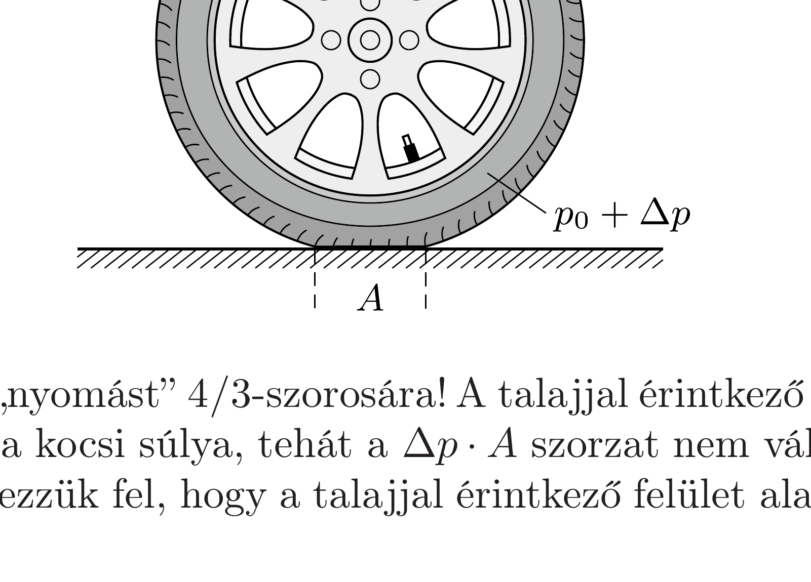

## Útmutatás

A nyomás növelésekor csökken a kerekek és a talaj érintkezési felülete, emiatt a kerék elfordításakor ébredó súrlódási eró forgatónyomatéka kisebb lesz.

## Megoldás

Jelöljük a kerekekben lévő levegő túlnyomását $\Delta p$-vel. (Az elterjedt szóhasználat szerint ezt a túlnyomást nevezik a kerék „nyomásának”, a külső légköri nyomást nem számítják hozzá.) Ha a gépkocsi egy kerékre eső súlya $G$, akkor a kerék annyira lapul be, hogy a talajjal érintkező $A$ felület és a $\Delta p$ túlnyomás szorzata éppen $G$ legyen.

Növeljük meg a „nyomást” 4/3-szorosára! A talajjal érintkező felület ekkor 3/4ére csökken, hiszen a kocsi súlya, tehát a $\Delta p \cdot A$ szorzat nem változik. Az egyszerúség kedvéert tételezzük fel, hogy a talajjal érintkező felület alakja nem változik,
csak lineáris mérete csökken minden irányban $\sqrt{3 / 4}$-szeresére. A kormányt elforgatva a talajhoz szorított gumifelület elegendően nagy forgatónyomaték esetén megcsúszik. Gondolatban feloszthatjuk a behorpadt gumifelületet kicsiny darabkákra, és a teljes forgatónyomatékot az egyes darabkákra ható „elemi” súrlódási erők forgatónyomatékainak összegeként számíthatjuk. A kerék felfújása után ezen darabkák mindegyike $\sqrt{3 / 4}$-szer közelebb kerül a talajjal való érintkezési felület „középpontjához", az elemi súrlódási erők karja tehát ugyanilyen arányban csökken. Mivel a behorpadt gumifelület egyes darabkáit a talajhoz nyomó eró nem változik (hiszen a felületük ugyanolyan arányban csökken, ahogy $\Delta p$ növekszik), a darabkákra ható elemi súrlódási erők is ugyanakkorák maradnak, így a megcsúszáshoz szükséges forgatónyomaték $\sqrt{3 / 4} \approx 0,87$-szerese lesz az eredetinek. A kormány elforgatásához szükséges eró tehát kb. 13\%-kal lecsökken.

A fenti gondolatmenet során felhasználtuk, hogy a talajjal érintkező gumifelület méretarányosan változik. A valóságban ez nem egészen igaz! A gépkocsi gumiabroncsát úgy alakítják ki, hogy a felfekvő felület keresztirányú mérete nagyjából ugyanakkora a „puha” guminál, mint a keményre felfújt kerék esetében; az $A$ felület változása a hosszanti, nyomvonallal párhuzamos méret változásából adódik. Ha a kerék nagyon keskeny (vonalszerú) lenne, akkor a 3/4-szeres területcsökkenés 3/4-szeres lineáris méretváltozást, tehát 25\%-os kormányerő-csökkenést eredményezne. A valóság a két szélsőséges eset, tehát a 13\% és a 25\% között, hozzávetőlegesen 20\%-nál lehet.
