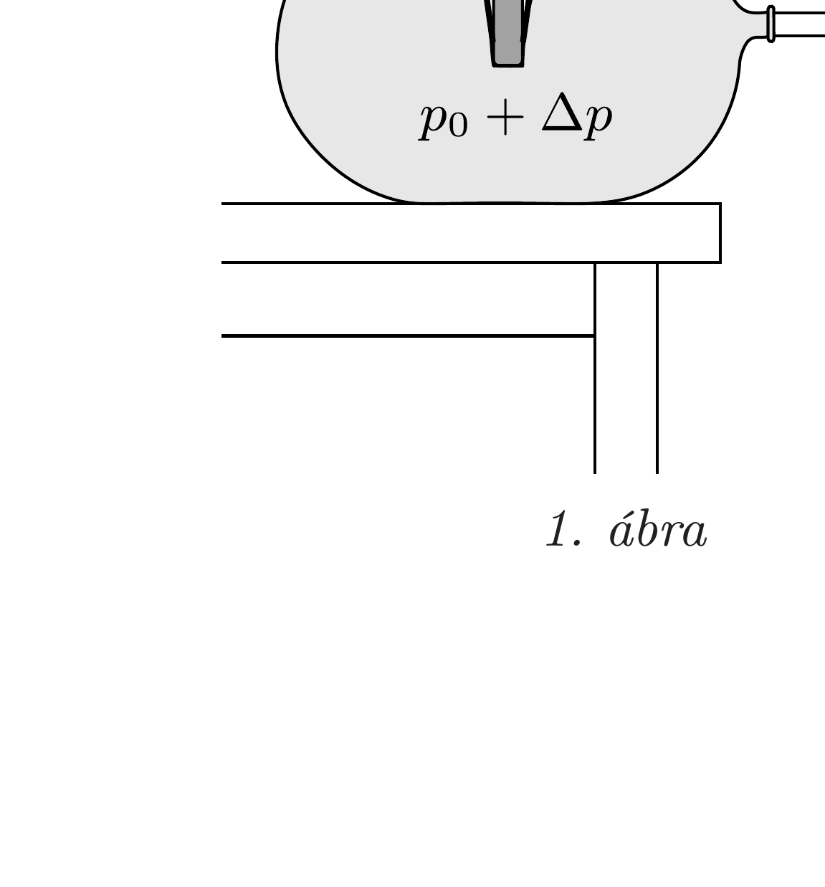
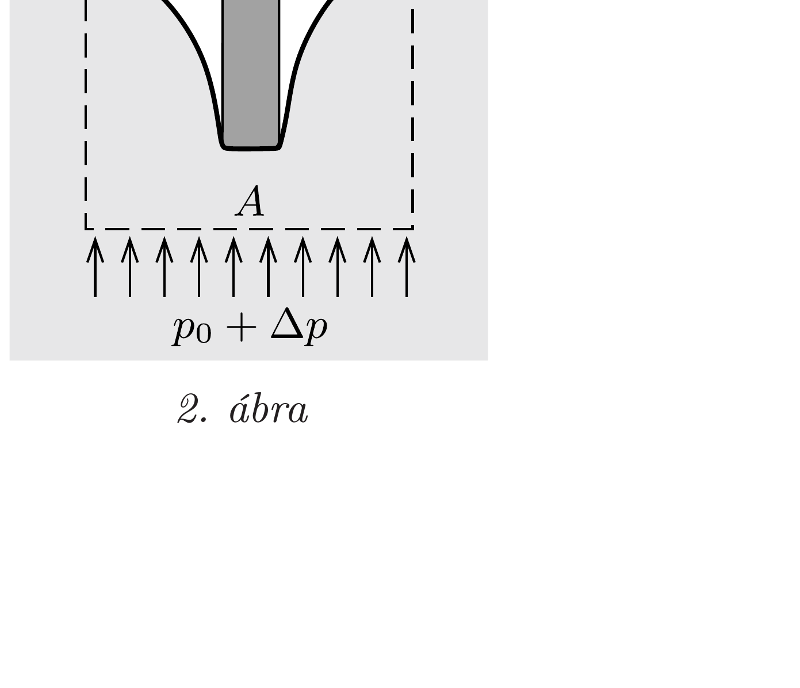

## Útmutatás

Hibás az a gondolat, hogy a végállapotban a lufiban lévő túlnyomás és a rúd keresztmetszet-területének szorzata egyenlő a rúd súlyával. A rúd alsó végére ugyanis nem csak a lufiban lévő túlnyomásból származó nyomóerő hat, hanem a lufi falában ébredő rugalmas eró is!

## Megoldás

Kezdetben a lufiban a túlnyomás 10 cm vízoszlop hidrosztatikai nyomásával egyezik meg. A vasrúd óvatos leengedése után akkor csordulna ki a víz a manométerből, ha a túlnyomás elérné az 50 „vízcentimétert”, azaz kb. 5 kPa-t.

Az 50 cm hosszú és 2 cm vastag hengeres vasrúd súlya 12 N. Ha ezt a súlyt a rúd keresztmetszetének területével elosztjuk (arra gondolva, hogy a rúd csak a végével nyomja a lufit), kb. 40 kPa-t kapunk, vagyis a víz kicsordulásához szükséges túlnyomás sokszorosát. Ennek ellenére a víz mégsem csordul ki a manométerből! Ha ugyanis óvatosan engedjük a vasrudat a lufiba süllyedni, a lufi fala az 1. ábrán látható módon behorpad, és a rudat nemcsak a $\Delta p$ túlnyomásból származó erố, hanem a megfeszülő gumiban ébredő $F$ erők is tartják.

Megmutatjuk, hogy a lufiban a nyomás nem növekszik jelentősen, csak a lufi alakja változik meg. A $\Delta p$ túlnyomást a 2. ábrán látható, $A$ alapterületü, felül behorpadt hengeres térrész erőegyensúlyából becsülhetjük meg. Mivel most a gumiban ébredő erőnek függőleges összetevője nincs, az $m g=\Delta p \cdot A$ összefüggésből (az $A$ alapterületet kb. $1 \mathrm{dm}^{2}$-nek becsülve)
\[
\Delta p=\frac{12 \mathrm{~N}}{1 \mathrm{dm}^{2}} \approx 1,2 \mathrm{kPa}
\]
adódik, ami az eredetinél csak 2 cm-rel nagyobb, 12 cm-es vízszintkülönbségnek felel meg. Eredményünk nem függ lényegesen az $A$ terület becsült értékétől: felevagy harmadakkora területet beírva sem éri el a túlnyomás a víz kicsordulásához szükséges értéket.

Ez a becslés egybevág azzal a tapasztalattal is, hogy egy lufit „tüdővel” könnyen fel lehet fújni. (A tüdőnkben lévő túlnyomás a légköri nyomás néhány százalékának felel meg, különben a mellkasunk relatíve nagy felületére nagyon nagy eró hatna.)
