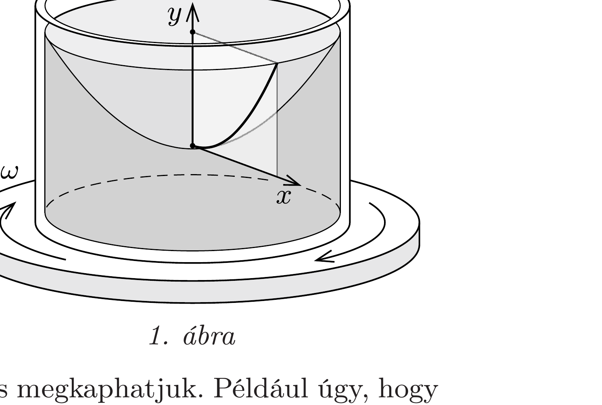
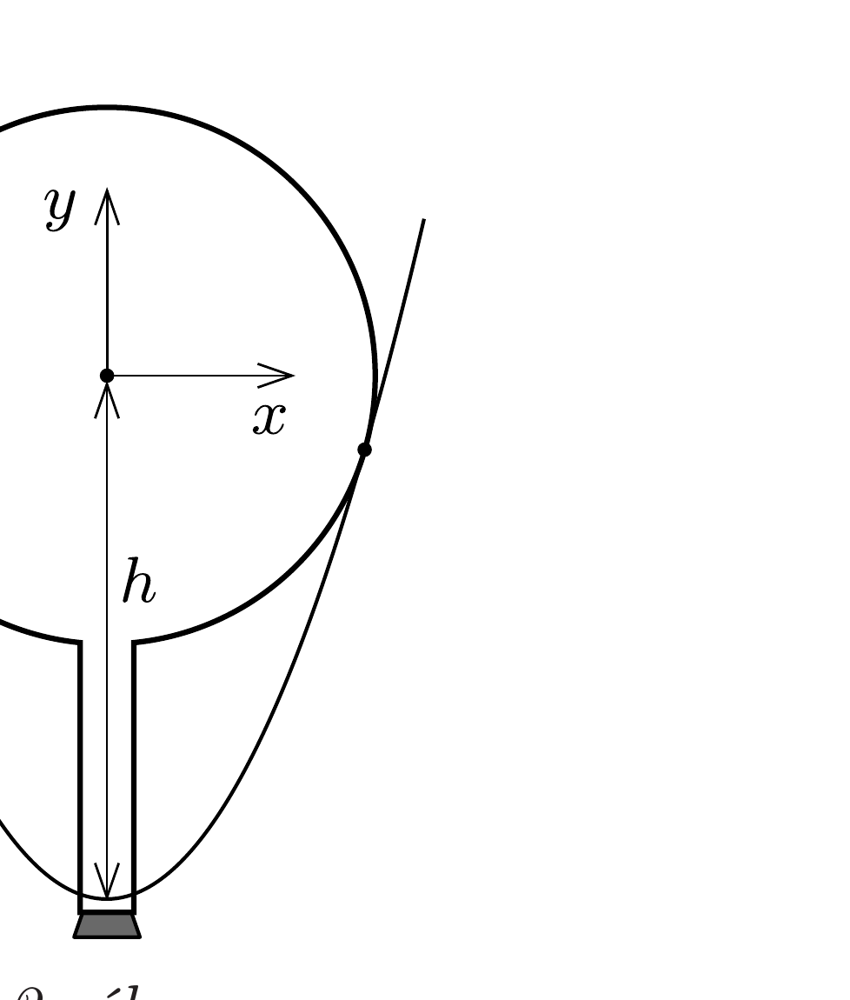
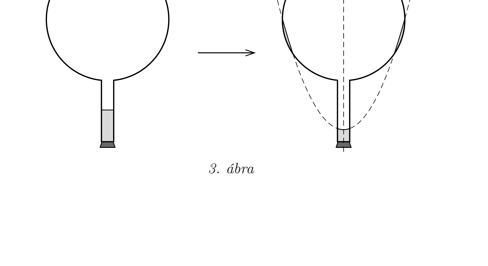

## Útmutatás

A feladat első ránézésre mechanikai problémának látszik, de valójában legalább ennyire termodinamikai feladat is. Az egyensúly, ami „kellően hosszú idő
után" beáll, termodinamikai egyensúly lesz, melynek kialakulásában a lombikban található vízgőz is fontos szerepet játszik.

## Megoldás

Ha egy folyadékot tartalmazó hengeres edényt egyenletes, $\omega$ szögsebességú forgásba hozunk, akkor a folyadék felszíne rövid idő után a földi homogén nehézségi erőtérben forgásparaboloid alakot vesz fel (1. ábra). A folyadékfelszín síkmetszete (a „megforgatott parabola”) egyenlete az ábrán felvett koordináta-rendszerben
\[
y=\frac{\omega^{2}}{2 g} x^{2} .
\]

Megjegyzés. A fenti összefüggést többféle módon is megkaphatjuk. Például úgy, hogy felismerjük: a forgó koordináta-rendszerben egy $m$ tömegú folyadékdarabkára ható centrifugális erő kifejezése hasonló a Hooke-törvényben szereplő rugóerő képletéhez, de a „rugóállandó” negatív, $D=-m \omega^{2}$. Ennek megfelelően a „centrifugális potenciális energia" $-m \omega^{2} x^{2} / 2$, amihez hozzáadva a gravitációs helyzeti energiát a teljes potenciális energiára
\[
E_{\mathrm{pot}}=-\frac{m \omega^{2} x^{2}}{2}+m g y
\]
adódik. A folyadék szabad felszínén a teljes potenciális energiának mindenhol ugyanakkorának kell lennie, ami a megadott parabola egyenletéhez vezet.

A feladat konkrét adatait megvizsgálva belátható, hogy a forgó folyadék felülete felveszi a forgásparaboloid alakot anélkül, hogy a folyadék széle a lombik nyakában egészen a gömbig felemelkedne. Felmerülhet azonban egy kérdés - és ez a kulcs a feladat helyes megoldásához -, hogy ha gondolatban meghosszabítanánk ezt a forgásparaboloidot egészen a gömbig, vajon nem „vágna-e bele” a gömbbe? Mert ha igen, akkor ott a gömbben, a forgásparaboloid alatt is lehetne víz!

Vegyünk egy, a lombik forgástengelyén átmenó síkmetszetet. Határozzuk meg annak az ( $\omega$ szögsebességhez tartozó) parabolának a legmélyebb pontját, amely
érinti a lombik gömbjének síkmetszeteként adódó kört. Legyen ez a pont $h$-val mélyebben, mint a kör középpontja, így a parabola egyenlete (a kör közepéhez választva a koordináta-rendszer kezdőpontját)
\[
y+h=\frac{\omega^{2}}{2 g} x^{2},
\]
a kör egyenlete pedig
\[
x^{2}+y^{2}=R^{2},
\]
ahol $R$ a lombik gömbjének sugara. Ebből $x^{2}$-et kifejezve és a parabola egyenletébe helyettesítve a kör és a parabola közös pontjainak $y$ koordinátáira a következő másodfokú egyenletet kapjuk:

\[
y^{2}+\frac{2 g}{\omega^{2}} y+\frac{2 g h}{\omega^{2}}-R^{2}=0 .
\]

Amikor a parabola érinti a kört (2. ábra), a fenti egyenletnek csak egy gyöke lehet, tehát a diszkriminánsnak zérusnak kell lennie, és éppen ez ad feltételt a $h$ magasságra:
\[
h=\frac{g}{2 \omega^{2}}+\frac{\omega^{2}}{2 g} R^{2} .
\]
Behelyettesítve a $g=9,81 \mathrm{~m} / \mathrm{s}^{2}, \omega=2 \pi \cdot 3 \mathrm{~s}^{-1}, R=0,1 \mathrm{~m}$ adatokat, $h$-ra 0,195 m = 19,5 cm adódik. A gömb sugara 10 cm, a nyak hossza ugyancsak 10 cm, együtt ez több, mint 19,5 cm.

A gömböt érintő paraboloid tehát a lefelé fordított lombik nyakának legalsó pontjánál fél centiméterrel feljebb halad. A feladat megoldásához tartozó paraboloid persze ennél az érintő paraboloidnál valamivel feljebb helyezkedik el, mégpedig úgy, hogy a gömblombik nyakában a paraboloid alatt maradó víz éppen annyival kevesebb az eredetileg ott lévő víznél, amennyi a gömbben, egy körbefutó keskeny sávban a paraboloid alá került.

De hogyan került oda a víz? A gömblombik felpörgetésekor talán odafröccsenhetett a víz, mégsem ez a probléma megoldása, hanem az, hogy a lombik nyakánál elpárolgó vízgőz egy része csapódik ki - megfelelő helyen - a lombik falára. Ennek a termodinamikai folyamatnak a hajtóereje pedig éppen a lombikban fellépő icipici nyomáskülönbség, ami a nehézségi erő és a forgás együttes hatása miatt alakul ki. Egy-egy forgásparaboloid mentén a víz a forgó koordináta-rendszerből nézve egyensúlyban van, hiszen éppen ez a feltétel határozza meg a felület alakját. Két különböző forgásparaboloidot összehasonlítva viszont a magasabban elhelyezkedő felület mentén nagyobb a víz fajlagos (tömegegységre eső) energiája, mint az alacsonyabban lévő felületnél. Egyensúlyi állapotban a víz felszínének ugyanazon a paraboloidon kell elhelyezkednie a lombik nyakában és a gömbben is, ha nem így lenne, a párolgás és a lecsapódás folyamata előbb-utóbb „megkeresné" az alacsonyabb összenergiájú állapotot.

Hosszú idő után tehát a víz a 3. ábrán látható vázlatos rajznak megfelelően helyezkedik el a lombikban.

Megjegyzés. A szokatlan jelenség első ránézésre eléggé hihetetlen, ezért könnyen azt gondolhatjuk, hogy a valóságban nem is következik be. „Ugyanúgy nem, mint ahogy az asztalon álló vizespohárból sem mászik ki a víz az asztalra, hiába lenne ott kisebb az energiája!" - érvelhetünk. Nos, az érdekes az, hogy a víz onnan is kimászhat, még tökéletes hőmérsékleti egyensúly esetén is, éppen a meglévő piciny barometrikus nyomáskülönbség miatt, ami a pohárban lévố víz felszíne és az asztal szintje között fennáll. Letakarva egy üvegharanggal az asztalon álló pohár vizet, el is végezhető a kísérlet. Csak kissé sokáig kell várni! (Üvegharang nélkül is „kimászik” a víz a pohárból, de a szoba nagy légtere miatt sehol sem csapódik le, hanem telítetlen gőz formájában a levegőben marad.)
