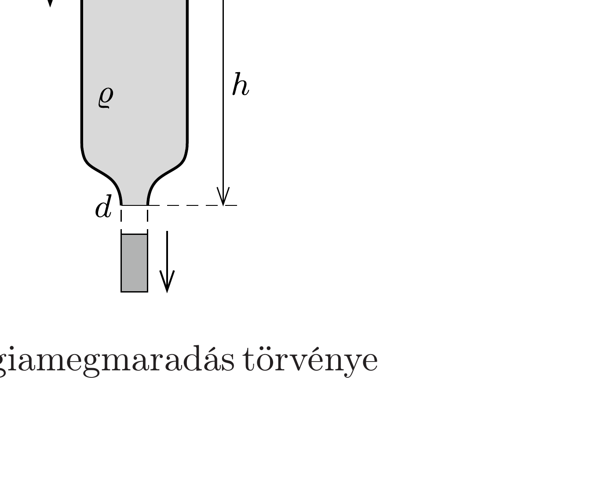

## Útmutatás

Írjuk fel a kezdetben álló, majd $a$ (kezdeti) gyorsulással mozgásba jövő folyadékra, hogy mennyit változik a helyzeti és mozgási energiája egy nagyon rövid $\Delta t$ időtartam alatt.

## Megoldás

Kicsiny $\Delta t$ idő alatt az $a$ gyorsulással induló folyadék szintje $\Delta h=a(\Delta t)^{2} / 2$ értékkel süllyed, így a kiáramló folyadék tömege $\Delta m=\varrho\left(D^{2} \pi / 4\right) \Delta h$. A víz helyzeti energiája ezek szerint $\Delta m g h$-val csökken. Ezalatt a folyadék egésze $v=a \Delta t$ sebességre gyorsul fel, a mozgási energiája tehát $\varrho\left(D^{2} \pi / 4\right) h \cdot v^{2} / 2$ értékkel növekszik. (A kiáramló folyadék sebessége nagyobb ugyan a fenti értéknél, ezt azonban nem kell figyelembe vennünk, hiszen az egész víz mennyiségéhez képest

kevés folyadékról van csak szó.)

A helyzeti és a mozgási energia megváltozása - az energiamegmaradás törvénye szerint - abszolút értékben egyenlő:
\[
\frac{D^{2} \pi}{4} \frac{a}{2}(\Delta t)^{2} \varrho g h=\frac{D^{2} \pi h \varrho}{4} \frac{(a \Delta t)^{2}}{2},
\]
ahonnan $a=g$ adódik.

A folyadék egésze tehát (a cső szúkületén kifolyó, csekély mennyiségứ víztől eltekintve) a kiáramlás kezdetekor szabadeséssel kezd el mozogni. A cső alsó végén kiáramló folyadék (az anyagmegmaradás törvénye értelmében) minden pillanatban $(D / d)^{2}$-szer nagyobb sebességgel mozog, mint a víz felszíne, így a gyorsulása is ugyanilyen arányban nagyobb, mint $g$. (Ha például a kifolyónyílás átméróje a cső átmérőjének tizede, akkor a kiáramló víz kezdeti gyorsulása $100 g$ lesz!)

Mennyi ideig igaz az, hogy a folyadék lényegében „szabadon esik”? A Torricelliféle törvény szerint a folyadék kiáramlási sebessége $\sqrt{2 g h}$, a vízfelszín süllyedési sebessége pedig $(d / D)^{2} \sqrt{2 g h}$. Az áramlás megindulása és a (majdnem állandó) kifolyási sebesség beállása között eltelt $\tau$ időt nagyságrendileg a
\[
g \tau \approx \frac{d^{2}}{D^{2}} \sqrt{2 g h}
\]
összefüggésből becsülhetjük meg. Ha például $h=20 \mathrm{~cm}$, és az átmérők aránya 1 : 10, akkor $\tau \approx 0,002 \mathrm{~s}$, tehát igen rövid idő.
