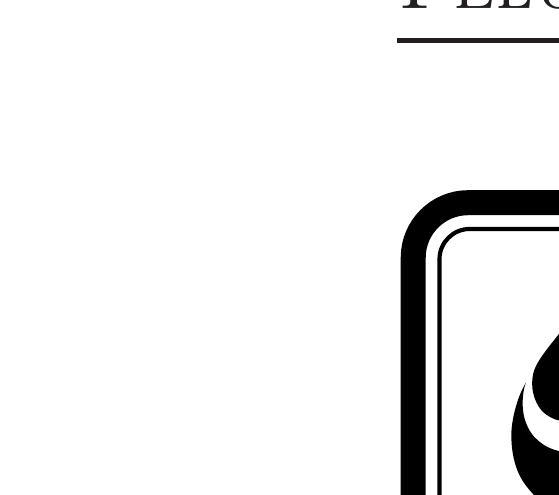
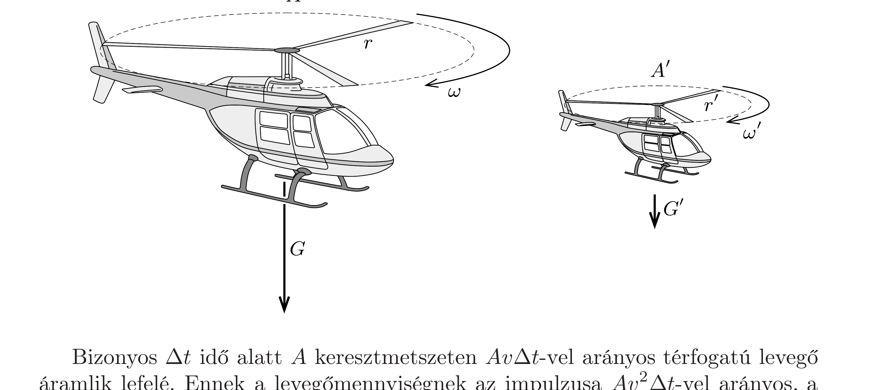

## Útmutatás

Egy lehetséges út a feladat megoldásához, ha meggondoljuk, hogy milyen fizikai mennyiségektől függhet az éppen lebegő helikopter teljesítménye, és alkalmazzuk a dimenzióanalízis módszerét. Dinamikai érveléssel is célhoz érhetünk, ha azt vizsgáljuk, hogyan érvényesül a hatás-ellenhatás törvénye a helikopterre és a lefelé mozgatott légtömegre.

\section*{Felületi feszültség}

## Megoldás

I. megoldás. Jelöljük az eredeti helikopter súlyát $G$-vel, a rotor által súrolt területet $A$-val, a rotor sugarát (azaz a „szárnyak” hosszát) $r$-rel, szögsebességét $\omega$-val, a rotorlapátok kerületi sebességét pedig $v$-vel. A másik, kicsinyített helikopternél ugyanezen mennyiségek legyenek $G^{\prime}, A^{\prime}, r^{\prime}, \omega^{\prime}$ és $v^{\prime}$.

Amennyiben $r^{\prime}=r / 2$, úgy $A^{\prime}=A / 4$ és $G^{\prime}=G / 8$. (Feltételezzük, hogy a kicsinyített modell ugyanolyan anyagból készült, mint az eredeti, emiatt az átlagos súrúségük megegyezik.) Mindkét „lebegő“ helikopternél fennáll az, hogy a forgásban lévő rotor által létrehozott emelőerő egyenló a helikopter súlyával.

Vajon miből származik az emelőerő, és hogyan fejezhető ki a helikopter adataival? A rotorok felgyorsítják (mintegy maguk alá lökik) a felettük lévő, kezdetben álló levegőt, tehát függőlegesen lefelé irányuló lendületet adnak neki. A felgyorsított levegő sebessége feltehetően arányos $v$-vel. (Az arányossági tényező természetesen függ a rotor lapátjának alakjától, de mindkét helikopterre ugyanakkora.)

Bizonyos $\Delta t$ idő alatt $A$ keresztmetszeten $A v \Delta t$-vel arányos térfogatú levegő áramlik lefelé. Ennek a levegőmennyiségnek az impulzusa $A v^{2} \Delta t$-vel arányos, a levegő felgyorsításához szükséges függőleges erő (időegységre vonatkoztatott impulzusváltozás) tehát $A v^{2}$-tel arányos. A hatás-ellenhatás törvénye szerint ugyanekkora nagyságú erőt fejt ki a levegő is a helikopterre. Az emelőerő és a súly egyenlőségéből
\[
\frac{G^{\prime}}{G}=\frac{A^{\prime} v^{\prime 2}}{A v^{2}},
\]
ahonnan (a területek és a súlyok arányára korábban felírt összefüggéseket felhasználva) $v^{\prime}=v / \sqrt{2}$, valamint $\omega^{\prime}=\sqrt{2} \omega$ adódik. A kicsinyített modell rotorjának tehát kisebb kerületi sebességgel, de nagyobb szögsebességgel kell forognia, mint az eredetinek.

A helikopter motorja által leadott mechanikai teljesítmény a szükséges $M$ forgatónyomaték és a rotor szögsebességének szorzataként számítható ki: $P=M \omega$. A forgatónyomaték a rotorra ható közegellenállási eróvel (tehát $A v^{2}$-tel) és a rotor $r$ sugarával arányos. (Itt $A$ jelölheti a rotorlapátok egyes részeinek mozgásirányú keresztmetszetét, de a rotor átlal súrolt területet is, hiszen arányos kicsinyítésnél
ezek ugyanolyan mértékben csökkennek.) Így a kérdéses teljesítményarány:
\[
\frac{P^{\prime}}{P}=\frac{A^{\prime} v^{\prime 2} r^{\prime} \omega^{\prime}}{A v^{2} r \omega}=\frac{1}{4} \cdot \frac{1}{2} \cdot \frac{1}{2} \cdot \sqrt{2}=\frac{1}{2^{3,5}}=0,088 .
\]
A kicsinyített modell motorja által leadott teljesítmény tehát az eredetinek mindössze 9 százaléka.
II. megoldás. Próbáljuk megtalálni azokat a paramétereket, melyektől egy adott helikopter lebegéséhez szükséges $P$ teljesítmény függ. Ezek között biztosan szerepelnie kell a $g$ nehézségi gyorsulásnak és a helikopter jellemző $L$ hosszméretének. A teljesítmény természetesen függ még a helikopter (átlagos) $\varrho_{\mathrm{h}}$ sürúségétől, valamint a környező közeg (jelen esetben a levegő) $\varrho_{1}$ sürúségétől is. (A helikopter tömege, a rotorlapátok hossza és hasznos felülete már kifejezhető ezekkel az adatokkal.)

Ésszerú feltételezni, hogy a szükséges teljesítmény (legalábbis közelítőleg) csak a felsorolt paraméterektől függ, és
\[
P=k \cdot g^{\alpha} \cdot L^{\beta} \cdot \varrho_{\mathrm{h}}^{\gamma} \cdot \varrho_{1}^{\delta}
\]
alakú összefüggésből számítható ki (ahol $k$ egy dimenziótlan állandó). A két oldal mértékegységeinek meg kell egyeznie:
\[
\frac{\mathrm{kg} \mathrm{~m}^{2}}{\mathrm{~s}^{3}}=\left(\frac{\mathrm{m}}{\mathrm{~s}^{2}}\right)^{\alpha} \cdot \mathrm{m}^{\beta} \cdot\left(\frac{\mathrm{kg}}{\mathrm{~m}^{3}}\right)^{\gamma} \cdot\left(\frac{\mathrm{kg}}{\mathrm{~m}^{3}}\right)^{\delta} .
\]
A kitevők alapegységenként egyenlők:
\[
\gamma+\delta=1, \quad \alpha+\beta-3(\gamma+\delta)=2, \quad-2 \alpha=-3 .
\]
Ennek az egyenletrendszernek a megoldása: $\beta=\frac{7}{2}, \alpha=\frac{3}{2}$ és $\gamma=1-\delta$.
Azt kaptuk tehát, hogy a helikopter lebegéséhez szükséges teljesítmény a lineáris méret $\frac{7}{2}$-ik hatványával arányos, a felére kicsinyített helikopter tehát $2^{-3,5}=$ 0,088-szoros teljesítménnyel képes fenntartani magát.

Megjegyzések. 1. A motorok hatásfokának egyik fontos jellemzője a motor által leadott teljesítmény és a motor tömegének aránya. Amennyiben a helikopter motorját is a többi lineáris mérettel arányos mértékben kicsinyítjük, a motor tömege nyolcadára, a szükséges teljesítmény viszont ennél nagyobb mértékben csökken. Eszerint a kisebb repülő szerkezet lebegéséhez rosszabb hatásfokú motor is elegendő. Fordítva: minél nagyobb méretú (levegőnél nagyobb súrúségữ) testet akarunk helikopter-elven lebegtetni, annál jobb hatásfokú motorra van szükségünk. Hasonló okok magyarázhatják azt a tényt, hogy az evolúció során pl. a legyek nem nốttek emberméretúre, hiszen méretarányosan felnagyítva őket képtelenek volnának repülni. Ugyancsak szembetúnő a legnagyobb repülő állatok és a legnagyobb szárazföldi gerincesek (pl. a sas és az elefánt) közötti nagyon nagy térfogat-, illetve tömegkülönbség.
2. A II. megoldásban leírt dimenzióanalízis módszerével a $\gamma$ és $\delta$ kitevőknek csak az összegét tudtuk megadni. Ha azonban azt is figyelembe vesszük, hogy a helikopter
súrúsége csak $g$-vel szorozva jelenhet meg a teljesítmény képletében (hiszen a mozdulatlan helikopternek nem a tehetetlen tömege, hanem csak a súlya kaphat szerepet), úgy a $\gamma=\alpha$ megszorítást kapjuk, ahonnan $\gamma=\frac{3}{2}$ és $\delta=-\frac{1}{2}$ adódik. Ezek szerint a teljesítmény formulája:
\[
P \propto\left(L^{3} \varrho_{\mathrm{h}} g\right) \cdot \sqrt{L g} \cdot \sqrt{\frac{\varrho_{\mathrm{h}}}{\varrho_{1}}} .
\]
Ebben a képletben az első (zárójeles) tényező a helikopter súlyával arányos, a második egy félhelikopternyi magasságból szabadon eső test végsebessége, a harmadik tényező pedig dimenziótlan (kb. 100-as nagyságrendű) számfaktor, amely csak a súrúségarányoktól függ.

Földi körülmények között csak $L$-t és $\varrho_{\mathrm{h}}-\mathrm{t}$ lehet változtatni, egy idegen bolygó felderítésére szánt repüló szerkezetek (drónok) tervezésénél azonban fontos lehet annak ismerete is, hogy miként függ $P$ a nehézségi gyorsulástól, illetve a környező közeg súrúségétől.

\section*{Felületi feszültség}
