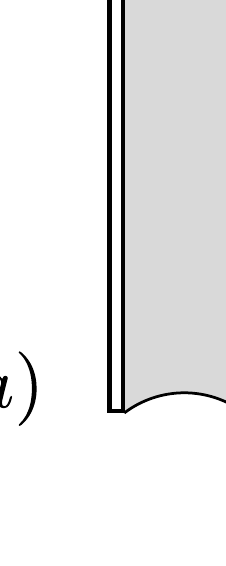
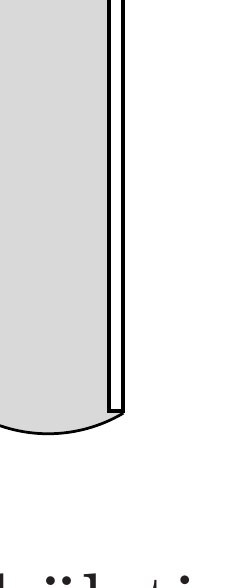
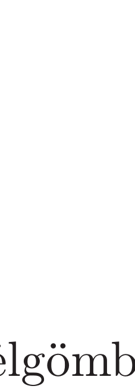

## Útmutatás

A kapilláris cső végén a görbületi nyomás tart egyensúlyt a folyadék belsejében lévő nyomás és a külső légnyomás különbségével.

## Megoldás

Az $a$ ) esetben a víz nem folyhat ki a csőből, hiszen ellenkező esetben perpetuum mobilét készíthetnénk: a kicsurgó vízzel lapátkereket hajtva örökmozgót múködtethetnénk!

A $b$ ) és a $c$ ) eset már nem ilyen egyszerú. Mindkét cső vége alacsonyabban van, mint az edénybeli vízszint, a víz nyomása tehát mindkét cső végénél nagyobb, mint a külső légnyomás. Ezért a folyadék kifelé domborodik, és olyan görbületi sugarat alakít ki, amelynek megfelelő görbületi nyomás éppen a víz és a külső levegő nyomáskülönbségének felel meg. Az $a), b$ ) és $c$ ) eseteket megvalósító vízfelszíneket az ábra mutatja.

A legnagyobb görbület (legkisebb görbületi sugár) a félgömb alakhoz tartozik. Ez éppen a $H$ magasságú vízoszlop nyomásának felel meg, hiszen a függőlegesre állított kapillárisban ilyen magasra emelkedik a víz. Ha a nyomáskülönbség nagyobb a $H$ magasságú vízoszlop hidrosztatikai nyomásánál, akkor a felületi feszültség nem tudja megtartani a vizet a csőben, és az kifolyik. Ez történik a $c$ ) jelú csőnél, a b) jelú kapillárisból viszont nem fog kicsurogni a víz.
