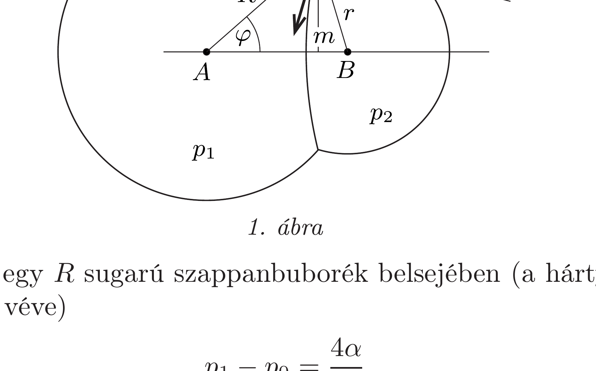
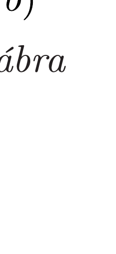
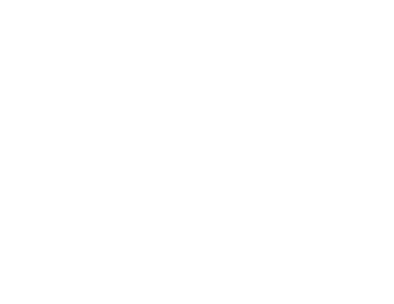

## Útmutatás

Az elválasztó hártya görbületi sugarának meghatározásához írjuk fel a görbületi nyomások egyensúlyát! Az érintkezési kör sugarát úgy kaphatjuk meg, ha megvizsgáljuk a körvonal kicsiny darabkájára ható erőket.

## Megoldás

A két buborék közötti hártya $\varrho$ sugarú gömbsüveget alkot, a gömbök középpontja egy egyenesbe esik. Ha erre az egyenesre illeszkedő síkkal elmetsszük a buborékokat, az 1. ábrán látható metszetet kapjuk. (Feltehetjük, hogy $R>r$.)

Ismert, hogy egy $R$ sugarú szappanbuborék belsejében (a hártya mindkét oldalát figyelembe véve)
\[
p_{1}-p_{0}=\frac{4 \alpha}{R}
\]
a túlnyomás, ahol $\alpha$ a folyadék (szappant vagy mosogatószert tartalmazó víz) felületi feszültsége, $p_{0}$ pedig a légköri nyomás. Hasonlóan, a kisebb buborék túlnyomása
\[
p_{2}-p_{0}=\frac{4 \alpha}{r},
\]
a két buborékot elválasztó hártyára pedig fennáll, hogy
\[
p_{2}-p_{1}=\frac{4 \alpha}{\varrho} .
\]
A (2) összefüggésből (1)-et kivonva, majd (3)-ba helyettesítve - némi átalakítás után - a keresett görbületi sugárra
\[
\varrho=\frac{R r}{R-r}
\]
adódik.
Az érintkezési kör $m$ sugarát a következő gondolatmenet segítségével határozhatjuk meg. A $C$ ponton átmenő kör kicsiny darabkájára három egyenlő nagyságú eró hat, ezek tehát egymással 120°-os szöget zárnak be. Ebből következik, hogy az $A C B \varangle=60^{\circ}$. (Felhasználtuk, hogy a kör érintő́je merőleges a sugárra.) Alkalmazzuk az $A B C$ háromszögre a koszinusz- és szinusztételt:
\[
A B^{2}=R^{2}+r^{2}-2 R r \cos 60^{\circ},
\]
illetve (az 1. ábra jelöléseivel)
\[
\frac{\sin \varphi}{\sin 60^{\circ}}=\frac{r}{A B} .
\]
Ezekből az érintkezési kör sugarára végül az
\[
m=R \sin \varphi=\frac{\sqrt{3}}{2} \frac{R r}{\sqrt{R^{2}+r^{2}-R r}}
\]
eredményt kapjuk.
Megjegyzés. A 2. ábra három részén néhány speciális eset látható:
- a) $R=r$, ekkor $\varrho=\infty$ (az elválasztó felület sík) és $m=r \sqrt{3} / 2$;
- b) $R \gg r$, ekkor $\varrho=r$ és $m=r \sqrt{3} / 2$;
- c) $R=2 r$, ilyenkor $\varrho=R$ és $m=r$.

2. ábra
