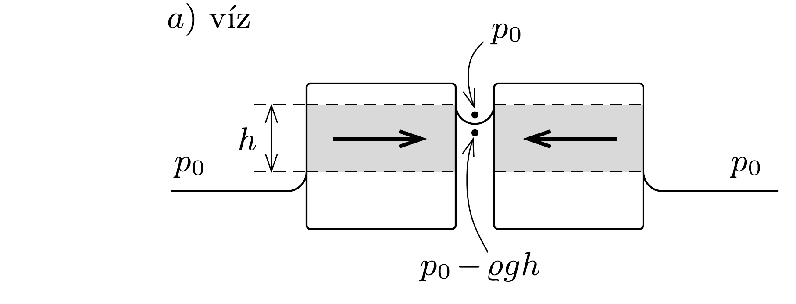
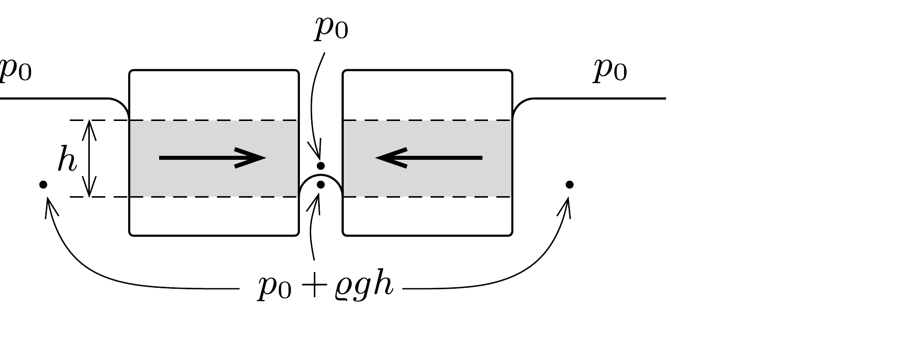

## Útmutatás

Rajzoljunk ábrákat, melyek a folyadékfelszíneket és a nyomásviszonyokat mutatják a tárgyak között, illetve mellettük!

## Megoldás

A folyadék felületi feszültségének következtében a közeli tárgyak közötti folyadékszint-magasság nem ugyanakkora, mint a testeken kívül; a víz esetében magasabb (ezt mutatja az $a$ ) ábra), míg a higany esetén alacsonyabb (ebben az esetben az illeszkedési szög 90°-nál nagyobb, lásd a b) ábrát). (A két ábrán szereplő testek súrúsége természetesen különböző.)

A testek közötti folyadékfelszín felett a nyomás mindkét esetben a légköri nyomással egyezik meg, míg ugyanezeken a helyeken közvetlenül a felszín alatt a két esetben a nyomás eltérő. A víz esetében a folyadék nyomása kisebb, a higany esetében pedig nagyobb, mint a légköri nyomás. Ez úgy lehetséges, hogy a nyomáskülönbséget a folyadékfelszínek (ellentétes előjelü) görbületi nyomása egyenlíti ki. Az ábrán látszik, hogy az eltérő nyomások miatt a testek szürkével jelölt részeire kiegyenlítetlen erők hatnak, és ezek eredője mindkét esetben egymás felé húzza az úszó testeket.
