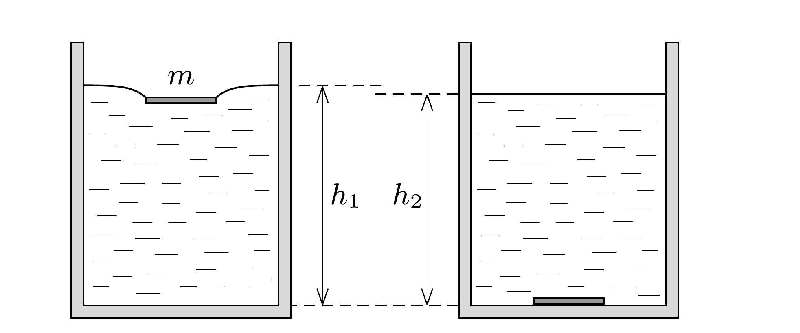
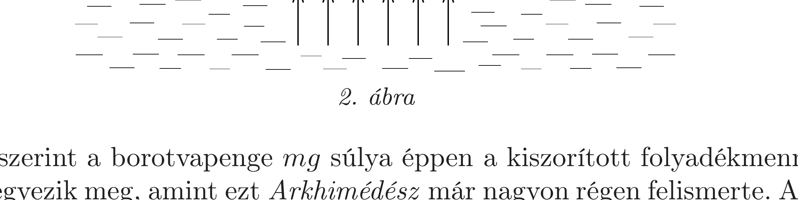

## Útmutatás

Gondoljuk meg, mekkora eró terheli a pohár alját, amikor a borotvapenge még úszik, és mekkora akkor, amikor már a pohár fenekére süllyedt.

## Megoldás

I. megoldás. Ha a borotvapenge még úszik a víz felszínén, és a pohárban $h_{1}$ magasan áll a víz, akkor a pohár fenekét
\[
F_{1}=\varrho g h_{1} A
\]
eró nyomja lefelé, ahol $A$ a pohár belsejének alapterülete, $\varrho$ pedig a víz súrúsége (1. ábra). Ha a penge elsüllyed, és a vízszint magassága $h_{2}$-re változik, akkor a fenékre ható nyomóeró módosul:
\[
F_{2}=\varrho g h_{2} A+m g-\frac{m}{\varrho_{\text {penge }}} \varrho g .
\]
A fenti képletben az utolsó tag a pohár fenekére süllyedt $m$ tömegü pengére ható felhajtóerőt veszi figyelembe. (Feltételezhetjük, hogy a penge és a pohár alja között marad egy vékony vízréteg. Ha nem ez lenne a helyzet, akkor az utolsó tag onnan származna, hogy a penge felsó felületénél a víz nyomása kicsit kisebb, mint a pohár alján.)

Másfelól viszont $F_{1}$ és $F_{2}$ ugyanakkora, mindkettő a víz és borotvapenge együttes súlyával egyenlő; éppen ennyivel mutat többet egy mérleg a vízzel és a borotvapengével teli pohárnál, mint az üres pohár esetében.

Eszerint $h_{1}>h_{2}$, a borotvapenge elsüllyedésekor a vízszint kicsit lecsökken. A vízszint csökkenésének mértékét a borotvapenge felhajtóerővel csökkentett súlyával megegyező súlyú (a pohárban egyenletesen szétterített) vízréteg magassága adja meg.

Megjegyzés. Az egyszerúség kedvéért hallgatólagosan feltettük, hogy a pohár olyan anyagból készült, melyre nézve a víz illeszkedési szöge 90°, azaz a vízfelszín a pohár széléhez közel vízszintes marad. Ha nem ez a helyzet, akkor a vízfelszín pereme által a pohárra ható, felületi feszültségből származó erốt is figyelembe kell venni, ez azonban az úszó és az elsüllyesztett penge esetén is ugyanakkora járulékot ad.
II. megoldás. Tekintsük a borotvapenge által „kiszorított”, (a 2. ábrán szürkével jelölt) „ hiányzó” víznek megfelelő térrészt. Ebben a térrészben lévő anyag (nevezetesen a borotvapenge, hiszen az ott lévő levegő tömege gyakorlatilag nulla) azért lehet egyensúlyban, mert a rá ható nehézségi eróvel egyensúlyt tart a (légköri nyomásnál nagyobb nyomású) folyadék által kifejtett erórendszer eredője. Ez az eredő erő azon folyadékmennyiség súlyával is egyensúlyt tudna tartani, amely a 2. ábrán $A B C D$-vel jelölt térrészt ki tudná tölteni.

Ezek szerint a borotvapenge $m g$ súlya éppen a kiszorított folyadékmennyiség súlyával egyezik meg, amint ezt Arkhimédész már nagyon régen felismerte. A helyzet érdekessége abban rejlik, hogy az Arkhimédész-törvényben szereplő „kiszorított víz" most nem csupán a borotvapenge által ténylegesen elfoglalt térfogatból hiányzó vizet jelenti, hanem annál lényegesen többet: a felületi feszültség által megnövelt tartomány járulékát is.

A kiszorított víz térfogata tehát nagyobb, mint a penge saját térfogata, emiatt a vízszint a borotvapenge elsüllyedésekor biztosan csökkenni fog.

Megjegyzés. A víznél nagyobb súrúségú testek úszásánál a testre ható nehézségi erốvel egyrészt a testtel alulról érintkező víz nyomóereje, másrészt felületi feszültségből
származó, a test pereménél ható erők függőleges komponense tart egyensúlyt. Az előbbi a test feletti „hiányzó" víz súlyával egyenlő, nagysága a test vízszintes vetületének területével arányos. A felületi feszültség járuléka a kiszorított víz maradék részének súlyával egyenlő, ez a test vízszintes vetületének kerületével arányos. A viszonylag nagy méretú testek úszásánál a víz nyomása adja a döntő́ járulékot, a felületi feszültségnek csak stabilizáló szerepe van. A kisebb keresztmetszetú testeknél (pl. a vízi molnárka lábainál) éppen fordított a helyzet: a nehézségi erốt főleg a felületi feszültségből származó erőhatás egyensúlyozza, a víz nyomásának nincs lényeges szerepe. A borotvapenge esetében a kétféle erőhatás egyforma nagyságrendú, mindkettő hatása számottevő.
