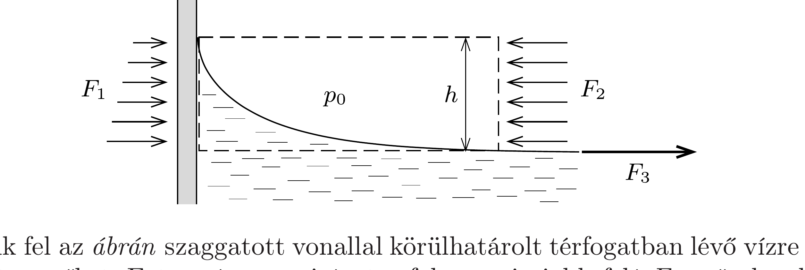

## Útmutatás

Írjuk fel a megemelkedett vízrétegre ható vízszintes irányú eróket!

## Megoldás

A $h$ magasságra felemelkedett víz nyomása a magasság függvényében lineárisan változik: alul a külső $p_{0}$ légnyomással egyezik meg, legfelül pedig $p_{0}-\varrho g h$ nagyságú. A falra kifejtett átlagos nyomás tehát $p_{\text {átlag }}=p_{0}-\varrho g h / 2$, a nyomóerő pedig (egy $\ell$ szélességú vízrétegre vonatkoztatva): $F_{1}=\ell p_{\text {átlag }} h$.

Írjuk fel az ábrán szaggatott vonallal körülhatárolt térfogatban lévő vízre ható vízszintes eróket. Ezt a vízmennyiséget a fal nyomja jobb felé $F_{1}$ erốvel, a külső levegő balra $F_{2}=\ell p_{0} h$ eróvel, a felületi feszültség miatt pedig a víz többi része húzza jobbra $F_{3}=\ell \alpha$ eróvel. Ezek eredője nulla, hiszen a vizsgált térrészben lévő anyag nyugalomban van. Eszerint
\[
\left(p_{0}-\frac{1}{2} \varrho g h\right) \ell h-p_{0} \ell h+\ell \alpha=0,
\]
ahonnan az emelkedési magasság (a szobahőmérsékletú víz $\alpha=0,073 \mathrm{~N} / \mathrm{m}$ adatával számolva)
\[
h=\sqrt{\frac{2 \alpha}{\varrho g}}=\sqrt{\frac{2 \cdot 0,073}{1000 \cdot 9,8}} \mathrm{~m}=0,0039 \mathrm{~m} .
\]
A víz tehát közel 4 milliméternyit emelkedik fel az akvárium falánál.
