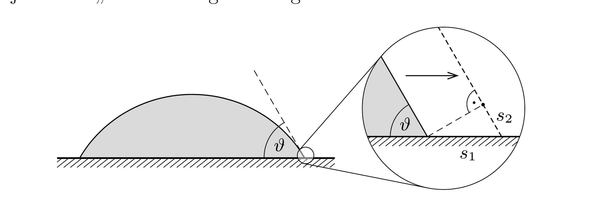
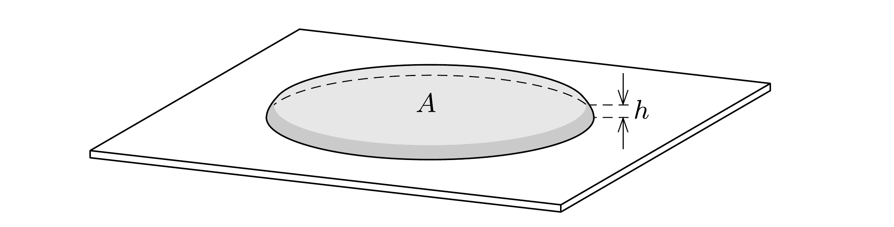

## Útmutatás

Két hatás verseng egymás ellen: a felületi erók igyekeznek minél kisebb területúre összehúzni a tócsát, a gravitáció ezzel szemben szeretné minél vékonyabbra lapítani. A tócsa egyensúlyi méretét végül az energiaminimum elve határozza meg. Ne felejtsük el figyelembe venni a padló és a víz érintkezéséból származó kölcsönhatási energiát!

## Megoldás

A tócsa olyan alakot vesz fel, amely esetén a felületi energia és a gravitációs helyzeti energia összege a lehető legkisebb. A felületi energia két tagból, a víz-levegő határfelület energiájából és víz-padló érintkezési felületnek megfeleló energiából számítható.

Tekintsünk egy, a padlóra cseppentett vízcseppet! A víz a levegővel is és a padlóval is érintkezik. A víz-levegő határréteg egységnyi felületú darabjának energiája $\alpha$, ezt a mennyiséget nevezzük a víz (levegőre vonatkoztatott) felületi feszültségének. Ezen kívül a víz bizonyos nagyságú felületen a padlóval is érintkezik. Ha
ez a felület valamilyen ok miatt megváltozik (vagyis a padló és a víz érintkezési felülete megnő, a levegővel érintkezó padlófelület pedig lecsökken), akkor ennek a változásnak is megfelel valamekkora, a felületváltozással arányos energiakülönbség. Jelöljük ezt a „felületi energiasürüséget” $\alpha^{\prime}$-vel!

Az $\alpha$ és $\alpha^{\prime}$ állandók, valamint az egyensúlyi állapotra jellemző $\vartheta$ illeszkedési szög nem függetlenek egymástól. Ha ugyanis a vízcsepp pereménél gondolatban (virtuálisan) egy kicsiny $s_{1}$ távolsággal elmozdítanánk a különböző halmazállapotok érintkezési vonalát (1. ábra), akkor a felületi energiák összege első rendben (első közelítésben) nem változna meg; - ezt állítja a virtuális munka elve. Az érintkezési vonal egységnyi hosszú szakaszán a felületi energiák megváltozása
\[
\alpha^{\prime} s_{1}+\alpha s_{2}=0 .
\]
Az 1. ábráról leolvasható $s_{2}=s_{1} \cos \vartheta$ összefüggést felhasználva az
\[
\alpha^{\prime}=-\alpha \cos \vartheta
\]
összefüggést kapjuk. Esetünkben, amikor $\vartheta=60^{\circ}, \alpha^{\prime}=-\frac{1}{2} \alpha<0$.
Megjegyzések. 1. Az $\alpha^{\prime}$ energiasứrúség negatív előjele azt fejezi ki, hogy a víz „nedvesíti" a padlót, energetikailag az a kedvezőbb, ha minél nagyobb felületen érintkezik a víz a padló szilárd anyagával. Vannak olyan folyadékok és szilárd anyagok (pl. a higany és az üveg), amelyekre $\alpha^{\prime}>0$, és az illeszkedési szög $\vartheta>90^{\circ}$. Ezek a „nem nedvesítő" folyadékok igyekeznek minél kisebb felületen érintkezni a kérdéses szilárd anyaggal, számukra ez felel meg alacsonyabb energiájú állapotnak.
2. Az $\alpha^{\prime}$ mennyiséget felírhatjuk az $\alpha_{\mathrm{sz}-\mathrm{f}}$ és $\alpha_{\mathrm{sz}-\mathrm{g}}$ felületi energiasürúségek (ún. határfelületi feszültségek) különbségeként, ahol az első tag a szilárd anyaggal érintkező folyadék, a második pedig a szilárd anyaggal érintkező gáz felületegységre vonatkoztatott energiája. Ez a felbontás azonban önkényes, hiszen a képletekben mindig csak $\alpha^{\prime}$ jelenik meg, a szilárd anyag (folyadékra, illetve gázra vonatkoztatott) energiasúrúsége önmagában nem kap szerepet.

A $V=5$ liter térfogatú víz viszonylag nagy területú tócsát képez a padlón (2. ábra), emiatt a víz-levegő határfelület és a víz-padló érintkezési felület nagysága jó közelítéssel egyenlő, jelöljük ezt $A$-val. Így a tócsa energiáját az
\[
E \approx \alpha A+\alpha^{\prime} A+m g \frac{h}{2}
\]
formula adja meg, ahol $m$ a tócsa tömege, $h=V / A$ pedig a magassága. Az (1) eredményt felhasználva, majd a tócsa tömegét a víz $\varrho$ sürúségével kifejezve kapjuk a tócsa energiáját az $A$ terület függvényében:
\[
E(A)=\alpha(1-\cos \vartheta) A+\frac{\varrho g V^{2}}{2 A} .
\]

Az energia minimumának meghatározásához a számtani és mértani közepek között fennálló összefüggést használhatjuk, mely szerint:
\[
E(A) \geq \sqrt{2 \alpha(1-\cos \vartheta) \varrho g V^{2}},
\]
egyenlőség pedig akkor áll fenn, ha a (2) egyenletben szereplő két tag megegyezik. Ebből a feltételből a tócsa területére az
\[
A=\sqrt{\frac{\varrho g V^{2}}{2 \alpha(1-\cos \vartheta)}} \approx 1,8 \mathrm{~m}^{2}
\]
eredmény adódik.
Megjegyzés. A tócsa felületének ismeretében meghatározhatjuk a magasságát is :
\[
h=\frac{V}{A}=\sqrt{\frac{2 \alpha}{\varrho g}(1-\cos \vartheta)} \approx 2,7 \mathrm{~mm} .
\]
Ez az eredmény - a 176. feladat megoldásának gondolatmenetét követve - az erők egyensúlyából is megkapható. Az összefüggésben megjelenő, hosszegység dimenziójú, a legtöbb folyadékra mm-es nagyságrendú $\lambda_{\mathrm{k}}=\sqrt{\alpha /(\varrho g)}$ mennyiség az ún. kapilláris hossz, amely azt a karakterisztikus méretskálát adja meg, amelyen a felületi jelenségek és a gravitációs tér hatása összemérhető. Azok a folyadékcseppek, amelyek mérete sokkal kisebb a $\lambda_{\mathrm{k}}$ karakterisztikus hossznál, jó közelítéssel gömb alakúak: formájukat a felületi feszültségből származó görbületi nyomás határozza meg. $\mathrm{A} \lambda_{\mathrm{k}}$ hossznál jóval nagyobb méretú „cseppek" alakját elsősorban a gravitációs mező alakítja, ezért ezek szétterülnek, tócsát képeznek.
