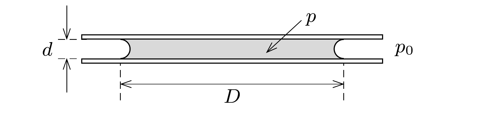

## Útmutatás

A víz felületi feszültsége (görbületi nyomása) miatt a vízpogácsában kisebb a víz nyomása, mint a külső légnyomás.

## Megoldás

I. megoldás. A vízpogácsa tömegközéppontján átmenő, az üveglapokra merőleges metszetben a víz-levegő határvonal egy-egy $d / 2$ sugarú félkör. A vízfelszín görbülete egyik irányban tehát $2 / d$, a másik irányú görbület pedig $D \gg d$ miatt elhanyagolható. A levegő felé görbülő vízfelszín $\Delta p=2 \alpha / d$ görbületi
nyomást hoz létre, emiatt a vízpogácsa belsejében a nyomás a külső $p_{0}$ légnyomásnál kisebb, $p_{0}-2 \alpha / d$ értékú. Ez a nyomáskülönbség a víz és az üveglapok $D^{2} \pi / 4$ nagyságú érintkezési felületén egyenként
\[
F=\frac{D^{2} \pi}{4} \cdot \frac{2 \alpha}{d}
\]
erốt eredményez. Ekkora eróvel „húzza össze” a folyadék az üveglapokat. Az üveglapok egyensúlya a számított erővel megegyező nagyságú, a lapokat széthúzó külső erőkkel biztosítható.

II. megoldás. A feladat energetikai megfontolással is megoldható. Képzeljük el, hogy az egyik üveglapot nagyon kicsi $\Delta x$ távolsággal $(\Delta x \ll d)$ eltávolítjuk a másik üveglaptól. Eközben az állandónak tekintett $F$ külső erő (amely az üveglap egyensúlyát biztosítja) $F \Delta x$ munkát végez, amely a rendszer energiáját növeli. A bekövetkező energiaváltozás jó közelítéssel a nedvesített üvegfelület területváltozásának és az üveg-víz határfelület $\alpha^{\prime}$ energiasürúségének szorzataként számolható. ( $d$ kicsiny volta miatt a víz-levegő határfelület energiaváltozását elhanyagolhatjuk.) Tökéletes nedvesítés esetén az illeszkedési szög $\vartheta=0$, így az előző feladat megoldásának (1) képlete szerint $\alpha^{\prime}=-\alpha$. Ez annyit jelent, hogy minél kisebb felületen érintkezik a víz az üveggel, annál nagyobb lesz az érintkezésből származó energiája.

A vízpogácsa eredetileg két $D$ átmérőjü körlapon, összesen tehát $D^{2} \pi / 2$ területen érintkezik az üveggel. Ha az átmérő $D^{\prime}$-re csökken, akkor ugyanez a terület $D^{\prime 2} \pi / 2$-re csökken, így az energia megváltozása
\[
\Delta E=\alpha^{\prime} \frac{\pi}{2}\left(D^{\prime 2}-D^{2}\right)=\alpha \frac{\pi}{2}\left(D^{2}-D^{\prime 2}\right) .
\]
A vízpogácsa térfogata az elképzelt széthúzás közben változatlan marad:
\[
\frac{D^{2} \pi}{4} d=\frac{D^{\prime 2} \pi}{4}(d+\Delta x),
\]
vagyis
\[
D^{2}-D^{\prime 2}=D^{2}\left(1-\frac{d}{d+\Delta x}\right)=\frac{D^{2}}{d+\Delta x} \Delta x \approx \frac{D^{2}}{d} \Delta x .
\]
A munkatétel szerint
\[
F \Delta x=\alpha \frac{\pi}{2} \frac{D^{2}}{d} \Delta x,
\]
ahonnan a keresett erő:
\[
F=\frac{\alpha D^{2} \pi}{2 d} .
\]

Megjegyzés. Amennyiben $d$ sokkal kisebb, mint $D$, ez az eró igen tekintélyes lehet. Valóban megfigyelhetjük, hogy két sík üveglapot - ha víz kerül közéjük - nagyon nehéz, szinte lehetetlen a síkjukra merólegesen széthúzni. Ha mégis szét akarjuk választani óket, a saját síkjukkal párhuzamosan kell elcsúsztatnunk a lapokat.
