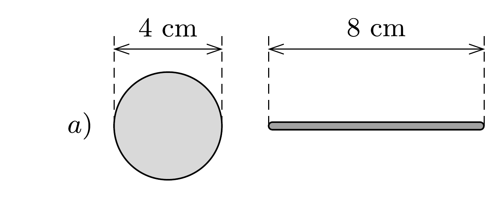
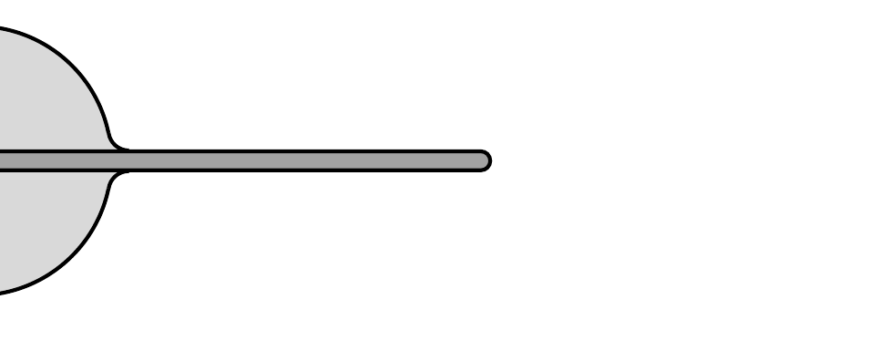
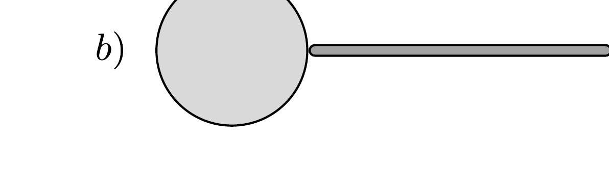
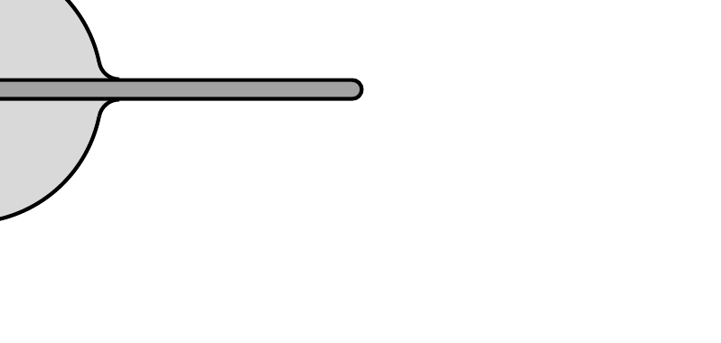
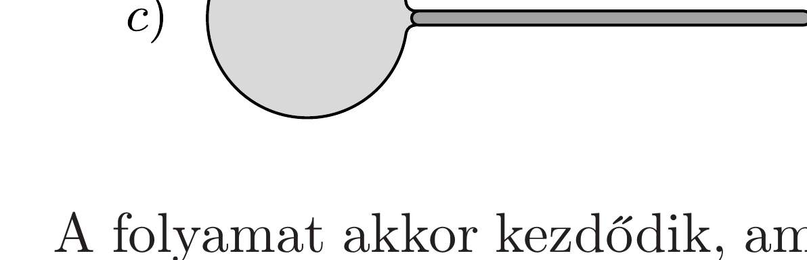
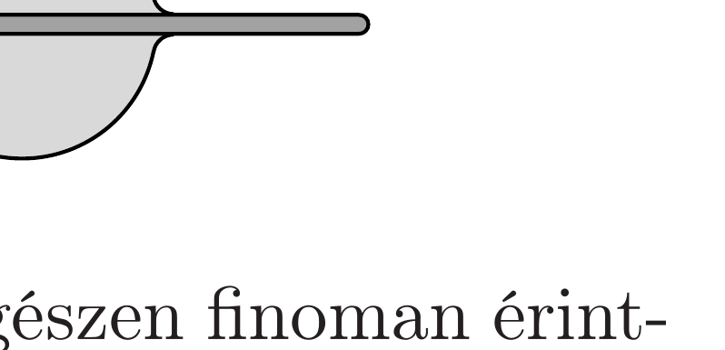

## Útmutatás

Könnyen azt gondolhatjuk, hogy a vízcsepp egyensúlyi állapotban teljesen körülfolyja a pálcát, ez azonban nem igaz. A vízcsepp alakját az energiaminimum határozza meg, a pálca elhelyekedését pedig az eróegyensúly.

## Megoldás

Az ábra a) részén látható kiindulási helyzetben a vízgolyó közelében lebeg az üvegpálca.

A folyamat akkor kezdődik, amikor a pálca egyik végét egészen finoman érintkezésbe hozzuk a vízcseppel ( $b$ ) ábra). A víz nedvesíti az üveget, kissé „ráfolyik” a pálca legömbölyített végére $(c)$ ábra). Itt azonban a folyamat nem állhat le, mert az üvegpálcára ható erők eredője nem nulla. Igaz ugyan, hogy az $R$ sugarú vízcsepp belsejében a nyomás egy kicsit nagyobb, mint a külső légnyomás ( $\Delta p=2 \alpha / R$, ahol $\alpha$ a felületi feszültség), és ez $r^{2} \pi \Delta p$ eróvel tolná kifelé az $r$ sugarú pálcát, de ennél sokkal nagyobb a pálcára rásimuló vízhártya által kifejtett $2 r \pi \alpha$ nagyságú húzóerő. A pálca tehát benyomul a vízcseppbe, egy közbülső helyzet a $d$ ) ábrán látható.

Az eróegyensúly ebben a helyzetben sem áll fenn, nincs ok, amiért a pálca megállna, így továbbhalad az $e$ ) ábrán látható állapotig. Most már a pálca elérte a vízcsepp bal oldali szélét, kissé túl is ment rajta, a vízfelszín itt kissé kinyomódik. Az erőegyensúly azonban csak akkor áll be, amikor a pálca bal oldali vége teljesen kibújik a vízcseppből az $f$ ) ábrán látható módon, ekkor a pálca mindkét végét körülölelő víz felszíne ugyanolyan alakú.

Meg kell gondolnunk még, hogy vajon a vízcsepp nem folyik-e szét a pálcán. A rendszer összenergiája a levegővel érintkező víz felületi energiájának és a vízzel érintkező üveg energiájának összegével egyenlő; ez a mennyiség igyekszik minél kisebb lenni. Tekintettel arra, hogy a pálca vékony, az üveg teljes felülete elhanyagolható a vízgolyó felületéhez képest. A rendszer egyensúlyát tehát a legkisebb vízfelszín követelménye határozza meg, ez pedig (adott térfogatú víz esetén) a gömb alaknál valósul meg.

A végállapotban tehát a vízgolyó majdnem pontosan gömb alakú, az üvegpálca ennek a gömbnek egyik átmérője mentén helyezkedik el, és mindkét végét „kidugja” a vízből.
