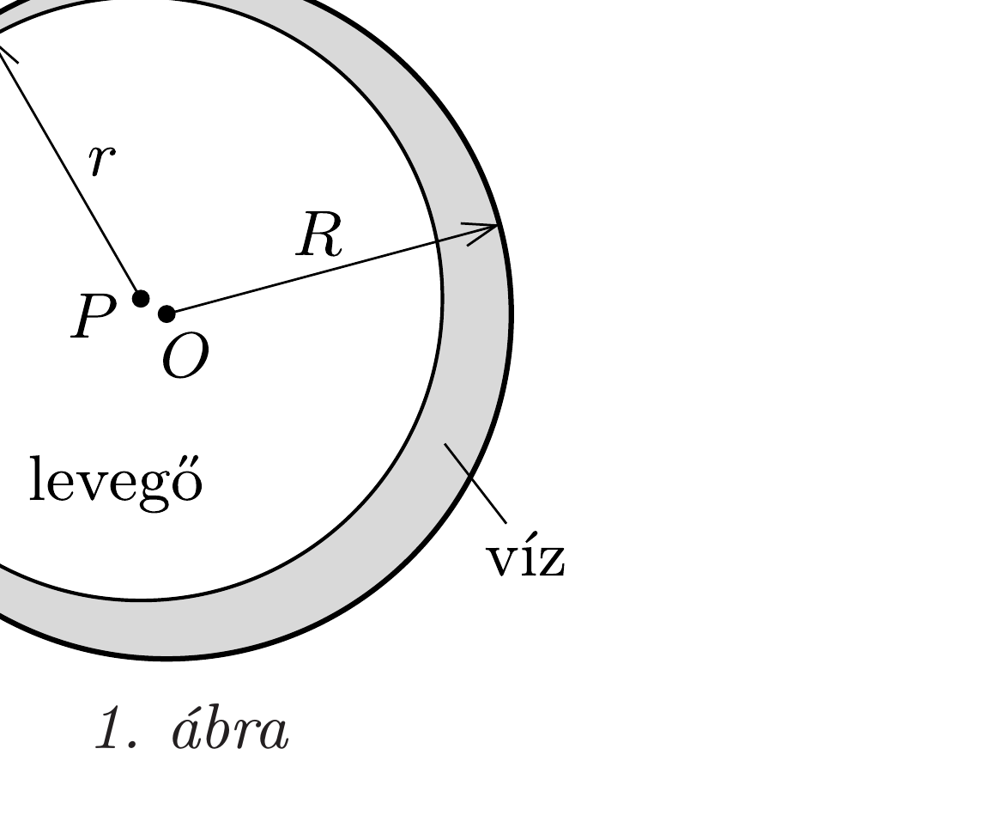
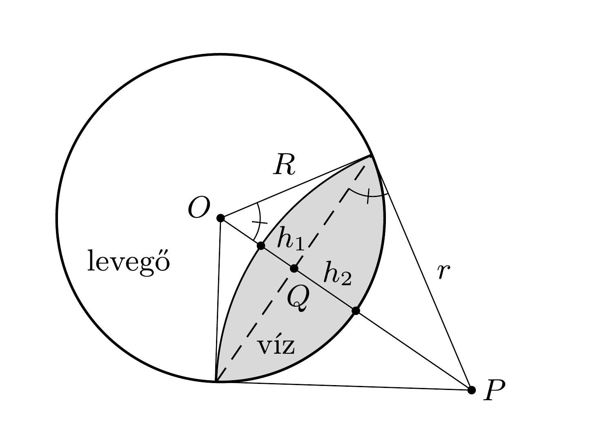

## Útmutatás

Az egyensúlyi állapotot pl. az energiaminimum-elv segítségével találhatjuk meg. Súlytalanság állapotában a gravitációs helyzeti energia figyelmen kívül hagyható, elegendő a felületi energiákkal foglalkoznunk.

## Megoldás

a) Az üveget jól („tökéletesen”) nedvesítő víz számára energetikailag az a kedvező, ha minél nagyobb felületen érintkezik az edény falával. Mivel a gravitáció nem szab gátat ennek, a víz az üreges gömb teljes belsó felületét benedvesíti, a légbuborék tehát valahol az üreg belsejében fog elhelyezkedni. Alakját az a feltétel szabja meg, hogy a felülete - adott térfogat mellett - a lehető legkisebb legyen. (A térfogat azért állandó, mert a normál légnyomás mellett a felületi feszültségből származó nyomás elhanyagolhatóan kicsi, tehát a gáznak a nyomása és a hőmérséklete, és így a térfogata is meghatározott értékú.)

Adott térfogatú testek közül a gömbnek a legkisebb a felszíne (ezt már az ókorban is tudták). Az $R=4 \mathrm{~cm}$ sugarú üregbe bezárt levegő tehát gömb alakot vesz fel (1. ábra). A gömb $r$ sugarát a térfogatából számolhatjuk ki:
\[
\frac{4 r^{3} \pi}{3}=\frac{2}{3} \cdot \frac{4 R^{3} \pi}{3},
\]
ahonnan
\[
r=\sqrt[3]{\frac{2}{3}} R=3,5 \mathrm{~cm} .
\]

A légbuborék $P$ középpontja (ott, ahol a buborék egyáltalán elfér) tetszőleges helyen lehet, az egyensúly tehát $P$ helyzetére nézve közömbös (indifferens). A buborék az üreges edényben a legkisebb hatásra (pl. az ürállomás nagyon kicsi fékeződésére) lassan mozoghat, de az edény falához érve onnan visszapattan, nem „ragad” oda.

Megjegyzés. A gömb alakú felület minden pontjának ugyanakkora a görbülete, és ennek megfelelően a légbuborék falánál mindenhol ugyanakkora a felületi feszültségből származó görbületi nyomás. Ennek így is kell lennie, hiszen a belül lévớ gáz nyomása is és a külső víz nyomása is (súlytalanság állapotában) a felület mentén haladva nem változik; különbségük pedig éppen a görbületi nyomás.
b) Az ezüstgömbbe zárt légbuborék is olyan alakot vesz fel, amelynek az átlagos görbülete
\[
\frac{1}{2}\left(\frac{1}{r_{\max }}+\frac{1}{r_{\min }}\right)=\text { állandó, }
\]
ahol $r_{\text {max }}$ és $r_{\text {min }}$ az ún. főgörbületekhez tartozó sugarakat jelöli. Az átlagos görbület tehát a felület minden pontjában ugyanakkora (hiszen a levegő nyomása is és a víz nyomása is állandó a felület mentén), továbbá a fallal való érintkezési vonal mentén a vízfelület érintősíkja mindenhol merőleges a falfelület érintősíkjára. Ezt a két feltételt egy alkalmasan választott méretú és középpontú gömbsüveg (a gömbfelületnek egy síkkal „levágott” része) teljesíti, ez tehát egy lehetséges megoldás.

Mivel azonban a matematikai probléma megoldása - fizikai okokból - egyértelmú, ez lesz $a$ megoldás: az edényben lévő víz két gömbsüvegből összetehető alakot vesz fel (2. ábra).

Megjegyzés. A folyadék és a levegő határfelülete általában nem gömbfelület vagy annak egy darabkája, hanem bonyolultabb (konstans átlaggörbületü) alakzat. Ha például az úrállomáson lebegő tartály ürege nem gömb, hanem szabálytalan alakú lenne, akkor az üreg szélénél összegyülő vízet nem határolhatná gömbfelület; annak érintősíkjai ugyanis nem mindenhol ugyanakkora szögben illeszkednének a falfelülethez. Feladatunkban azért lehetséges egy viszonylag egyszerú felülettel, a gömbsüveggel kielégíteni a szükséges feltételeket, mert két gömb áthatásakor a felületek közös része mentén az érintősíkok szöge mindenhol ugyanakkora.

A határfelület $r$ görbületi sugarát és $P$ középpontjának az üreges gömb $O$ középpontjától mért távolságát a víz térfogata és az illeszkedési szög határozza meg. A Pitagorasz-tétel, valamint a 2. ábrán látható hasonló háromszögek arányai miatt fennállnak a következő összefüggések:
\[
O P=\sqrt{R^{2}+r^{2}}, \quad O Q=\frac{R^{2}}{\sqrt{R^{2}+r^{2}}} \quad \text { és } \quad P Q=\frac{r^{2}}{\sqrt{R^{2}+r^{2}}},
\]
melyekből a 2. ábrán látható gömbsüvegek magassága:
\[
h_{1}=r\left(1-\frac{r}{\sqrt{R^{2}+r^{2}}}\right), \quad h_{2}=R\left(1-\frac{R}{\sqrt{R^{2}+r^{2}}}\right) .
\]

Egy $\varrho$ sugarú, $h$ magasságú gömbsüveg térfogata $\frac{1}{3} \pi h^{2}(3 \varrho-h)$, így a víz ismert térfogata
\[
\frac{\pi}{3} h_{1}^{2}\left(3 r-h_{1}\right)+\frac{\pi}{3} h_{2}^{2}\left(3 R-h_{2}\right)=\frac{1}{3} \cdot \frac{4 \pi}{3} R^{3}
\]
módon fejezhető ki. Innen az $x=r / R$ sugár-arányra az
\[
x^{3}\left(1-\frac{x}{\sqrt{1+x^{2}}}\right)^{2}\left(2+\frac{x}{\sqrt{1+x^{2}}}\right)+\left(1-\frac{1}{\sqrt{1+x^{2}}}\right)^{2}\left(2+\frac{1}{\sqrt{1+x^{2}}}\right)=\frac{4}{3}
\]
egyenlet adódik, amelynek (numerikusan vagy grafikus függvényábrázolással megkapható) megoldása: $x=3,206 \approx 3,2$.

Az úrállomáson lebegő ezüstgömbbe zárt vizet tehát egy $r=12,8 \mathrm{~cm}$ sugarú gömbsüveg alakú felület választja el a levegőtől; méretarányos rajza a 3. ábrán látható. A „vízlencse” állása a súlytalanság miatt tetszőleges lehet. Elvben elképzelhető, hogy a légbuborék ebben az esetben is az 1. ábrán látható gömb alakú, és valahol a gömb belsejében lebeg, de ez az állapot instabil. Ha a buborék - bármilyen kis zavar hatására - megközelíti az edény falát, onnan nem pattan vissza (mint az $a$ ) esetben), hanem rátapad a falra. Kiszámítható, hogy a felületi energia számottevően kisebb a 3. ábrán látható elrendezésben, mint az 1. ábrának megfelelőben. (Az energiaviszonyok könnyen összehasonlíthatóak egy sík felületre tapadó buboréknál. Itt egy gömbből vele azonos térfogatú félgömb lesz, ennek felülete $1 / \sqrt[3]{2} \approx 0,8$-szorosa a teljes gömb felületének.)
