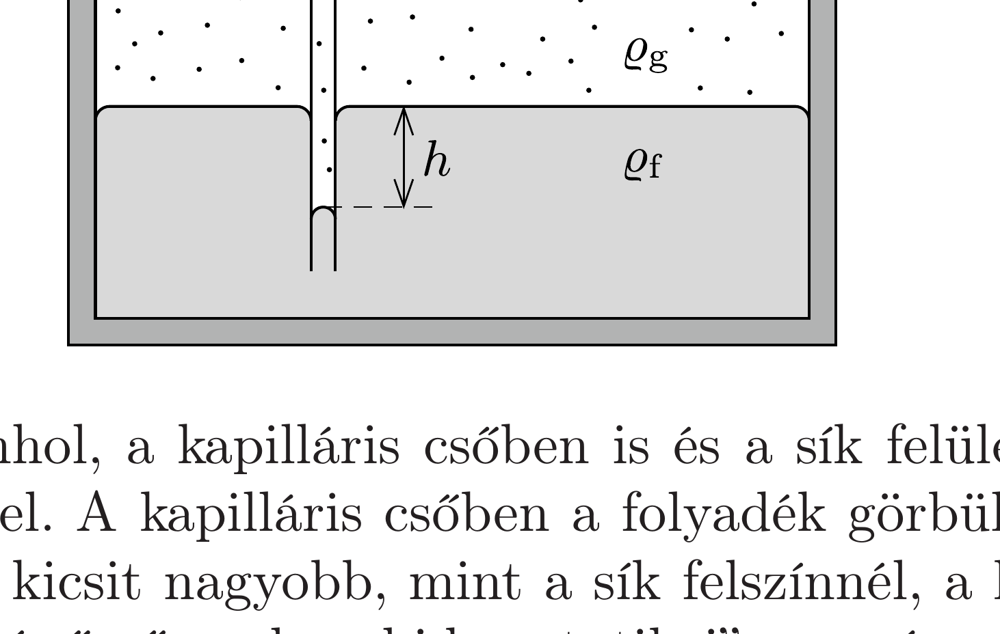

## Útmutatás

A kisebb méretú folyadékcseppek felületének közelében a telített gőz nyomása kicsit nagyobb, mint a nagyobb cseppeknél. Mivel a zárt edény alján a gőznyomás mindenhol ugyanakkora, a nagyobb cseppeknél ez a nyomás nagyobb, mint az egyensúlyi érték, tehát azokra lecsapódik a gőz és meghíznak, a kisebb méretú cseppek pedig inkább párolognak, tehát egyre fogynak.

A telített gőznyomás és a csepp görbülete közti kapcsolatot úgy vezethetjük le, ha végiggondoljuk, hogyan alakul ki a nyomások egyensúlya egy zárt térrészben
lévő, valamennyi folyadékot tartalmazó edény és egy abba belelógatott kapilláris csó́ esetében.

## Megoldás

Képzeljünk el egy zárt edényt, amelyben valamennyi folyadék és felette annak telített gőze található. A folyadékba egy $r$ sugarú kapilláris cső merül. A folyadék a cső falát nem nedvesíti. Ilyen körülmények között a folyadék a kapillárisban bizonyos $h$ mélységig lesüllyed. A süllyedés mértékét a hidrosztatikai nyomás és a felületi feszültség által létrehozott görbületi nyomás egyensúlyának
\[
2 \pi r \alpha=\varrho_{\mathrm{f}} g h \cdot r^{2} \pi
\]
feltételéből határozhatjuk meg, ahol $\alpha$ a folyadék felületi feszültsége, $\varrho_{\mathrm{f}}$ pedig a súrúsége. Innen
\[
h=\frac{2 \alpha}{\varrho_{\mathrm{f}} g r} .
\]

A folyadék mindenhol, a kapilláris csőben is és a sík felületnél is egyensúlyben van a saját gőzével. A kapilláris csőben a folyadék görbült felszínénél a gőz nyomása azonban egy kicsit nagyobb, mint a sík felszínnél, a különbség éppen a $h$ magasságú, $\varrho_{\mathrm{g}}$ sürúségú gőzoszlop „hidrosztatikai” nyomása:
\[
\Delta p=\varrho_{\mathrm{g}} g h=\frac{2 \alpha}{r} \frac{\varrho_{\mathrm{g}}}{\varrho_{\mathrm{f}}} .
\]
Ez a képlet azt mutatja, hogy egy kisebb görbületi sugarú felületdarabkán a folyadék csak nagyobb nyomású gőzzel kerülhet egyensúlyba, mint ahogy ez a kevésbé
görbült felületnél történne. Az eredeti feladatban viszont a különböző méretú folyadékcseppek azonos nyomású gőzben találhatók, tehát mindegyikük nem lehet egyensúlyban a gőzzel. A kisebb méretú cseppek gyorsabban párolognak, mint a nagyobbak, sőt, a gőznyomás növekedtével a nagyobb cseppekre már lecsapódik a gőz, míg a kisebbek tovább párolognak. A folyamat végén a kisebb cseppek mind elfogynak, és egyetlen csepp marad csak, ami egyensúlyba kerül a telített gőzével.

A felület görbületéből adódó gőznyomás-különbség $\varrho_{\mathrm{g}} \ll \varrho_{\mathrm{f}}$ miatt sokkal kisebb, mint az $r$ sugárhoz tartozó görbületi nyomás, de ahhoz elegendő, hogy hosszú idő alatt létrehozza a leírt jelenséget.
