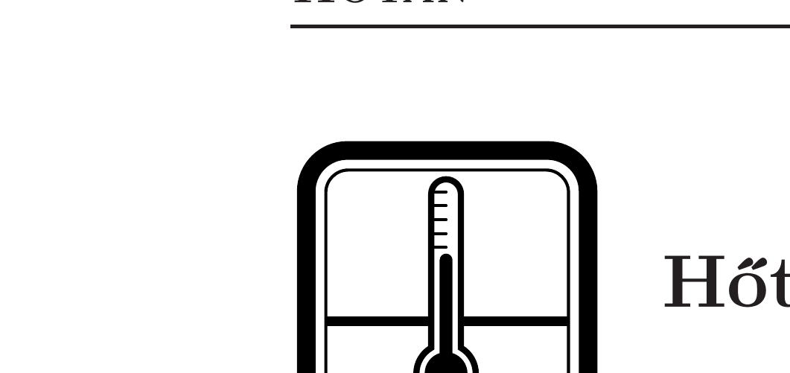

## Útmutatás

A felületi vízhullámok terjedési sebességét kis hullámhosszak esetén a felületi feszültség szabja meg. Gondoljuk meg, hogyan függhet a (kapilláris) vízhullámok terjedési sebessége a hullámhosszuktól, és hogy van-e a vízhullámok hullámhosszának alsó határa.

## Megoldás

A felületi vízhullámok terjedési sebessége a víz $\alpha$ felületi feszültségétől, a víz $\varrho$ súrúségétől és a $\lambda$ hullámhossztól függhet. Ezen mennyiségek dimenziója:
\[
[\alpha]=\frac{\mathrm{N}}{\mathrm{~m}}=\frac{\mathrm{kg}}{\mathrm{~s}^{2}}, \quad[\varrho]=\frac{\mathrm{kg}}{\mathrm{~m}^{3}}, \quad[\lambda]=\mathrm{m} .
\]
Ezekből a mennyiségekből úgy lehet sebességet „kikeverni”, ha $\alpha$ és $\varrho$ hányadosa szerepel benne (különben a „kg” nem esne ki!). Mivel azonban
\[
\left[\frac{\alpha}{\varrho}\right]=\frac{\mathrm{m}^{3}}{\mathrm{~s}^{2}},
\]
osztanunk kell még a hullámhosszal, majd gyököt vonnunk, így kapunk sebesség dimenziót. Összefoglalva: dimenzionális megfontolásokból az adódik, hogy a kapilláris vízhullámok terjedési sebessége a hullámhossz négyzetgyökének reciprokával
arányos:
\[
v \sim \sqrt{\frac{\alpha}{\varrho \lambda}} \sim \frac{1}{\sqrt{\lambda}} .
\]

Ebből a függvénykapcsolatból (és a megadott számadatból) arra következtethetünk, hogy a $10^{-8} \mathrm{~cm}$ nagyságrendú hullámhossztartományban érné el a felületi hullámok sebessége a hangét. Mivel azonban a felületi hullámok sebessége nem lehet nagyobb a hangsebességnél (a felület közelében sem „lökdöshetik” gyorsabban a molekulák egymást, mint az anyag belsejében), kb. $10^{-8} \mathrm{~cm}$-es méretnél kisebb hullámhosszaknak nem lehet értelme. Valóban, ez a vízmolekulák méretének nagyságrendje!

