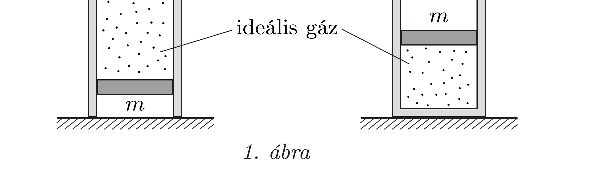
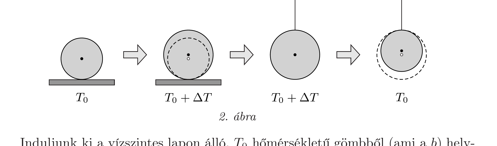

## Útmutatás

Képzeljük el, hogy egyetlen gömbbel olyan termodinamikai körfolyamatot valósítunk meg, amelyben először a $b$ ), majd az $a$ ) esetnek megfeleló állapotváltozás történik. Számítsuk ki, mekkora lenne ezen körfolyamat termodinamikai hatásfoka, ha Jánosnak mindenben igaza lenne. Hasonlítsuk össze ezt a hatásfokot a Carnot-körfolyamat hatásfokával!

## Megoldás

János érvelése jól hangzik, de mégsem helyes! Azt, hogy a gravitációs helyzeti energia változására alapozott okoskodással valami baj van, jól mutatja az alábbi, minden részletében végigszámolható példa.

Képzeljük el, hogy a feladatban leírt kísérletet fémgömbök helyett egy hőszigetelt henger hószigetelt dugattyúval lezárt részében lévó ideális gázzal hajtjuk végre. Az $a$ ) esetben a hengerben lévő gáz a dugattyú felett helyezkedik el, míg a b) esetben alatta (1. ábra). A dugattyú súlya miatt a gáz nyomása az elsó esetben kisebb, a második esetben pedig nagyobb, mint a külső légnyomás.

1. ábra

Közöljünk most mindkét gázzal ugyanakkora hőt! (Az edényfal és a dugattyú hốszigetelése miatt a közölt hố csak az edényben lévő gázt melegíti.) Vajon melyik esetben változik többet a gáz hőmérséklete? Az $a$ ) esetben a dugattyú helyzeti energiája lecsökken, a b) esetben pedig megnő. János érvelése szerint az első esetben a közölt hőnél több, a második esetben pedig kevesebb energia „jut” a gáz melegítésére, tehát az első esetben többet változik a gáz hőmérséklete, mint a másodikban. Ez azonban téves következtetés, hiszen az ideális gáz állandó nyomáshoz tartozó hőkapacitása nem függ a gáz nyomásától, csak a gáz anyagmennyiségétől és a gázmolekulák szabadsági fokainak számától. A hengerben lévő gáz tehát mindkét esetben ugyanannyira melegszik fel.

Megjegyzés. Részleteiben is nyomon követhetjük, hogy mire fordítódik a gázzal közölt hő: mindkét esetben növeli a belső energiát, növeli vagy csökkenti a dugattyú gravitációs helyzeti energiáját, továbbá fedezi a külső légnyomás ellen végzett munkát. Az $a$ ) esetben a közölt hő (a szokásos jelölésekkel):
\[
Q=\frac{f}{2} n R \Delta T_{a}-m g \Delta h_{a}+p_{0} \Delta V_{a},
\]
ahol az ideális gázok állapotegyenlete szerint
\[
\Delta V_{a}=\frac{n R \Delta T_{a}}{p_{0}-m g / A} \quad \text { és } \quad \Delta h_{a}=\frac{\Delta V_{a}}{A} .
\]
Hasonlóan írhatjuk fel a közölt hőt a $b$ ) esetben:
\[
Q=\frac{f}{2} n R \Delta T_{b}+m g \Delta h_{b}+p_{0} \Delta V_{b},
\]
ahol
\[
\Delta V_{b}=\frac{n R \Delta T_{b}}{p_{0}+m g / A} \quad \text { és } \quad \Delta h_{b}=\frac{\Delta V_{b}}{A} .
\]
A behelyettesítések elvégzése után (természetesen) az izobár folyamatokra vonatkozó jól ismert összefüggéshez jutunk:
\[
Q=\frac{f+2}{2} n R \Delta T_{a}=\frac{f+2}{2} n R \Delta T_{b},
\]
amiból már adódik a $\Delta T_{a}=\Delta T_{b}$ egyenlőség. A számolás azt mutatja, hogy a dugattyú gravitációs helyzeti energiájának megváltozása és a külső légnyomás ellenében végzett munka a két esetben külön-külön eltérő nagyságú (a helyzeti energia megváltozásának esetében még előjelben is különböznek), de ezek összege mindkét esetben ugyanakkora.

Térjünk vissza a feladatban szereplő gömbökhöz, és próbáljuk kitalálni, mire gondolhatott Tamás, amikor a hőtan II. főtételét emlegette. Képzeljük el, hogy egy gömbbel a 2. ábrán látható lépéseket tartalmazó körfolyamatot végezzük.

Induljunk ki a vízszintes lapon álló, $T_{0}$ hőmérsékletú gömbből (ami a $b$ ) helyzetnek felel meg), és emeljük meg a környezet hómérsékletét egy kicsiny $\Delta T$ értékkel! Ennek következtében a gömb hőmérséklete is megnő $\Delta T$-vel, és az eredetileg $r_{0}$ sugarú gömb tömegközéppontja $\alpha r_{0} \Delta T$-vel magasabbra kerül ( $\alpha$ a gömb anyagának lineáris hótágulási együtthatója). A melegedés közben az $m$ tömegú gömb a $T_{0}+\Delta T$ hőmérsékletú környezetétől (meleg hőtartályból) $Q_{\mathrm{fel}}$ hốt vesz fel, melynek nagyságát a hốtan I. főtétele értelmében
\[
Q_{\mathrm{fel}}=c_{0} m \Delta T+m g \alpha r_{0} \Delta T
\]
módon számolhatjuk, ahol az első tag a gömb belső energiájának megváltozása. János szerint ez csak a hőmérséklet-változástól függ (és nyilvánvalóan arányos a test tömegével), ezért írhattuk fel $c_{0} m \Delta T$ alakban, ahol $c_{0}$ állandó. Ezután függesszük fel a gömböt ebben a helyzetében egy hőszigetelő fonál segítségével, majd távolítsuk el az alátámasztást! Ha a környezet hőmérsékletét lecsökkentjük $T_{0}$ értékre, a gömb is lehúl, tömegközéppontja pedig tovább emelkedik. A hülés közben a gömb $Q_{\text {fel }}$-nél kevesebb,
\[
Q_{\mathrm{le}}=c_{0} m \Delta T-m g \alpha r_{0} \Delta T
\]
nagyságú hőt ad le környezetének (a hideg hőtartálynak). Itt felhasználtuk János azon álláspontját, miszerint „ha az egyforma gömbök belső energiája ugyanakkora mértékben növekedne, akkor a hőmérsékletük is ugyanannyival emelkedne", azaz ugyanazt a $c_{0}$ értéket kell beírnunk az (1) és (2) összefüggésekbe.

A folyamatsor végére a test helyzeti energiája a kiindulási helyzethez viszonyítva
\[
W=2 m g \alpha r_{0} \Delta T=Q_{\mathrm{fel}}-Q_{\mathrm{le}}
\]
értékkel növekedett, a test termodinamikai állapotának jellemzői pedig az eredeti értékekre kerültek vissza. Az egész körfolyamatot egy termodinamikai hőerőgép egyetlen ciklusának is tekinthetjük, amely során végzett hasznos munka éppen $W$. A hőerőgép hatásfoka:
\[
\eta=\frac{W}{Q_{\mathrm{fel}}}=\frac{2 m g \alpha r_{0} \Delta T}{c_{0} m \Delta T+m g \alpha r_{0} \Delta T}=\frac{2 g \alpha r_{0}}{c_{0}+g \alpha r_{0}},
\]
vagyis a $\Delta T$ hőmérséklet-különbségtől független állandó. Másrészt viszont tudjuk, hogy egy $T_{0}$ és $T_{0}+\Delta T$ hőmérsékletú hőtartályokkal múködő Carnot-gép hatásfoka
\[
\eta_{\text {Carnot }}=\frac{\Delta T}{T_{0}+\Delta T},
\]
ami elegendően kicsi $\Delta T$ esetén biztosan kisebbé válik, mint a fent kiszámított, $\Delta T$-től független nagyságú $\eta$. Ez azonban nem lehetséges, mert a hőtan II. fótételének egyik megfogalmazása szerint nem létezik a Carnot-gépnél jobb hatásfokú termodinamikai hőerőgép.

Ellentmondásra jutottunk, így nem fogadható el János elsó́ pillantásra logikusnak túnő érvelése. Megmutatható, hogy János gondolatmenete ott hibás, amikor a gömb belső energiájának megváltozásában szereplő $c_{0}$ arányossági tényezót a két esetben azonosnak, a gravitációtól (azaz a gömb deformációs állapotától) független állandónak tekinti. Tamás kétségei ezek szerint jogosak, jóllehet az érveléséből nem derül ki, hogy ténylegesen melyik gömb melegszik fel jobban. Ahhoz, hogy erre a kérdésre is felelni tudjunk, mélyebb termodinamikai megfontolásokra és anyagszerkezeti ismeretekre lenne szükségünk. A részletesebb vizsgálatok ${ }^{6}$ azt mutatják, hogy - ellentétben a naiv várakozással - a vízszintes lapon álló gömb melegszik fel jobban.

Megjegyzés. A feladatban olyan finom effektusról van szó, hogy reális méretú gömbök és hőmérséklet-változás mellett a két esetben a végső hőmérsékletek különbsége mérhetetlenül kicsiny érték. Ennek ellenére a probléma felvetése elméletileg érdekes, és rámutat arra, hogy a hótan I. főtételét az ideális gázoktól eltéró anyagokra nagyon körültekintően kell alkalmazni.
