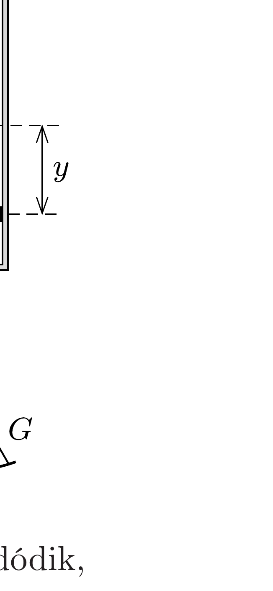

## Útmutatás

A hengerbe zárt levegő belső energiája ugyanannyival növekszik, amenynyivel a dugattyúra akasztott test helyzeti energiája csökken. A mechanikai energia a gáz belső súrlódása, valamint a dugattyú és a henger fala közötti súrlódás révén alakul belső energiává.

## Megoldás

Jelöljük a dugattyú keresztmetszetét $A$-val, a kezdeti helyzet és az új egyensúlyi helyzet közötti függőleges elmozdulást pedig $y$-nal (lásd az ábrát).

A dugattyúra akasztott $G$ súlyú test helyzeti energiájának csökkenése a hengerben lévő levegő belső energiáját és a mozgásba jött testek mozgási energiáját növeli. A lengések lecsillapodása után az energia megmaradását kifejezó egyenlet:
\[
G \cdot y=\frac{5}{2}\left[p_{1} A(h-y)+p_{2} A(h+y)-2 p_{0} A h\right],
\]
ahol $p_{1}$ az alsó és $p_{2}$ a felsó́ féltérben kialakuló nyomást, $p_{0}$ pedig az eredeti nyomást jelöli. (Felhasználtuk, hogy a kétatomos gázok belső energiája $\frac{5}{2} p V$ alakban is felírható.) Amennyiben a $G$ súly nagyon nagy, a helyzeti energia csökkenése (és emiatt a gázok belső energiájának növekedése is) igen nagy érték, ami mellett a levegő kezdeti belső energiáját elhanyagolhatjuk:
\[
G \cdot y=\frac{5}{2}\left[p_{1} A(h-y)+p_{2} A(h+y)\right] .
\]
A dugattyúra akasztott teher egyensúlyban van, ennek dinamikai feltétele:
\[
\left(p_{1}-p_{2}\right) A=G .
\]
Tudjuk továbbá, hogy a két féltérben egyforma a hőmérséklet, és a gáz tömege is megegyezik, ezért a belső energiájuk is egyenlő:
\[
\frac{5}{2} p_{1} A(h-y)=\frac{5}{2} p_{2} A(h+y) .
\]

Az (1'), (2) és (3) egyenletekből a dugattyú elmozdulására $y=\sqrt{5 / 7} h$ adódik, vagyis az alsó féltérben lévő gáz eredeti térfogatának $1-\sqrt{5 / 7} \approx 15 \%$-ára nyomódik össze.

Megjegyzés. Meglepő módon azt kaptuk, hogy tetszőlegesen nagy súly esetén sem tart nullához az alsó féltérben lévő gáz térfogata (pedig azt tanultuk és tanítjuk, hogy a gázok könnyen összenyomhatóak)! A nagy terhelés nagyon megnöveli a bezárt levegő belső energiáját, tehát magas lesz a hőmérséklet, vagyis nemcsak a létrejövő nyomáskülönbség lesz igen nagy, hanem maga a nyomás is erósen megnő. A közelítő számítás szerint a nyomás mindkét oldalon $G$-vel arányosan nố, azonban az arányossági tényező az alsó részen $6+\sqrt{35} \approx 12$-szer nagyobb, vagyis nagy terhelések esetén az alsó részben közel 12-szer nagyobb a nyomás, mint felül.

A gyakorlatban a szerkezet mechanikai teherbírása és az alkalmazott anyagok olvadáspontja szab határt a terhelés korlátlan növelésének. Emellett az is kérdéses, hogy milyen hőmérsékletig lehet a levegőt kétatomos ideális gázként tárgyalni.

Ha a levegő kezdeti belső energiáját nem hanyagoljuk el, az eredmény:
\[
\frac{y}{h}=\frac{\sqrt{35 G^{2}+25 p_{0}^{2} A^{2}}-5 p_{0} A}{7 G} .
\]
