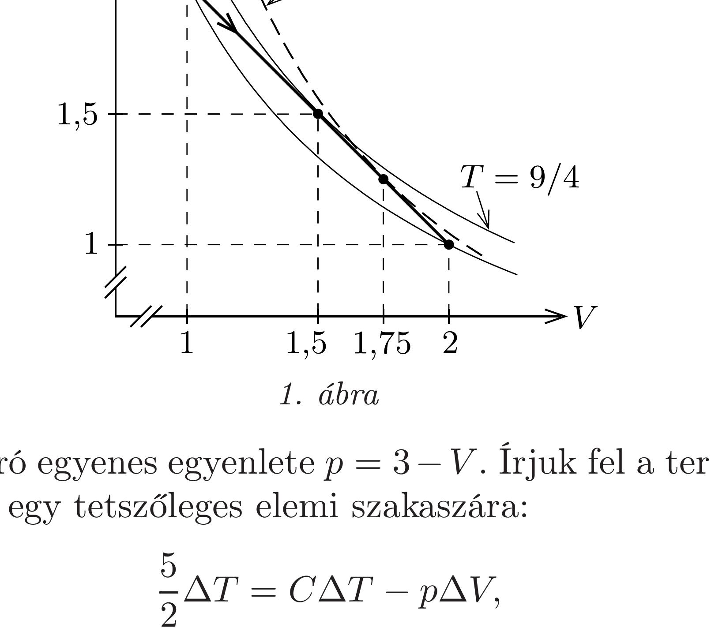
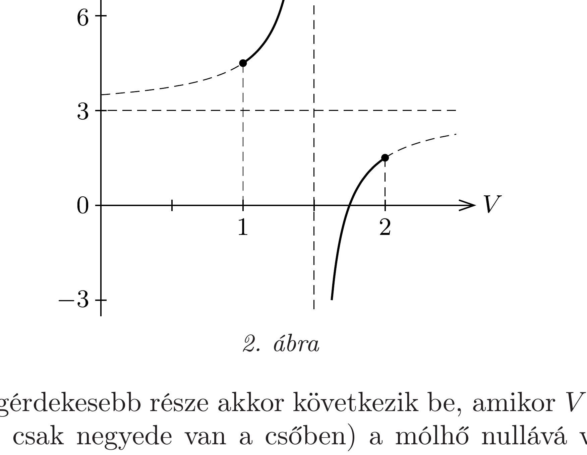

## Útmutatás

Ha a bezárt levegő állapotváltozását $p-V$ diagramon ábrázoljuk, egyenest kapunk. A feladatban rejlő szépség akkor tárul elénk, ha átgondoljuk, mit is jelent az, ha a folyamatot jellemző egyenes valamely pontjában éppen érinti a hozzá tartozó izotermát vagy adiabatát.

## Megoldás

A számolás egyszerúsítése érdekében válasszunk olyan egységrendszert, amelyben a kezdeti térfogat is és a külső légnyomás is egységnyi. Válasszuk meg úgy a gázállandó mértékegységét, hogy számértéke egységnyi legyen, és vizsgáljunk mólnyi anyagmennyiséget! Ez az általánosság megsértése nélkül megtehető, hiszen $n \mathrm{~mol}$ levegővel az 1 mol levegőhöz képest éppen $n$-szer több hőt kell közölnünk, hogy a higany távozzon a csőből. Az állapotegyenlet ekkor így egyszerúsödik: $p V=T$, azonban a hőmérséklet egységét már nem választhatjuk meg szabadon, hanem azt a nyomás és a térfogat szorzata határozza meg. Ebben az egységrendszerben a mólhő olyan szám lesz, amiből a megszokott mólhőt úgy kaphatjuk meg, hogy egyszerúen megszorozzuk a gázállandóval.

Kezdetben a gáz nyomását a felette lévő 76 cm-es higanyoszlop és a külső légnyomás adja, ami összesen 2 egységnyi nyomást jelent. Ahány cm-rel tágul a gáz, annyival csökken a felette lévő higanyoszlop magassága, tehát miközben a gáz térfogata 1 egységről 2-re növekszik, a nyomása 2-ről 1-re csökken lineárisan, ahogy ezt az 1. ábra mutatja. A bezárt levegő kezdeti hőmérséklete 2 egység, és ugyanekkora a hőmérséklet az ábrán látható egyenes szakasz végén is, hiszen ezek a pontok a $p V=2$ izotermán vannak. Ebben az ábrázolásban az izotermák a $p-V$ tengelyek szögfelezőjére szimmetrikusak, tehát a folyamat közben a legmagasabb hőmérsékletet akkor érjük el, amikor annak izotermája már nem metszi, hanem az 1. ábrán látható módon csak érinti az egyenest. Ez a folyamat közepén, a $p=\frac{3}{2}$, $V=\frac{3}{2}$ pontokban következik be, vagyis a maximális hőmérséklet $\frac{9}{4}$.

A folyamatot leíró egyenes egyenlete $p=3-V$. Írjuk fel a termodinamika első fótételét a folyamat egy tetszőleges elemi szakaszára:
\[
\frac{5}{2} \Delta T=C \Delta T-p \Delta V,
\]
ahol a bal oldalon a belső energia változása szerepel (a levegő kétatomos gáz, ezért $C_{V}=\frac{5}{2}$ ), a jobb oldalon a hőközlés kifejezésében találhatjuk a keresett $C$ mólhőt. Az egyenes egyenletéből fejezzük ki a nyomást a térfogattal, és a térfogatváltozást alakítsuk át hómérséklet-változássá. Ezt úgy tehetjük meg, hogy a $p V=T$ állapotegyenletbe is beírjuk a nyomást: $(3-V) V=T$, majd képezzük mindkét oldal kicsiny megváltozását: $(3-2 V) \Delta V=\Delta T$. Az összes múveletet elvégezve az első főtétel így alakul:
\[
\frac{5}{2} \Delta T=C \Delta T-\frac{3-V}{3-2 V} \Delta T .
\]
$\Delta T$-vel egyszerúsíthetünk, majd kifejezhetjük a folyamat mólhőjét:
\[
C=\frac{21-12 V}{6-4 V} .
\]

A mólhốt a térfogat függvényében a 2. ábra mutatja. Láthatjuk, hogy $V=\frac{3}{2}$ térfogatnál a mólhő végtelenhez tart, ami annak felel meg, hogy ekkor az egyenes jól közelíti a maximális hőmérséklethez tartozó izotermát. Izotermikus folyamat közben hőközlés van, hőmérséklet-változás nincs, ezért válik végtelenné a mólhő. A térfogatot tovább növelve a mólhő negatív értéket vesz fel, ami azt jelenti, hogy hiába pozitív a hőközlés, a gáz belső energiája csökken, mert a hőközlésnél nagyobb a gáz által végzett munka.

A folyamat legérdekesebb része akkor következik be, amikor $V=\frac{7}{4}$-nél (ekkor a higanynak már csak negyede van a csőben) a mólhő nullává válik. Ez éppen az adiabatikus folyamatnak felel meg, hiszen hőközlés nincs, hőmérséklet-változás azonban van. Ebben a pontban a folyamatot leíró egyenes éppen érinti a ponton áthaladó adiabatát. Ezután a hőmérsékletnek tovább kellene csökkennie, miközben a mólhő pozitívvá válik. Ezt (mindvégig egyensúlyi állapotokon haladva) csak hőelvonással érhetnénk el.

Ha viszont nem hútjük, hanem - a feladat eredeti megfogalmazása szerint - tovább melegítjük a rendszert, akkor az állapotot jellemző pont a $p-V$ diagramon
már nem követi az egyenest, hanem önálló életet kezd élni, végigfut az érintett adiabatán! A levegő hőmérséklete csökken ugyan, de nem annyit, amennyit az egyenes előírna számára. A levegő belső energiájának csökkenése a külső légnyomás ellenében végzett tágulási munkán és a maradék higany felemelésén kívül még a higany felgyorsítását is fedezi: a higany kilövell a csőből!

Visszatérve a feladat eredeti kérdésére, hogy mekkora hőközlés kell a higany eltávolításához, láthatjuk, hogy csak $V=1$-től $V=\frac{7}{4}$-ig kell hőt közölnünk. Az első fótételen alapuló számolással meggyőződhetünk arról, hogy eddig a pontig a gáz által végzett munka sajátos egységrendszerünkben $\frac{39}{32}$, míg a belső energia növekedése $\frac{15}{32}$, tehát a szükséges hóközlés: $Q=\frac{27}{16}$. Közönséges egységekre (joule) visszatérve, ha a csőben a higany $n$ mólnyi levegőt zár el, akkor a kiszabadításához szükséges hőközlés nagysága: $\frac{27}{16} n R \approx 34 \mathrm{~mJ}$.
