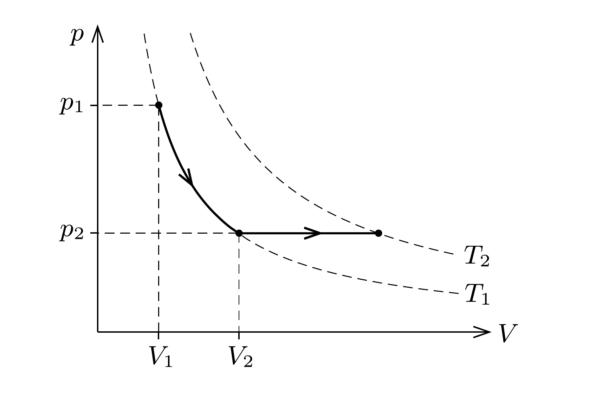

## Útmutatás

Ha a nyomás lassan csökken, akkor a gáz egyensúlyi állapotokon keresztül, reverzibilis folyamatban éri el a végállapotot. Gyors nyomáscsökkenéskor a folyamat irreverzibilis, és a burokra ható erők eredője a tágulás során nem lesz zérus.

## Megoldás

I. megoldás. A könnyen táguló burok ugyanazt a szerepet tölti be, mint egy tartályt lezáró csőben könnyen mozgó dugattyú, a továbbiakban tehát ezt a szóhasználatot fogjuk követni.

Ha a külső nyomást lassan csökkentjük, akkor a dugattyú lassan mozdul el, közbenső állapotai lényegében egyensúlyinak tekinthetők. Ilyenkor a bezárt gáz állapotváltozása adiabatikus, belső energiájának csökkenése éppen a gáz által végzett tágulási munkával egyenlő.

A második esetben, amikor a külső légnyomást hirtelen csökkentjük, a dugattyúra ható erók eredóje nem lesz nulla. A dugattyú tehát gyorsulni kezd, sebessége eleinte nő, majd az egyensúlyi helyzeten átlendülve fokozatosan lassulva megáll, és elindul visszafelé. Ha nem lenne súrlódás (sem a dugattyú és a tartály fala között, sem pedig a gáz „belső súrlódása” nem játszana szerepet), akkor a dugattyú sosem állna meg, a gáz térfogata, nyomása és hómérséklete is periodikusan váltakozna, nem lenne tehát értelme a gáz kialakuló hőmérsékletéről beszélni. A valóságban azonban nem ez történik, a rezgés előbb-utóbb megáll, mert a dugattyú (rendezett) mozgási energiája disszipálódik, a rendezetlen hốmozgásnak megfelelő belső energiát növeli. A gáz végső (egyensúlyi) térfogata, és ezzel arányosan a belső energiája és a hőmérséklete a második esetben nem lehet ugyanakkora, mint amekkorák ezek a mennyiségek az első (kvázisztatikus) esetben, hanem azoknál nagyobb, hiszen a belsó energia csökkenése kisebb, mint a gáz által végzett tágulási munka, és az energiakülönbség (vagy annak egy része) a súrlódáson keresztül „visszakerül” a gáz + dugattyú rendszerbe.

A tartályban (burokban) lévő gáz hőmérséklete tehát akkor csökken jobban, ha a külső nyomás lassan csökken.
II. megoldás. Abban az esetben, amikor a külső nyomást lassan csökkentjük, a gáz egyensúlyi állapotokon halad keresztül, ezért a folyamat megfordítható, reverzibilis. Ezzel szemben a hirtelen lecsökkenő külső nyomásnál a gáz közbenső állapotai nem tekinthetők egyensúlyinak. A burok gyors rezgésbe kezd, amely végül a disszipatív folyamatok miatt lecsillapodik: a rendszer állapotváltozása irreverzibilis.

A hốtan II. fótétele értelmében egy rendszer entrópiájának $\Delta S$ változása reverzibilis folyamatoknál a $\Delta Q / T$ mennyiségek összege (integrálja), irreverzibilis folyamatoknál pedig ennél nagyobb. Az elsó́ esetben a folyamat reverzibilis, továbbá (a burok hőszigetelése miatt) nincs hőközlés $(\Delta Q=0)$, így $\Delta S_{\text {rev }}=0$. A második (gyors nyomáscsökkenésnek megfelelő) esetben a folyamat irreverzibilis, a gázzal közölt hő pedig vagy nulla (ha a rezgés csillapodását a gáz belső súrlódása okozza), vagy pedig pozitív (ha a burok súrlódása is számottevő). Akármelyik eset áll is fenn, $\Delta S_{\text {irrev }}>0$.

Egy bizonyos mennyiségú ( $n$ mólnyi) gáz entrópiájának megváltozása független a folyamat részleteitől, a kezdeti állapot és a végállapot egyértelmúen meghatá-
rozza. Másképp megfogalmazva: az entrópia állapotjelző, amely kifejezhető más állapotjelzőkkel, pl. a nyomással és a hőmérséklettel. Jelölje $T_{1}$ a gáz kezdeti, $T_{2}$ pedig a végállapotbeli hőmérsékletét. Az entrópiaváltozás kiszámításához tekintsünk egy olyan folyamatot, melyben a nyomást először állandó $T_{1}$ hőmérsékleten $p_{1}$-ról $p_{2}$-re csökkentjük, majd állandó $p_{2}$ nyomáson a gázt $T_{2}$ hőmérsékletre melegítjük (lásd az ábrát).

Az entrópia megváltozása az első, izoterm szakaszban:
\[
\Delta S_{1}=\frac{Q}{T_{1}}=\frac{W_{\text {gáz }}}{T_{1}}=\frac{1}{T_{1}} \int_{V_{1}}^{V_{2}} \frac{p_{1} V_{1}}{V} \mathrm{~d} V=\frac{p_{1} V_{1}}{T_{1}} \ln \frac{V_{2}}{V_{1}}=-n R \ln \frac{p_{2}}{p_{1}}
\]
A második, izobár folyamatban pedig:
\[
\Delta S_{2}=\int \frac{\mathrm{d} Q}{T}=\int_{T_{1}}^{T_{2}} n C_{p} \frac{\mathrm{~d} T}{T}=n C_{p} \ln \frac{T_{2}}{T_{1}},
\]
ahol $C_{p}$ a gáz állandó nyomáson vett mólhője. A ( $T_{1}, p_{1}$ ) állapotból a ( $T_{2}, p_{2}$ ) állapotba kerülő gáz entrópiaváltozása:
\[
\Delta S=\Delta S_{1}+\Delta S_{2}=n C_{p} \ln \frac{T_{2}}{T_{1}}-n R \ln \frac{p_{2}}{p_{1}} .
\]
A vizsgált folyamatokban a kezdeti és végső nyomás aránya ugyanakkora, a reverzibilis és az irreverzibilis entrópiaváltozás közötti különbségből tehát a végső hőmérsékletek közötti különbségre következtethetünk. Mivel $\Delta S_{\text {irrev }}>\Delta S_{\text {rev }}$, ezért a végállapotban $T_{\text {gyors }}>T_{\text {lassú }}$.

A burokban lévő gáz tehát gyorsan csökkentett külső nyomás esetén kevésbé húl le, mint amikor a nyomáscsökkenés lassan következik be.
