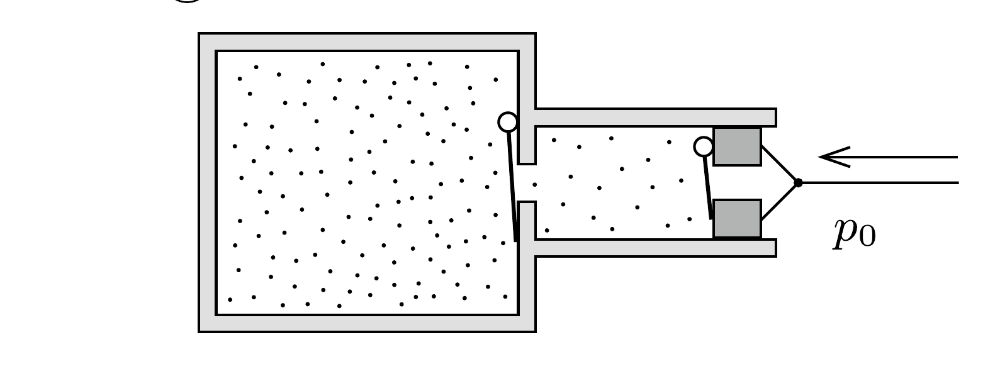
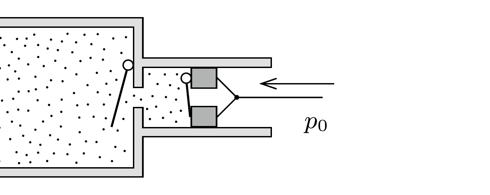

## Útmutatás

Számítsuk ki a tartályba kerülő levegő entrópiaváltozását!

## Megoldás

A pumpa múködése közben minden összenyomási ciklus két szakaszra bontható. Kezdetben mindkét szelep zárva van, a pumpában pedig a külső légköri nyomással megegyező nyomású levegő található (lásd az ábra bal felét).

A dugattyú az 1 literes térrészben lévó gázt izotermikusan összenyomja. Amikor a pumpában lévő gáz nyomása eléri a tartályban lévő gáz nyomását, akkor a belső szelep kinyit, és a továbbiakban az egész gázmennyiség nyomódik össze izotermikusan (ez látható az ábra jobb oldalán). A belső szelep kinyitásának pillanata a pumpálási ciklusokon belül egyre későbbre tolódik, emiatt meglehetősen bonyolult a teljes munkavégzés kiszámítása. Szerencsére van egyszerúbb eljárás is!

Tekintsük azt a gázmennyiséget, amely a folyamat végén a tartályba kerül. Ez egyrészt az eredetileg is ott lévő 10 liternyi levegő, továbbá még 9-szer ennyi, tehát összesen 100 liternyi (kezdetben légköri nyomású) levegő. Ezt a gázmennyiséget nyomjuk össze 10 liternyire.

A hốtan elsố fótétele szerint a gázon végzett $W$ munka és a gáz által felvett $Q$ hőmennyiség összege a gáz belső energiáját növeli. Jelen esetben a gáz hőmérséklete nem változik, így a belső energiája is ugyanakkora marad, mint kezdetben volt. Eszerint $W+Q=0$, vagyis a gázon végzett munka éppen a leadott hóvel, -Q-val egyenlő.

Másrészt viszont tudjuk, hogy állandó $T$ hőmérsékleten, reverzibilis folyamat során a gáz entrópiájának változása $\Delta S=Q / T$. Ha tehát ki tudnánk számítani a gáz entrópiaváltozását, abból már a leadott hốt és a munkavégzést is meghatározhatnánk.

Ha $N$ molekulát 10-szer kisebb helyre „zsúfolunk össze”, akkor a lehetséges mikroállapotok száma az eredetinek $1 / 10^{N}$-szerese lesz. Az entrópia statisztikus értelmezése szerint a gáz entrópiaváltozása ezen szám logaritmusának Boltzmannállandó-szorosa:
\[
\Delta S=k \ln \left(\frac{1}{10^{N}}\right)=-N k \cdot \ln 10 .
\]
A gáz által leadott hő innen:
\[
-Q=-T \Delta S=N k T \ln 10=n R T \ln 10=10 p_{0} V_{0} \ln 10,
\]
és ugyanennyi a keresett munkavégzés is:
\[
W=10 \cdot 10^{5} \mathrm{~Pa} \cdot 10^{-2} \mathrm{~m}^{3} \cdot \ln 10 \approx 23 \mathrm{~kJ} .
\]

Megjegyzés. A gáz entrópiaváltozását nemcsak a statisztikus értelmezés, hanem a termodinamikai értelmezés alapján is kiszámíthatjuk. A 194. feladat II. megoldásában láthattuk, hogy ideális gázok izotermikus tágulása esetén az entrópia megváltozása:
\[
\Delta S_{\text {izoterm }}=-n R \ln \frac{p_{2}}{p_{1}}=-n R \ln 10 .
\]
