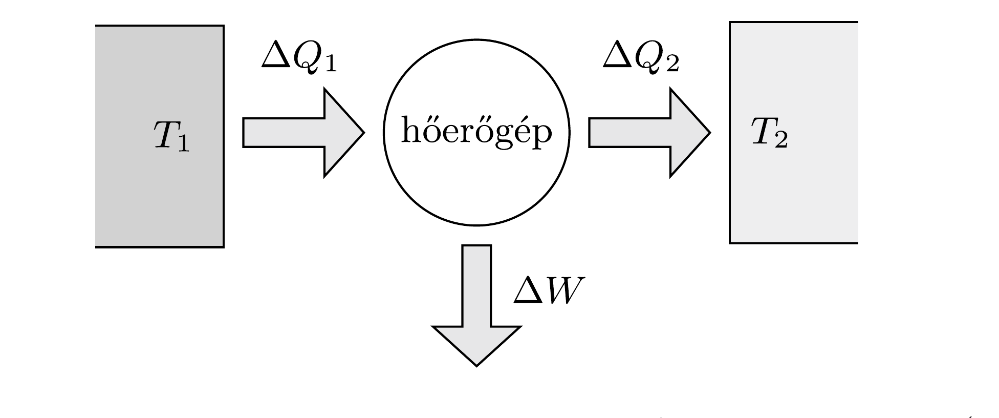

## Útmutatás

A legtöbb munka úgy nyerhető a két hőtartályból, ha közöttük Carnot-féle hőerőgépet üzemeltetünk. A folyamat során nem nőhet a rendszer entrópiája. A végállapotban a két hőtartály hőmérséklete azonos lesz.

## Megoldás

A két vízzel teli tartályból mint hőtartályokból úgy vehetünk ki munkát, hogy közöttük hőerőgépet múködtetünk. Általában a hőtartályok hôkapacitása olyan nagy a hőerőgép munkavégző közegének (gáz) hőkapacitásához képest, hogy a tartályok hőmérséklet-változása egy-egy cikluson belül elhanyagolható. Sok ciklus után azonban a hidegebb tartályt a munkavégző gáz felmelegíti, a melegebb tartályt pedig lehǘti, egészen addig, míg a tartályok hőmérséklete ki nem egyenlítődik. Ennek bekövetkezésekor a hőerőgép múködése leáll, ez szab tehát határt a rendszerből kivehető maximális munkának.

Ha egy $T$ abszolút hőmérsékletú test kicsiny $\Delta Q$ hőt vesz fel (miközben hőmérséklete elhanyagolható mértékben változik meg), akkor az entrópiaváltozása $\Delta S \geq \Delta Q / T$. (Az egyenlőség reverzibilis folyamatok esetén áll fenn.) A munkavégző gáz egy ciklus alatti teljes entrópiaváltozása (kvázisztatikus folyamatot feltételezve) nulla, hiszen az entrópia állapotjelző. Ezért a két hőtartályból és a hőerőgépből álló teljes rendszer ciklusonkénti entrópiaváltozása a hốtartályok entrópiaváltozásának összegével egyenlő.

Jelöljük a $T_{1}$ hőmérsékletú víztartály kicsiny hőmérséklet-változását $\Delta T_{1}$-gyel, a másik tartályét pedig $\Delta T_{2}$-vel. Az egész rendszer entrópiájának megváltozása egy ciklus alatt (az ábra jelöléseivel)
\[
\Delta S_{1}+\Delta S_{2}=\frac{\Delta Q_{1}}{T_{1}}+\frac{\Delta Q_{2}}{T_{2}} \geq 0
\]
ahonnan
\[
T_{2} \Delta Q_{1}+T_{1} \Delta Q_{2} \geq 0 .
\]

A tartályokban lévő víz tömege egyenlő, emiatt a hőátadások és a hőmérsékletváltozások aránya mindkét tartályra ugyanaz, a fenti egyenlőtlenség tehát így írható:
\[
T_{2} \Delta T_{1}+T_{1} \Delta T_{2}=\Delta\left(T_{1} T_{2}\right) \geq 0 .
\]
Azt kaptuk tehát, hogy a folyamat során a két víztartály hőmérsékletének mértani közepe nem csökkenhet (de esetleg növekedhet).

Ez az összefüggés minden egyes lépésben érvényes, tehát a kezdeti és a végállapot között is fennáll: a kialakuló közös hőmérséklet legalább $\sqrt{T_{1} T_{2}}$ értékü. Ha semennyi energiát nem veszünk ki a rendszerből, akkor a közös hőmérséklet a kezdeti hőmérsékletek számtani közepe lesz. A munkavégzés formájában maximálisan kivehetó energia tehát
\[
c \cdot 2 m\left(\frac{T_{1}+T_{2}}{2}-\sqrt{T_{1} T_{2}}\right)=c m\left(\sqrt{T_{2}}-\sqrt{T_{1}}\right)^{2},
\]
ahol $c$ a víz fajhője. Ez akkor lenne lehetséges, ha a hőtartályok között ideális Carnot-gépet üzemeltetnénk.
