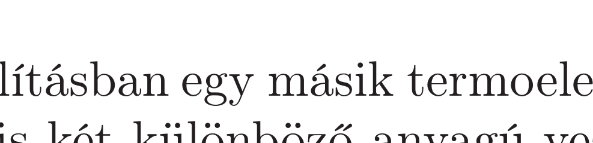

## Útmutatás

A termoelem úgy készül, hogy két, különböző anyagból készült fémszálat egyik végüknél összeforrasztanak. Ha a termoelemet olyan környezetbe helyezzük, ahol a forrasztási pont $T_{A}$ hőmérséklete eltér a szabad végek $T_{B}$ hốmérsékletétől, akkor a szabad végek között a hőmérséklet-különbséggel arányos $U$ elektromos feszültség alakul ki (Seebeck-effektus):
\[
U=S_{A B}\left(T_{A}-T_{B}\right),
\]
ahol $S_{A B}$ az anyagpárra jellemző állandó, az ún. Seebeck-együttható.

A feladatban leírt összeállításban egy másik termoelektromos jelenség is fellép: a Peltier-effektus. Ha ugyanis két különböző anyagú vezető csatlakozási pontján áram folyik keresztül, akkor a kontaktuson (az áram irányától függően) hő fejlődik vagy nyelődik el. Ennek a hőfejlődésnek/hőelvonásnak az üteme (teljesítménye) egyenesen arányos a forrasztási ponton átfolyó $I$ áram erősségével:
\[
P_{A}=\Pi_{A} I,
\]
ahol $\Pi_{A}$ a kontaktusra jellemző Peltier-együttható, ami termodinamikai okokból szoros kapcsolatban áll a Seebeck-együtthatóval és a forrasztási pont $T_{A}$ hőmérsékletével:
\[
\Pi_{A}=S_{A B} T_{A} .
\]

A fenti összefüggések használata helyett gondolkodhatunk úgy is, hogy a termoelemet a szoba levegője és a jéggel teli edény között múködtetett hőerőgépnek tekintjük.

## Megoldás

I. megoldás. A jég elolvadásának pillanatáig az állandó hómérsékletkülönbség miatt a termoelem forrasztási pontjai között
\[
U=S_{A B}\left(T_{A}-T_{B}\right)
\]
nagyságú elektromos feszültség keletkezik, ahol $S_{A B}$ a termoelemet alkotó anyagpár Seebeck-együtthatója. A feszültség hatására az áramkörben $I=U / R$ erősségü áram indul meg, így a vízbe helyezett $R$ ellenállású fogyasztó
\[
P_{\text {Joule }}=\frac{U^{2}}{R}=\frac{S_{A B}^{2}\left(T_{A}-T_{B}\right)^{2}}{R}
\]
teljesítménnyel melegíti a vizet.
Az áramkörben folyó áram hatására a Peltier-effektus miatt a $B$ forrasztási pontnál hőfejlődés, az $A$ csatlakozásnál pedig hőelvonás jelentkezik. A hőfelvétel és a hőleadás teljesítménye
\[
P_{A}^{\mathrm{fel}}=\Pi_{A} I=S_{A B} T_{A} I, \quad \text { illetve } \quad P_{B}^{\mathrm{le}}=\Pi_{B} I=S_{A B} T_{B} I,
\]
ahol felhasználtuk a Peltier- és Seebeck-együtthatók között fennálló kapcsolatot. Felvetődhet a kérdés, hogy honnan tudjuk biztosan a forrasztási pontokon lejátszódó hőcserék irányát. A teljesítmények kifejezéséből leolvasható, hogy a magasabb hőmérsékletú csatlakozásnál a hőcsere üteme nagyobb, így a fordított irányú folyamat (melyben az $A$ forrasztásnál hó fejlődik, a $B$ forrasztás pedig tovább húti környezetét, és eközben még az ellenálláson Joule-hő is fejlődik) sértené az energiamegmaradás törvényét.

Az eddigiekből következik, hogy a vizet melegítő Joule-hő és a jégnek leadott hő aránya:
\[
\frac{Q_{\text {Joule }}}{Q_{B}^{\mathrm{le}}}=\frac{c \cdot m \cdot \Delta T_{\text {víz }}}{L \cdot m}=\frac{P_{\text {Joule }}}{P_{B}^{\mathrm{le}}}=\frac{T_{A}-T_{B}}{T_{B}},
\]
ahol $c$ a víz fajhője, $L$ a jég olvadáshője, $m$ pedig a jég és a víz azonos tömege. A víz hőmérsékletének emelkedése tehát a jég elolvadásának pillanatáig:
\[
\Delta T_{\mathrm{víz}}=\frac{T_{A}-T_{B}}{T_{B}} \cdot \frac{L}{c} \approx 7,9^{\circ} \mathrm{C} .
\]
II. megoldás. A rendszerre tekinthetünk hőerőgépként: a meleg hőtartály a szoba levegője, a hideg hőtartály a 0 °C-os jég, a munkavégzés pedig nem egy gázt elzáró dugattyú mozgási energiájának növelésére fordítódik, hanem az ellenálláson fejlődő Joule-hőt fedezi:
\[
W=Q_{\text {Joule }} .
\]
Az energiamegmaradás értelmében az ellenálláson disszipálódó energia egyenlő az $A$ pontnál felvett hő és a $B$ pontnál leadott hő különbségével:
\[
Q_{\text {Joule }}=Q_{A}^{\mathrm{fel}}-Q_{B}^{\mathrm{le}} .
\]

Bár az ellenálláson történő hőfejlődés irreverzibilis folyamat, a termoelem múködése önmagában mégis reverzibilis, hiszen a termoelem által kicsatolt elektromos energiát használhatjuk arra is, hogy pl. egy akkumulátort töltünk fel vele, majd a jég elolvadása után erre az akkumulátorra kötjük a vizet melegítő fogyasztót. Ha viszont mégsem szeretnénk az akkumulátorban tárolt energiát vízmelegítésre használni, akkor a termoelemet az akkumulátorra kötve hőpumpát múködtethetünk a jég és a szoba között: így a jég hülni kezd, a szoba levegője pedig melegszik, a folyamat iránya tehát megfordul.

A folyamat reverzibilitásából következik, hogy a termoelem entrópiája időben állandó, vagyis az $A$ pontnál történó hőfelvételből származó entrópianövekedés egyenlő a $B$ pontnál bekövetkező hőleadás során létrejött entrópiacsökkenéssel:
\[
\frac{Q_{A}^{\mathrm{fel}}}{T_{A}}=\frac{Q_{B}^{\mathrm{le}}}{T_{B}} .
\]
Ezt felhasználva az ellenálláson keletkező Joule-hő és a jég által felvett hő közötti kapcsolat:
\[
Q_{\mathrm{Joule}}=\left(\frac{T_{A}}{T_{B}}-1\right) Q_{B}^{\mathrm{le}},
\]
összhangban az I. megoldás eredményével. Innen a víz hőmérséklet-változását már az ott leírt módon határozhatjuk meg.

Megjegyzés. A II. megoldásból látszik, hogy a termoelem egyfajta érdekes, „folytonos üzemú" Carnot-gépként múködik: a meleg hótartályból való hőfelvételre és a hideg hőtartálynak történő hőleadásra nem egy cikluson belül, egymás után kerül sor, hanem a két hốtartállyal való hốcsere folyamatosan, egy időben történik. Így érthetjük meg, hogy a feladat végeredménye nem függ egyetlen termoelektromos anyagi együtthatótól sem.
