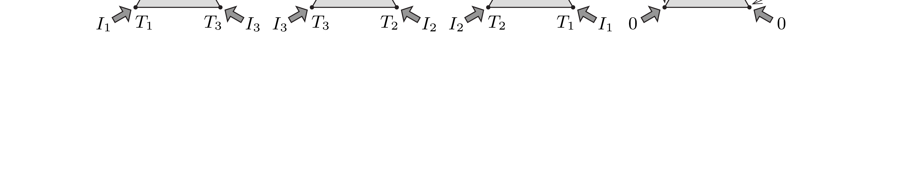

## Útmutatás

Használjuk fel az elrendezés szimmetriáját, és alkalmazzuk a hővezetési egyenlet (Fourier-törvény) linearitásából adódó szuperpozíciós elvet!

## Megoldás

Legyen $T_{0}$ a háromszög középpontjának hőmérséklete, valamint jelölje $I_{k}(k=1,2,3)$ a három csúcspontba befolyó hőáramot (időegység alatt beáramló hốt). Állandósult állapotban a hőáramok összege zérus:
\[
I_{1}+I_{2}+I_{3}=0 .
\]

Képzeljünk el két új elrendezést, melyeket a rendszer 120 és 240 fokos elforgatásával kaphatunk meg, majd képezzük ezeknek és az eredeti elrendezésnek a szuperpozícióját (vagyis adjuk össze a hőmérsékleteket és a hőáramokat), amint ezt az ábra mutatja. (A szuperpozíciós elv azért alkalmazható, mert a Fourier-törvény szerint a hőáramok és a hőmérséklet-különbségek közötti kapcsolat lineáris.)

A létrejövő eredő elrendezésben a hőmérséklet a háromszög mindhárom csúcspontjában ugyanakkora, $T_{1}+T_{2}+T_{3}$ értékú. Mivel az eredő hőáram $\left(I_{1}+I_{2}+I_{3}\right)$ mindhárom csúcspontban nulla, így a lemezben a hőmérséklet-eloszlás homogén: a lemez minden pontjában ugyanakkora a hőmérséklet.

A szuperponált rendszer középpontjában a hőmérséklet $3 T_{0}$, és ugyanekkora a csúcspontokban is, így teljesül, hogy $3 T_{0}=T_{1}+T_{2}+T_{3}$. Tehát az eredeti szabályos háromszög középpontjában a hőmérséklet éppen a csúcsponti hőmérsékletek számtani közepével egyezik meg:
\[
T_{0}=\frac{T_{1}+T_{2}+T_{3}}{3} .
\]

Megjegyzés. A feladat általánosítható $n$ csúccsal rendelkező, szabályos sokszög alakú lemezekre, valamint térben mind az öt szabályos testre. Például egy homogén, tömör dodekaéder középpontjában a hőmérséklet:
\[
T_{0}=\frac{1}{20} \sum_{k=1}^{20} T_{k} .
\]
