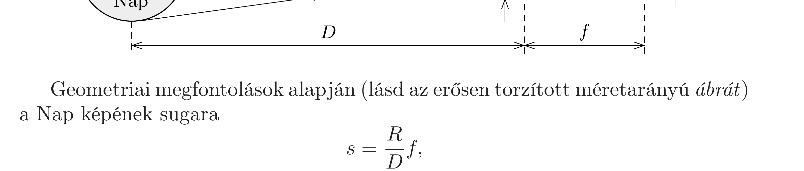

## Útmutatás

A Nap képe a fókuszsíkban nem pontszerú, hanem kicsi korong. A gömb alakú testre beeső napsugárzás teljesítménye egyenló a fekete test által kisugárzott teljesítménnyel.

## Megoldás

A Nap felszíni $T_{\text {Nap }}$ hőmérséklete, a Nap $R$ sugara és a $D$ Nap-Föld távolság ismert adatok; jelölje továbbá a lencse sugarát $r$, a fókusztávolságát pedig $f$. A Nap által kisugárzott teljes teljesítmény
\[
4 R^{2} \pi \sigma T_{\mathrm{Nap}}^{4}
\]
ahol $\sigma$ a Stefan-Boltzmann-állandó. Ebbő́l a kisugárzott teljesítménybő́l a lencsére $r^{2} \pi /\left(4 D^{2} \pi\right)$ hányad jut, így a Nap lencse által előállított képét
\[
P=\left(\frac{R}{D}\right)^{2} \pi \sigma T_{\mathrm{Nap}}^{4} r^{2}
\]
teljesítmény világítja meg.

Geometriai megfontolások alapján (lásd az erősen torzított méretarányú ábrát) a Nap képének sugara
\[
s=\frac{R}{D} f,
\]
így
\[
P=s^{2} \pi\left(\frac{r}{f}\right)^{2} \sigma T_{\mathrm{Nap}}^{4} .
\]

A kép minden pontja azonos fényességú, vagyis a kép egységnyi felületú darabjára
\[
w=\left(\frac{r}{f}\right)^{2} \sigma T_{\mathrm{Nap}}^{4}
\]
teljesítmény érkezik. Egy ekkora teljesítménnyel megvilágított tárgy addig a $T$ hőmérsékletig melegszik, amíg a felvett teljesítmény és a test által kisugárzott $A \sigma T^{4}$ teljesítmény azonos nem lesz. Mivel ez utóbbi függ a test $A$ felületétől, $T$ függ a melegített test alakjától is. Ha pl. a test egy elhanyagolható vastagságú $\varrho \leq s$ sugarú korong lenne, akkor a felvett teljesítmény $w \varrho^{2} \pi$, a leadott pedig $2 \varrho^{2} \pi \sigma T^{4}$, így $T=(1 / 32)^{1 / 4} T_{\text {Nap }} \approx 2430 \mathrm{~K} \approx 2160^{\circ} \mathrm{C}$ lenne.

Ha a test egy $\varrho=s$ sugarú gömb (ez látható az ábrán), a felvett teljesítmény éppen $P$, a leadott pedig $4 s^{2} \pi \sigma T^{4}$, innen $T=(1 / 64)^{1 / 4} T_{\text {Nap }} \approx 2040 \mathrm{~K} \approx 1770^{\circ} \mathrm{C}$.

Ha a gömb sugara kisebb, mint a Nap képének sugara $(\varrho<s)$, akkor is ugyanennyire melegszik fel a gömb. Legyen pl. a gömb sugara kétszer kisebb, mint a képé. Ekkor az időegységenként rá eső sugárzás energiája a lencsére eső sugárzás energiájának negyede, de mivel a gömb felszíne is negyede az $s$ sugarú gömbének, ezért ugyanakkora hómérsékleten négyszer kevesebb energiát sugároz ki.

Amennyiben a gömb sugara nagyobb, mint a Nap képének sugara, továbbá az anyaga elég jó hővezető, akkor a hőmérséklete kisebb lesz, mint a fentebb számított érték, hiszen a napfényből kapott energiát nagyobb felületen sugározza ki, mint a korábban számított esetben.

Megjegyzések. 1. A kapott eredmény (az, hogy egy lencsével nem tudunk akármekkora hőmérsékletúre felmelegíteni egy piciny testet) elég meglepő. A Nap messze van ugyan tőlünk, de a mérete (látószöge) természetesen véges, emiatt a képe sem pontszerú, hanem egy kicsiny korong. Ennek a képnek a fényessége (egységnyi felületre jutó energiája) határozza meg a melegített test maximális hőmérsékletét. Ez a hőmérséklet nem lehet nagyobb, mint a Nap felszíni hőmérséklete. Ténylegesen $T<T_{\text {Nap }}$, méghozzá az $r / f$ hányadostól függő mértékben marad el a felmelegedő test hőmérséklete a Napétól. Emiatt az $r / f$ hányados a lencse „fényerejére” jellemző mennyiség.
2. Az $r / f$ arány elvben 1-nél nagyobb is lehet, sót $r \gg f$ is elképzelhető. A levezetett képlet alapján ilyenkor látszólag $T>T_{\text {Nap }}$ hőmérséklet is kialakulhatna, ez azonban ténylegesen nem igaz. A levezetés során hallgatólagosan kihasználtuk, hogy a leképezésben résztvevő sugarak az optikai tengelyhez közel haladnak. Ha ez nem teljesül (gondoljunk pl. egy nagy parabolatükörre), a számításokat elvégezve minden esetben $T<T_{\text {Nap }}$ hőmérsékletet kapunk. Bebizonyítható, hogy lineáris (a szuperpozíció lehetőségét megengedő) optikai leképezőrendszerrel semmiképp nem lehetséges pusztán napenergiát használva a Nap felszíni hőmérsékletét túlszárnyalni. Ez az elvi korlát a hőtan második főtételével áll kapcsolatban.
3. Megfontolásaink során feltételeztük, hogy a Nap sugárzása akadálytalanul eljut a Föld felszínére. A valóságban a Föld légköre a sugárzás számottevő részét visszaveri, némileg el is nyeli; ezen hatások figyelembevétele még tovább csökkenti az elérhető hőmérsékletet.
4. Ha a kicsiny testet napenergiával, de nem (lineáris) optikai eszközökkel melegítjük, akkor a fenti elvi korlát érvényét veszti. Megtehetjük pl. azt, hogy napelemekkel nappal elektromos energiát nyerünk, azzal feltöltünk egy akkumulátort, majd az akkumulátort
éjszaka egy elektromos ívkisülés létrehozására használjuk. Az ívkisülés nyilván nem „emlékszik" már annak a testnek (esetünkben a Napnak) a hőmérsékletére, amelyből a tárolt energia származott.
